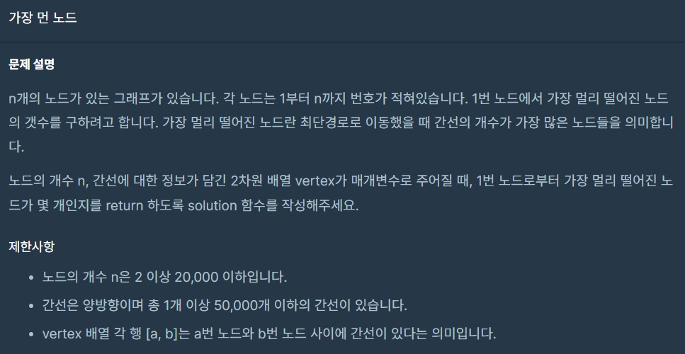
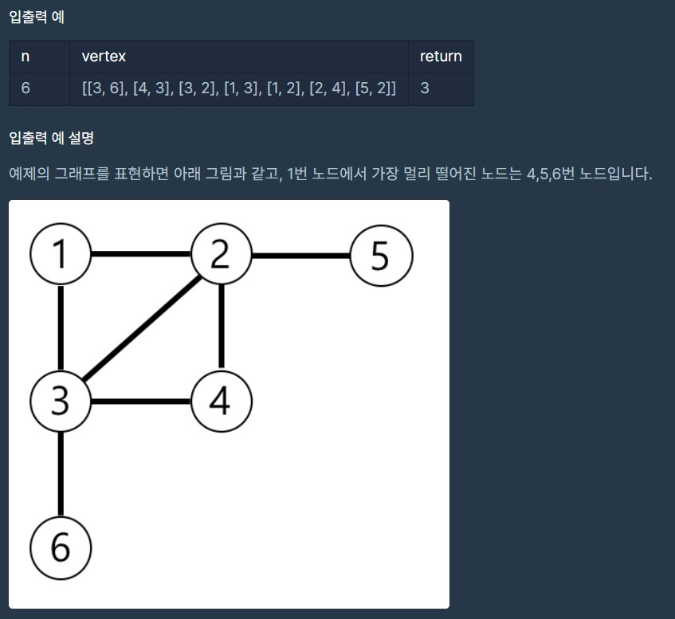

1. # 코딩 테스트 연습 - 가장 먼 노드
      
   <br>
      
   <br>
1. # 접근방법
   --- 그래프 생성
   1) node클래스 생성
   2) list생성
   3) list에 node담기
   4) 배열 요소끼리 관계를 node에 설정
   --- BFS 또는 DFS로 탐색
   5) 큐나 스택 생성(여기선 큐 생성)
   6) visited 설정
   7) 큐에 list 첫번째 값 넣기
   8) 큐 값 가져오기
   9) 연결된 node distance증가
   10) 연결된 node 큐에 넣기
   11) distance 최대값 구하기
1. # 소스 코드
   ```java
      
      public class TheMostFarNode {

          class Node{ //node클래스 생성
              int number; //노드 번호
              int distance; //거리
              boolean visited;
              List<Node> link = new LinkedList<>();

              Node(int number){
                  this.number = number;
              }
          }

          int solution(int n, int[][] edge){

              int answer = 0;

              List<Node> list = new ArrayList<>(); //list생성
              for(int i=0 ; i<n ; i++){
                  list.add(new Node(i+1)); //list에 node담기
              }

              /*
              ArrayList는 인덱스로 접근해서 바로 값을 가져올 수 있다.
              Node의 number(그래프에 숫자)에 -1을 하면 index가 된다.
              edge 배열값 : number, 배열값-1 : index
              */
              for(int[] arr : edge){ //배열 요소끼리 관계를 node에 설정
                  Node node1 = list.get(arr[0]-1); //ArrayList는 index로 접근해서 값을 가져온다.
                  Node node2 = list.get(arr[1]-1);

                  node1.link.add(node2);
                  node2.link.add(node1);
              }

              //BFS
              Queue<Node> queue = new LinkedList<>();

              Node first = list.get(0);
              first.visited = true; //시작값 visited설정
              queue.offer(first); //큐에 list 첫번째 값 넣기

              int distanceMax = 0;
              while(!queue.isEmpty()){
                 Node now = queue.poll(); //큐 값 가져오기

                  for(Node node : now.link){
                      /*
                      연결된 노드가 검색이 되면 바로 visited=true가 가능한 이유는
                      그래프가 1,4 대각선을 기준으로 좌우 대칭이기 때문에 어디서든
                      거리가 같기 때문에 가능
                      */
                      if(node.visited) continue;
                      node.visited = true;

                      node.distance = now.distance+1; //연결된 node distance증가
                      queue.offer(node); //연결된 node 큐에 넣기
                      distanceMax = Math.max(distanceMax, node.distance); //distance 최대값 구하기
                  }
              }

              for(Node node : list){
                  if(node.distance == distanceMax) {
                      System.out.println(" result:"+node.number);
                      answer++;
                  }
              }
              return answer;
          }
      }
   ```