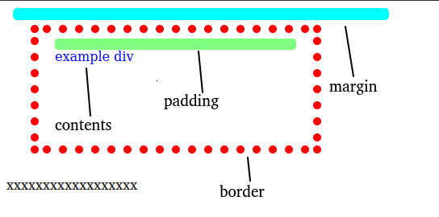

1. # 박스 모델
   박스 모델이란 HTML 요소들을 하나의 박스로 보고 박스 크기, 박스 배경색, 박스 여백 등 요소를 박스로 다루는 체계를 말합니다. CSS3는 HTML 요소를 콘텐츠, 패딩, 테두리, 여백(margin)으로 구성된 사각형 박스로 다룹니다.   

   __모든 HTML 태그는 콘텐츠, 패딩, 테두리, 여백으로 구성되는 박스__   

   콘텐츠 : 텍스트나 이미지 부분   
   패딩 : 콘텐츠를 직접 둘러싸고 있는 내부 여백   
   테두리 : 패딩 외부의 외곽선   
   여백(margin) : 박스의 맨 바깥 영역   

1. # 콘테츠 프로퍼티

   |              |     콘텐츠     |           패딩       |            테두리           |         여백(margin)           |
   |:------------:|:-------------:|:--------------------:|:--------------------------:|:------------:|
   | 크기 프로퍼티 |width<br>height|padding-top<br>padding-right<br>padding-left<br>padding-bottom|border-top-width<br>border-rigth-width<br>border-left-width<br>border-bottom-width|margin-top<br>margin-right<br>margin-left<br>margin-bottom|
   | 크기 단축 프로퍼티 | - | padding | border-width | margin |
   | 스타일 프로퍼티 | - | - |border-top-style<br>border-right-style<br>border-left-style<br>border-bottom-style||
   | 스타일 단축 프로퍼티 | - | - | border-style | - |
   | 색 프로퍼티 | - | - | border-top-color<br>border-right-color<br>border-left-color<br>border-bottom-color| - |
   | 색 단축 프로퍼티 | color | - | border-color | - |
   | 전체 단축 키 | - | - | border | - |
   
   콘텐츠는 크기와 색을 지정할 수 있습니다.
   패딩은 크기만 지정할 수 있고 색은 태그의 배경색을 따라 갑니다.   
   테두리는 크기, 스타일, 색을 지정할 수 있습니다.   
   여백은 크기만 지정할 수 있고 색은 부모 태그의 배경색을 따라 갑니다.   
   __*패딩과 마진은 크기 지정만 가능__   

   - 테두리 스타일 종류 : none / hidden / dotted / dashed / solid / double / groove / ridge / inset / outset   
   
1. # 콘텐츠, 패딩, 테두리, 여백(margin)

   <p class="codepen" data-height="300" data-default-tab="html,result" data-slug-hash="wvZdVev" data-pen-title="ch04.boxmodel" data-user="khj99" style="height: 300px; box-sizing: border-box; display: flex; align-items: center; justify-content: center; border: 2px solid; margin: 1em 0; padding: 1em;">
   <span>See the Pen <a href="https://codepen.io/khj99/pen/wvZdVev">
   ch04.boxmodel</a> by kimhyunjin (<a href="https://codepen.io/khj99">@khj99</a>)
   on <a href="https://codepen.io">CodePen</a>.</span>
   </p>
   <script async src="https://cpwebassets.codepen.io/assets/embed/ei.js"></script>   

   <br>

      
      
1. # 테두리를 꾸미는 단축 프로퍼티

   border : width style color   

   ```html
      <style>
         p { border : 3px dotted red}
      </style>
      
      <p>박스 모델</p>
   ```   
      
1. # 둥근 모서리 테두리(border-radius)
   왼쪽 모서리부터 시계방향으로 반직름 적용.   

   ```html
   <style>
      .example p{background: orange; width:300px; padding:20px;}
      #round1 {border-radius:30px 0px 0px 0px}
      #round2 {border-radius:0px 30px 0px 0px}
      #round3 {border-radius:0px 0px 30px 0px}
      #round4 {border-radius:0px 0px 0px 30px}
   </style>
   <div class="example">
      <p id="round1">30px 0px 0px 0px</p>
      <p id="round2">0px 30px 0px 0px</p>
      <p id="round3">0px 0px 30px 0px</p>
      <p id="round4">0px 0px 0px 30px</p>
   </div>
   ```   
      
   <style>
      .example p{background: orange; width:300px; padding:20px;}
      #round1 {border-radius:30px 0px 0px 0px}
      #round2 {border-radius:0px 30px 0px 0px}
      #round3 {border-radius:0px 0px 30px 0px}
      #round4 {border-radius:0px 0px 0px 30px}
   </style>
   <div class="example">
   왼쪽 위쪽 모서리를 가로 세로로 30px만큼 없앤다.   
   <p id="round1">30px 0px 0px 0px</p>
   
   오른쪽 위쪽 모서리를 가로 세로로 30px만큼 없앤다.   
   <p id="round2">0px 30px 0px 0px</p>
   
   오른쪽 아래 모서리를 가로 세로로 30px만큼 없앤다.   
   <p id="round3">0px 0px 30px 0px</p>
   
   왼쪽 아래 모서리를 가로 세로로 30px만큼 없앤다.
   <p id="round4">0px 0px 0px 30px</p>
   </div>