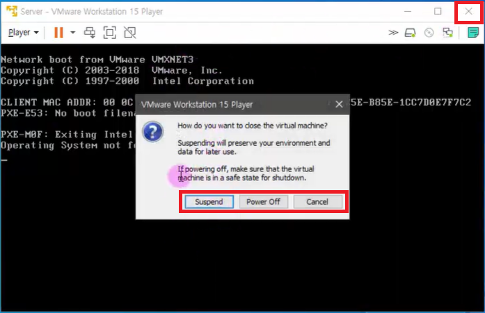
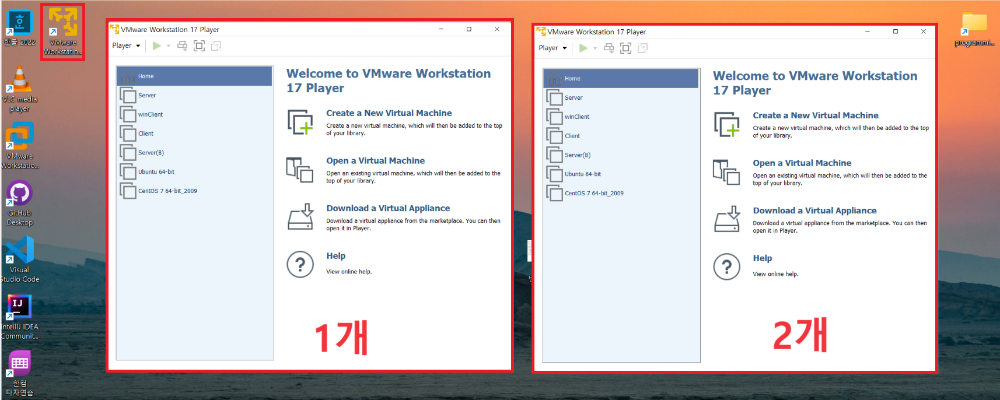
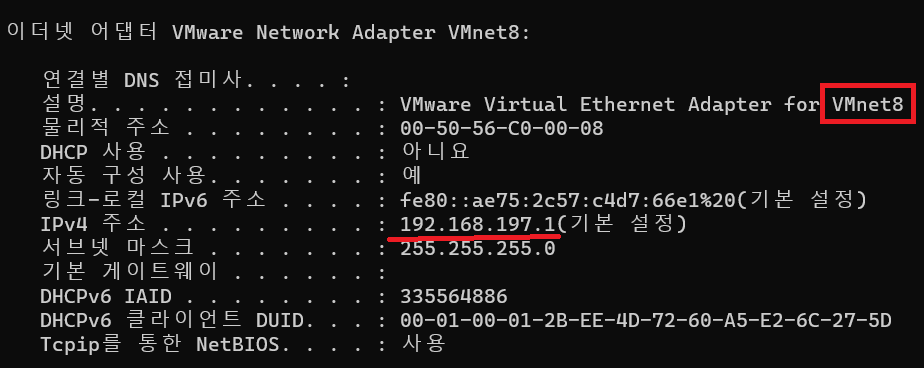
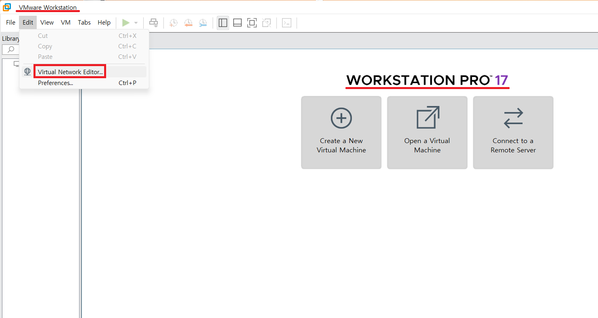
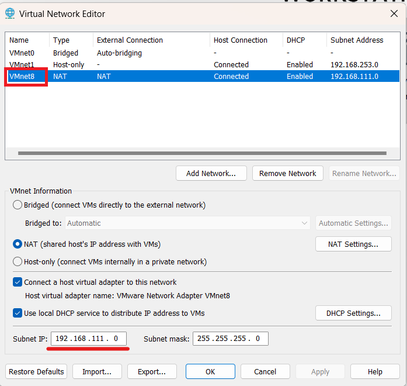
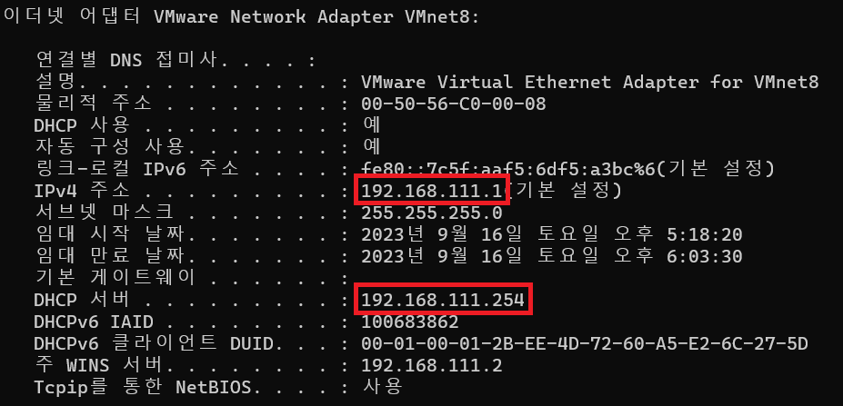

1. # 용어   
   실제 내 컴퓨터의 OS : host OS   
   VMWare의 OS : guest OS   
1. # 마우스 컨트롤   
   VMWare 안에서 빠져나올 때 : ctrl + alt   
1. # 닫기 버튼
        
    기본값 suspend : 현재 상태를 그대로 저장하면서 종료. 이 상태에선 하드웨어 셋팅이 불가. 노트북에 뚜껑을 그대로 닫은 상태와 똑같습니다.   
    Power Off : 정상적인 시스템 종료. 하드웨어 셋팅 가능   
1. # 가상머신 여러개 실행
   Woerkstation player를 클릭할 때마다 새로 player가 새로 실행됩니다. 하지만 같은 컴퓨터(예를 들어 server(B) 를 실행한 상태에서 또 server(B)를 실행한 경우)를 실행한 경우 play가 되지 않습니다.   
      
1. # 네트워크 설정
   ipconfig /all 명령어를 쳐서 VMnet8을 찾습니다.   
      
   VMWare에 사용할 ip주소를 교재와 동일하게 하기 위해 192.168.111.1로 변경을 하겠습니다. 가상머신의 ip설정은 pro버전에서 할 수 있습니다.   
    
      
   Vurtual Network Editor를 실행해서 바꿔줍니다.   
    
   VMnet8의 Subnet IP를 198.168.111.0으로 변경하고 DHCP 서버도 192.168.111.254로 변경합니다.   
      
    
   변경된 IP주소를 확인할 수 있습니다.   
      

