1. # CentOS 설치하기
   https://vault.centos.org/8.0.1905/isos/x86_64/CentOS-8-x86_64-1905-dvd1.iso   
   버전을 다운 받습니다.   
    
   Server의 Edit virtual machine settings를 선택합니다   
   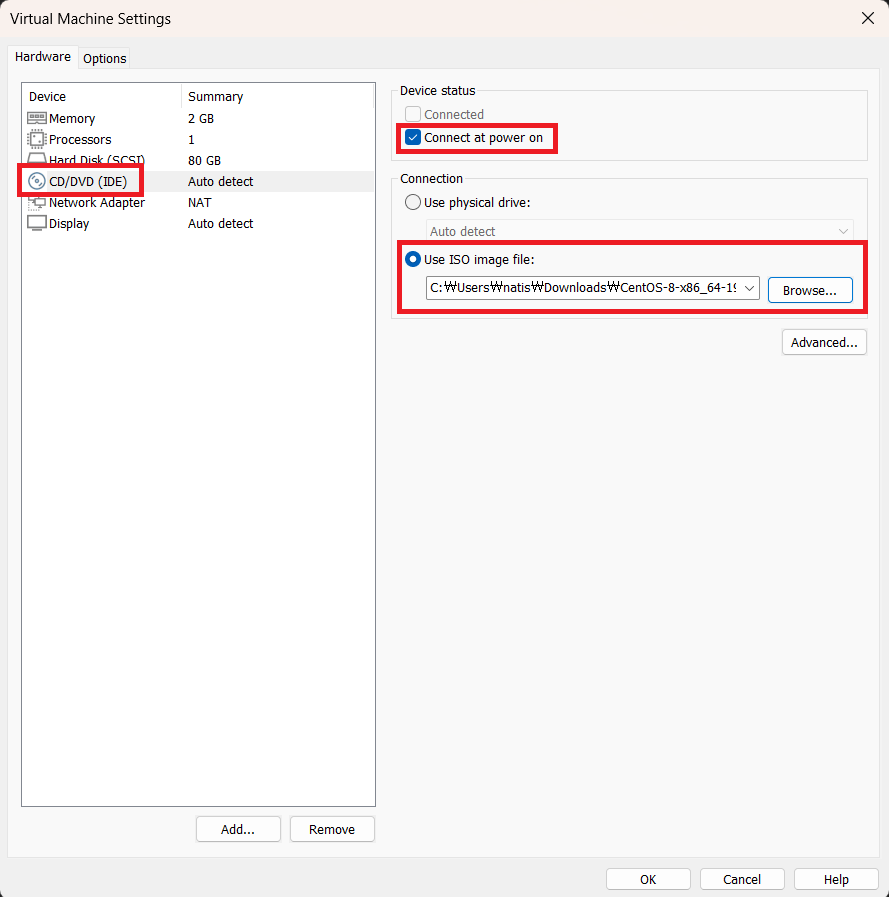   
    
   기본 설정이 test로 가 있기 때문에 커서를 위로해서 Install CentOS를 선택합니다.   
   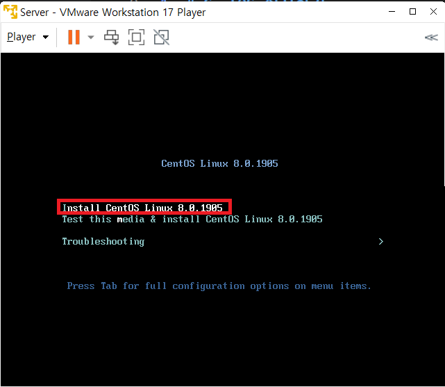  
    
   시간 및 날짜를 아시아 서울로 변경합니다.
    
   네트워크 설정을 켬으로 합니다.   
   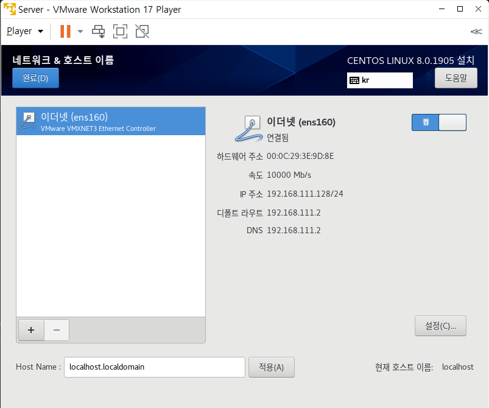  
    
   소프트웨어 선택에서 워크스테이션을 선택합니다.
   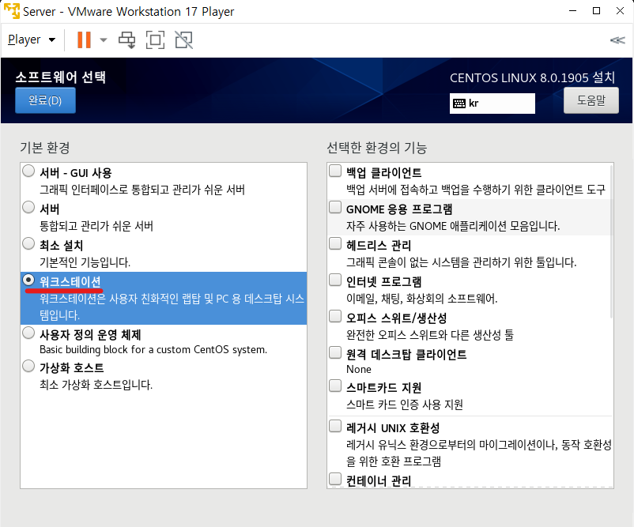   
    
   시스템의 설치 목적지를 선택합니다. 80GiB 드라이브를 선택하고 밑에 Custom을 선택하고 완료를 선택합니다. 그럼 파티션으로 넘어가게 됩니다.   
   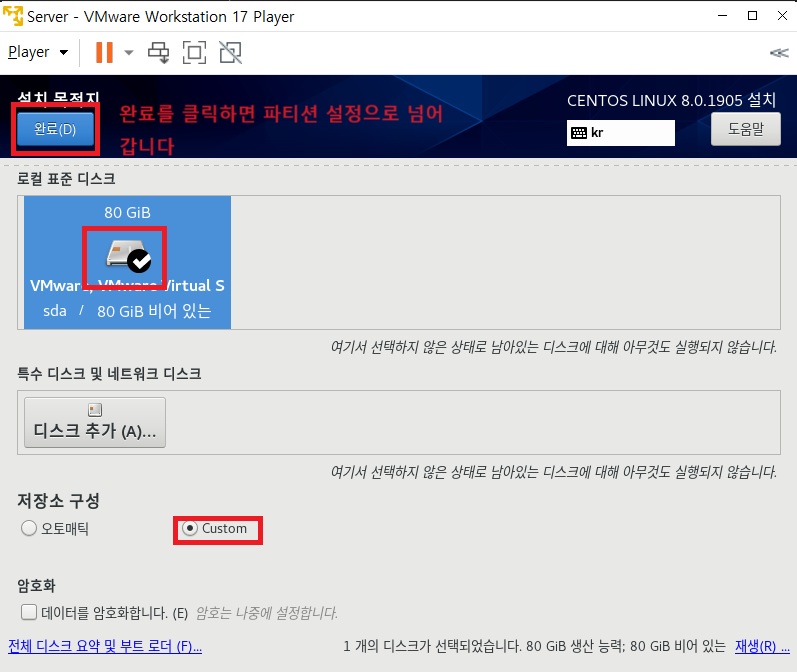   
    
   표준 파티션을 선택하고 + 버튼을 눌러 파티션을 추가합니다. 마운트 지점은 swap디렉토리를 선택하고 용량은 4G로 합니다. 80G중 4G를 임시 메모리 영역으로 사용하겠다는 뜻입니다.
   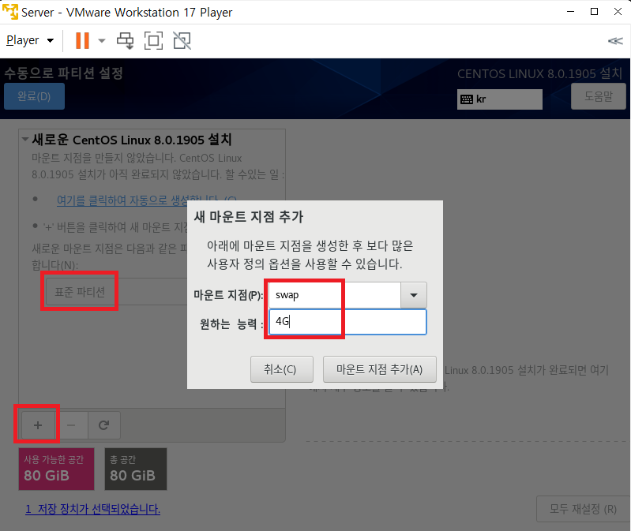   
    
   +를 선택해서 파티션을 추가합니다. 마운트 지점은 / (루트 파티션)을 선택하고 원하는 능력을 비워두면 앞에 4G를 뺀 나머지의 모든 용량이 할당 됩니다.   
   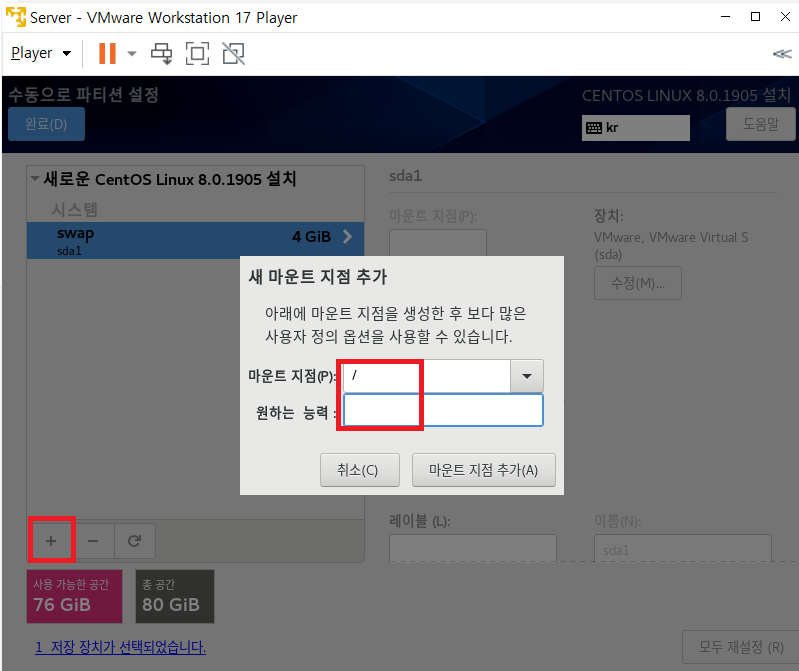   
    
   파티션 추가가 끝났으니 완료를 선택합니다.   
   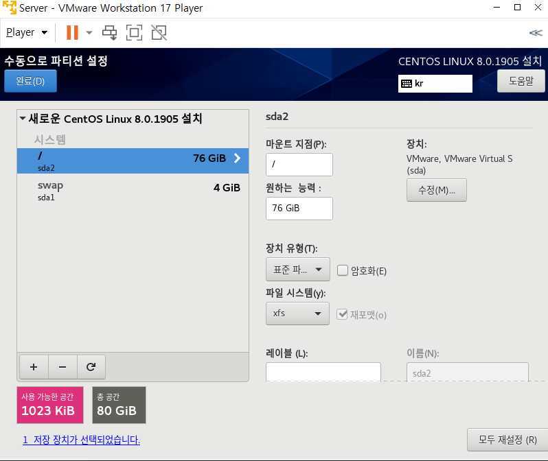  
    
   변경사항 적용을 선택합니다.
   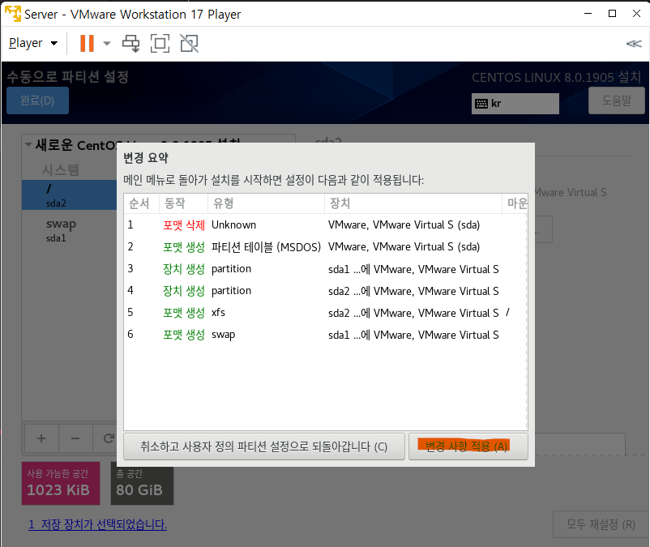  
     
   이후 설치 시작을 선택합니다.   
   설치 중에 Root암호를 클릭해서 암호를 설정합니다.   
   설치 중에 User Creation을 클랙해서 암호를 설정합니다.   
   설치가 끝났으면 재부팅을 해줍니다.
   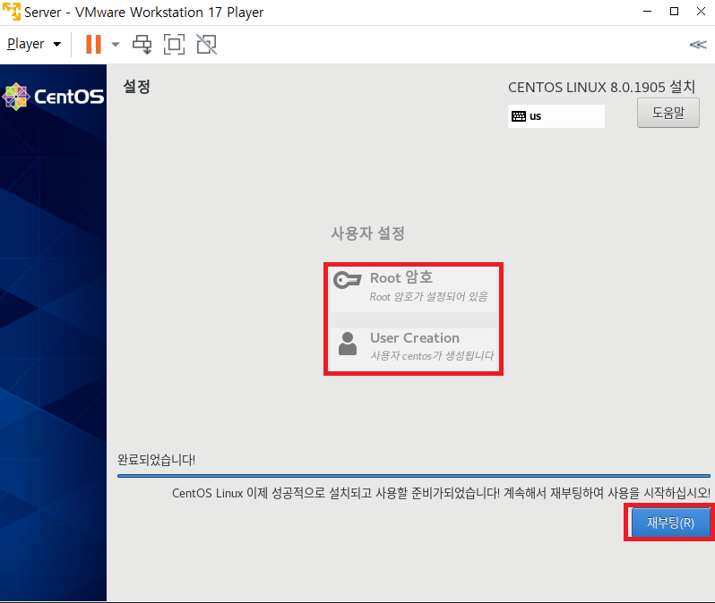   
    
   설정을 위해 root계정으로 로그인 합니다.   
   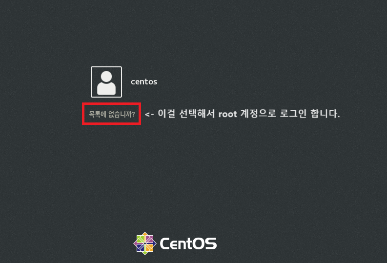   
    
   한국어(Hangul)을 선택합니다.   
   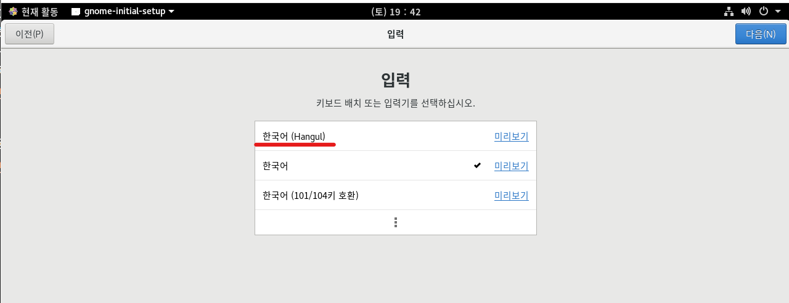   
   뒤엔 기본값으로 설정.   
    
  

   

