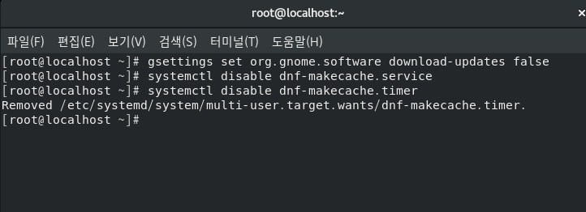
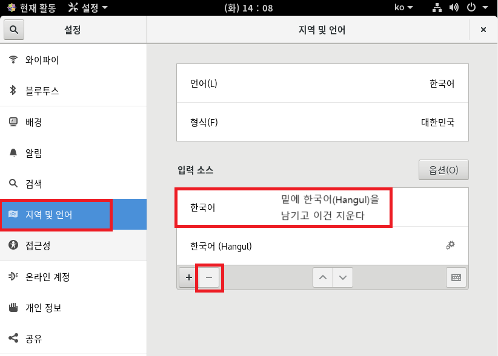
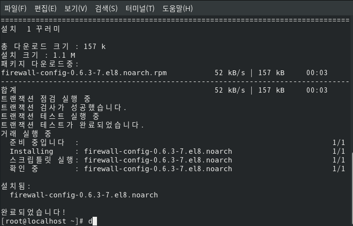

1. # 해상도
   설정 → 장치 → 디스플레이 → 해상도   
      
   화면 3대를 같이 띄워야하기 때문에 너무 높은 해상도가 아니라 적당한 1024x768로 설정   

1. # 자동 잠금
   자동 잠금 사용 안함
      
   설정 → 개인 정보 → 화면 잠금(오른쪽에) → 자동 화면 잠금 끄기   

1. # 자동 절전
   자동 절전 사용 안함   
      
   설정 → 전원 → 절전 → 빈화면 → 안 함   
  
1. # 자동 업데이트
   CentOS 자동 업데이트 사용 안함   
   gsettings set org.gnome.software download-updates false   
   systemctl disable dnf-makecache.service   
   systemctl disable dnf-makecache.timer   
      
   
1. # 소프트웨어 버전 고정
   소프트웨어(패키지)를 설치 시 현재 리눅스 버전의 패키지만 설치되도록 설정하는 작업   
   ```
      cd /etc/yum.repos.d/   
      mkdir backup   '←yum.repos.d에 있는 파일을 저자할 디렉토리'
      ls
      mv *.repo backup   '←.repo파일을 backup 디렉토리로 이동'
      gedit this.repo   '←this.repo 파일을 새로 생성'
   ```   
   <br>
   this.repo에 입력할 파일 내용   
   ```
      [BaseOS]
      name=CentOS-$releasever - Base
      baseurl=https://archive.kernel.org/centos-vault/8.0.1905/BaseOS/x86_64/os/
      	  http://linuxsoft.cern.ch/centos-vault/8.0.1905/BaseOS/x86_64/os/
      gpgcheck=0

      [AppStream]
      name=CentOS-$releasever - AppStream
      baseurl=https://archive.kernel.org/centos-vault/8.0.1905/AppStream/x86_64/os/
      	  http://linuxsoft.cern.ch/centos-vault/8.0.1905/AppStream/x86_64/os/
      gpgcheck=0

      [extras]
      name=CentOS-$releasever - Extras
      baseurl=https://archive.kernel.org/centos-vault/8.0.1905/extras/x86_64/os/
      	  http://linuxsoft.cern.ch/centos-vault/8.0.1905/extras/x86_64/os/
      gpgcheck=0

      [centosplus]
      name=CentOS-$releasever - Plus
      baseurl=https://archive.kernel.org/centos-vault/8.0.1905/centosplus/x86_64/os/
      	  http://linuxsoft.cern.ch/centos-vault/8.0.1905/centosplus/x86_64/os/
      gpgcheck=0

      [PowerTools]
      name=CentOS-$releasever - PowerTools
      baseurl=https://archive.kernel.org/centos-vault/8.0.1905/PowerTools/x86_64/os/
      	  http://linuxsoft.cern.ch/centos-vault/8.0.1905/PowerTools/x86_64/os/
      gpgcheck=0
   ```   
1. # 네트워크 고정IP로 설정
   ```
      [root@localhost ~]# cd /etc/sysconfig/network-scripts/
      [root@localhost network-scripts]# ls
      ifcfg-ens160   '←네트워크 하드 이름이 ens160이고 설정 내용이 ifcfg-ens160안에 들어있습니다' 
   ```   
   <br>
   ifcfg-ens160 파일 안에 내용
   ```
      [root@localhost network-scripts]# gedit ifcfg-ens160
      TYPE="Ethernet"
      PROXY_METHOD="none"
      BROWSER_ONLY="no"
      BOOTPROTO="dhcp"  '->dhcp를 none로 변경
      DEFROUTE="yes"
      IPV4_FAILURE_FATAL="no"
      IPV6INIT="yes"
      IPV6_AUTOCONF="yes"
      IPV6_DEFROUTE="yes"
      IPV6_FAILURE_FATAL="no"
      IPV6_ADDR_GEN_MODE="stable-privacy"
      NAME="ens160"
      UUID="8623d493-1714-4f0c-b2ee-ddab39aabfa6"
      DEVICE="ens160"
      ONBOOT="yes"
   ```   
   <br>
   dhcp를 none를 바꾸고 4줄 추가   
   ```
      TYPE="Ethernet"
      PROXY_METHOD="none"
      BROWSER_ONLY="no"

      BOOTPROTO="none"
      IPADDR="192.168.111.100"
      NETMASK="255.255.255.0"
      GATEWAY="192.168.111.2"
      DNS1="192.168.111.2"

      DEFROUTE="yes"
      IPV4_FAILURE_FATAL="no"
      IPV6INIT="yes"
      IPV6_AUTOCONF="yes"
      IPV6_DEFROUTE="yes"
      IPV6_FAILURE_FATAL="no"
      IPV6_ADDR_GEN_MODE="stable-privacy"
      NAME="ens160"
      UUID="8623d493-1714-4f0c-b2ee-ddab39aabfa6"
      DEVICE="ens160"
      ONBOOT="yes"
   ```
   설정 변경 후 적용하기 위해서 다음 명령어 입력 후 재부팅
   ```
      nmcli connection down 장치이름    → 네트워크 장치 중지(내 장치는 ens160)   
      nmcli connection up 장치이름    →네트워크 장치 시작
      reboot →재시작
   ```   
   <br>
   ens160의 고정 아이피 주소값 ifconfig /all   
   192.168.111.100 이 나오면 잘 된겁니다.   
       

1. # 보안 설정 끄기
   SELinux에 설정된 보안 정보 끄기
   ```
      [centos@localhost ~]$ gedit /etc/sysconfig/selinux

      # This file controls the state of SELinux on the system.
      # SELINUX= can take one of these three values:
      #     enforcing - SELinux security policy is enforced.
      #     permissive - SELinux prints warnings instead of enforcing.
      #     disabled - No SELinux policy is loaded.
      SELINUX=enforcing   'enforcing을 disabled로 변경'
      # SELINUXTYPE= can take one of these three values:
      #     targeted - Targeted processes are protected,
      #     minimum - Modification of targeted policy. Only selected processes are protected. 
      #     mls - Multi Level Security protection.
      SELINUXTYPE=targeted
   ```
   SELINUX=disabled 로 변경합니다.

   1. # 한글 설정
      
      한영 바꾸기 : 왼쪽shift + space

   1. # 설정에서 해상도가 안 바껴서 직접 파일로 적용
      ```
         [root@localhost ~]# gedit /etc/grub.d/10_linux
      ```   
         

      169행 ${args}뒤에 vga=773을 추가 합니다. 773이 1024x768 해상도를 의미합니다.   
        
     <br> 
      수정한 내용 적용하기   
      ```
         [root@localhost ~]# grub2-mkconfig -o /boot/grub2/grub.cfg
      ```   

         
      다음과 같이 done이 나오면 정상 적용.   

1. # 방화벽 기능 설치
   ```
      [root@localhost ~]# dnf -y install firewall-config
   ```   

      

1. # GNOME 업데이트 기능 끄기
       
   
       