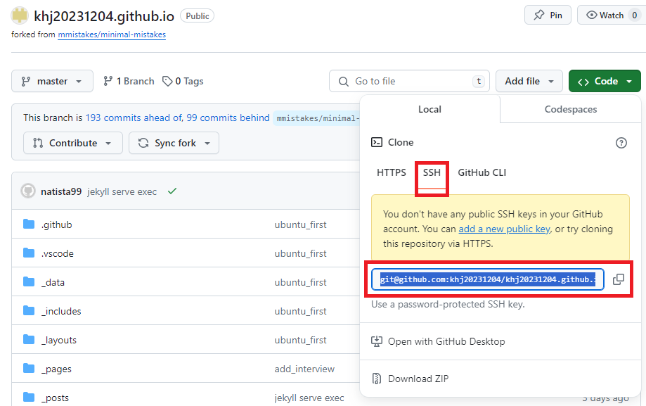

1. # git status
   현재 작업 트리의 상태를 확인

1. # git log
   커밋 히스토리 조회하기

1. # 최초 연결
   repository를 새로 생성한 경우   
   
   1.   
   ```s
      git init 
   ```
   명령어를 실행한 디렉토리에 .git 디렉토리 생성   

   2.   
   ```s
      git config --list 
   ```
   user.name과 user.email이 있는지 확인. 없는 경우   
   ```s
      git cofing --global user.name "KimHJ"
      git config --global user.email "natista99@gmail.com"
   ```
   앞으로 커밋을 할 때마다 사용하게될 user name과 emial입니다.   
 
   3.   
   ```s
      git remote add origin git@github.com:khj20231204/khj20231204.github.io.git
   ```   
   origin 설정. push할 때 연결될 github 주소를 설정합니다.   
      
   주소 확인 방법   
   *Support for password authentication was removed on August 13, 2021.   
   2021년 8월 이후 패스워드 인증 지원이 종료되었기 때문에 http가 아니라 ssh로 origin을 설정해 줘야 합니다.   

   4.   
   ```s
      git branch -M master
   ```   
   github에 push할 branch 설정   
   *2020년 6월 인종차별과 주종 관계의 의미를 담은 용어를 제거하는 취지에서 __기본 브랜치가 master에서 main__ 으로 변경되었습니다. 하지만 git init를 하면 기본으로 설정되는 브랜치가 mater입니다. 그렇기 때문에 git branch -M main 명령으로 branch를 main으로 바꿔줘야합니다. 
   
   5. 
   ```s
      git pull origin master
   ```
   github에 파일이 있는 경우 pull을 가장 먼저 한 후에 add → commit → push 를 한다

   6.   
   ```s
      git add . #.(점)은 전체 파일이란 뜻 - local staing area   
      git commit -m "first commit"   #local repository area
      git push -u origin main   # origin을 main으로 설정 
   ```   

1. # origin
   2. ## origin 확인
      ```s
         git remote -v
      ```   
      origin  git@github.com:khj20231204/khj20231204.github.io.git (fetch)
      origin  git@github.com:khj20231204/khj20231204.github.io.git (push)

   2. ## origin 삭제   
      ```s
         git remote rm origin
      ```   

   2. ## add한 파일 취소하기
      reset명령어를 이용하면 됩니다. reset명령은 add를 해서 staging area에 있는 파일을 다시 working directory로 옮기는 역할을 합니다.   
      ```s
         git reset README.md
      ```   

1. # branch
   2. ## branch 목록확인   
   ```s
      git branch 
   ```   

   2. ## branch 생성   
   second란 이름의 branch 생성   
   ```s
      git branch second
   ```   

   2. ## branch이동   
   새로 생성한 second branch 옮기기   
   ```s
      git checkout second
   ```   

1. # git 그래프로 확인하기
   ```s
      git log --graph
   ```   

1. # git master브랜치와 second브랜치 병합하기
   병합시 현재 위치한 브랜치에서 다른 브랜치를 가지고옵니다. master브랜치로 second브랜치를 병합하기 위해선 master브랜치로 먼저 이동해야됩니다.
   ```s
      git checkout master
      git merge second
   ```   

