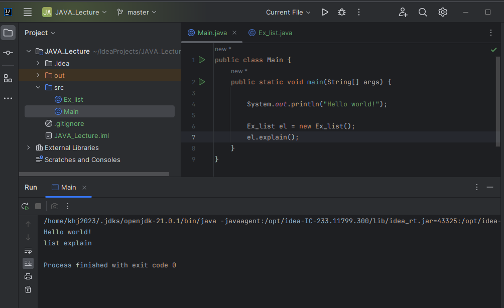
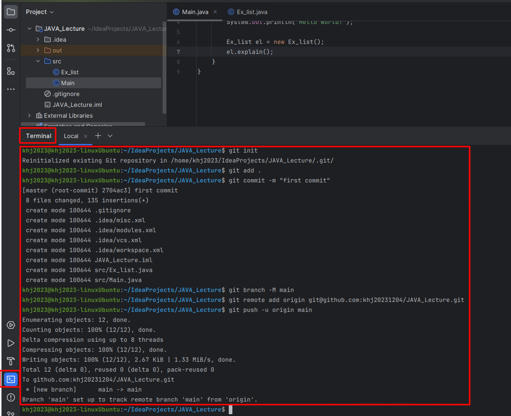
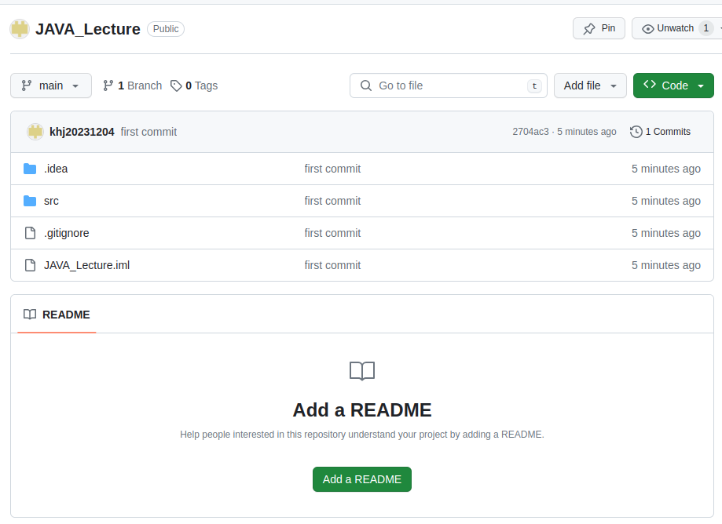

1. # IJ에서 프로젝트 생성
   JAVA_Lecture란 프로젝트를 생성합니다.
       

1. # github에 저장소 생성
   github에 소스를 저장할 JAVA_Lecture란 저장소를 생성합니다.
      

1. # 명령어 입력
   IJ의 터미널로 이동 후 명령어를 입력합니다.
   ```s
      git init
      git add . #전체파일 add .(점)으로 표시 - local staing area
      git commit -m "first commit"   #local repository area
      git branch -M main   # 깃허브 branch 생성
      git remote add origin git@github.com:khj20231204/JAVA_Lecture.git
      git push -u origin main
   ```   
   *주의 할 점은 __commit 이 후 branch를 생성__ 하는 것과 HTTPS 주소가 아니라 __SSH 주소__ 여야 합니다.   

      

1. # 결과 화면
   깃에 정상적으로 업로드가 되었습니다.   
      

