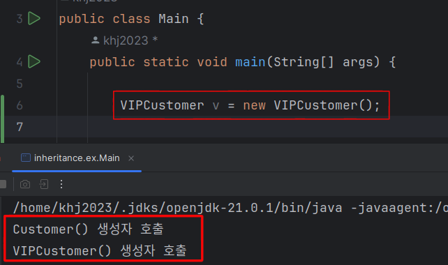

1. # 상속
   기존에 설계되어 있던 클래스에 속성이나 기능 등을 확장하기 위하여 재사용성을 높이고 코드의 중복을 제거하기 위한 방법입니다.    

   기존의 클래스 : __상속하는 클래스__ , 상위 클래스 , 부모 클래스, super class, base class    
   새로운 클래스 : __상속받는 클래스__ , 하위 클래스, 자식 클래스, derived class   

   구현 형태는 다음과 같습니다.   
   ```java
      class Child extends Parent{
      ...
   ```   
   extends 뒤에 오는 클래스는 단 하나의 클래스만 올 수 있습니다.   
   여러개의 클래스가 올 경우 모호성이 발생할 수 있기 때문에 하나의 클래스로 제한을 했습니다. 단 인터페이스는 다중 상속이 가능합니다.   

1. # 접근 제한자와 상속
   -private는 상속이 되지않습니다.
   ```java
      public class Customer {

         private String id; // ☜ private로 선언
         public double bonus;
      } 

      public class VIPCustomer extends Customer{

         public VIPCustomer(){
            this.bonus;
            //this.id  ☜ 나타나지 않음
         }
      }
   ```   
   private 접근 제한자를 사용할 경우 상속받은 클래스에서 접근이 제한됩니다. VIPCustomer클래스에서 this 연산자로 접근가능한 변수는 bonus만 허용이 됩니다.   
   상속을 하는 경우 접근을 완전 막는 private 대신 외부 클래스에선 접근할 수 없지만, 하위 클래스는 접근 할 수 있는 protected를 사용하면 됩니다.   
   ```java
      protected String id;
   ```   
   부모 클래스와 자식 클래스가 다른 패키지에 존재한다면 default 접근 제한를 갖는 필드와 메소드도 상속 대상에서 제외됩니다.   

1. # 부모 클래스의 생성자 값이 상속받은 자식 클래스에 적용
   ```java

   public class Customer {  //☜ 부모 클래스

      public String grade;

      public Customer(){
         this.grade = "SILVER";
      }
   }

   public class VIPCustomer extends Customer{  //☜ 자식 클래스

      public VIPCustomer(){
         System.out.printf("VIPCustomer의 grade:"+this.grade);
      }
   }

   결과: VIPCustomer의 grade:SILVER
   ```   
   부모 클래스의 생성자에서 선언한 값이 자식 클래스에 그대로 반영이 됩니다.   

1. # 상속시 클래스 실행 순서
   자식 클래스를 실행하면 부모 클래스가 먼저 호출 됩니다.   
   그렇기 때문에 부모 클래스 생성자에서 설정한 값을 자식 클래스에서 사용 가능합니다.   
   ```java
   class Customer{
      public Customer() {
            customerGrade = "SILVER";
            bonusRatio = 0.01;
            
            System.out.println("Customer() 생성자 호출");
      }
   }

   class VIPCustomer extends Customer{
      public VIPCustomer() {
            customerGrade = "VIP";
            bonusRatio = 0.05;
            
            System.out.println("VIPCustomer() 생성자 호출");
      }
   }
   ```   
       
   main에서 VIPCustomer vip = new VIPCustomer(); 를 호출하면   
   Customer() 생성자 호출
   VIPCustomer() 생성자 호출   
   이 실행됩니다.   
   상속을 받은 경우 소스코드에는 명시되어 있지 않지만
   ```java
      public VIPCustomer() {
            super();  //☜ 컴파일러가 입력
            customerGrade = "VIP";
            bonusRatio = 0.05;
            
            System.out.println("VIPCustomer() 생성자 호출");
      }
   ```   
   super()란 키워드를 입력해 놓습니다.

1. # 상속에서 super()
   상속을 받은 자식 클래스에선 무조건 super()를 호출 해야합니다. 만약 명시적으로 super()를 적지않으면 컴파일러가 대신 작성을 합니다.   
   ```java
      class VIPCustomer extends Customer{
         public VIPCustomer() {
               super(); // 컴파일러가 삽입
         }
   ```   
   이렇게 암묵적으로 super()를 사용하기 위해서는 부모 클래스에 public의 기본 생성자가 존재해야합니다.
   ```java
      class Customer{
         public Customer(){  // 기본 생성자
            ...
         }
      }
   ```   
   부모 클래스에 생성자가 오버로딩되어 기본 생성자가 없으면 에러가 발생합니다
   ```java
      class Customer{
         public Customer(String str){  // 기본 생성자가 없음
            ...
         }
      }
   ```   
   이런 경우 부모 클래스에 기본 생성자를 만들어주거나 
     ```java
      class Customer{

         public Customer(){ // 기본 생성자를 만듦
            ..
         }

         public Customer(String str){ 
            ...
         }
      }
   ``` 
   
   같은 형태의 생성자로 자식 클래스에서 똑같이 사용하면 됩니다.   
    ```java
      class VIPCustomer extends Customer{
         public VIPCustomer(String str) {
               super(str); // super를 명시적으로 삽입
         }
   ```   
   만약 부모 클래스가 다른 패키지이면서 생성자의 접근 제한자가 default나 private이면 error가 발생합니다.   
   ```java
      //------------------ A패키지 ------------------
      public class Parents {

         Parents(){
            System.out.println("parents defalut");
         }

         public Parents(int i){
            System.out.println("parents public");
         }

         protected Parents(String str){
            System.out.println("parents protected");
         }

         private Parents(int i, String str){
            System.out.println("parents private");
         }
      }

      //------------------ B패키지 ------------------
      class Child extends Parents {

         public Child(){
            //super();  ☜ 부모생성자 - default ,error 발생 
         }

         public Child(int i) {
            super(i);  // 부모생성자 - public
         }

         public Child(String str){
            super(str);  // 부모생성자 - protected
         }

         public Child(int i, String str){
            //super(i, str);  ☜ 부모생성자 - private ,error 발생 
         }
      }
   ```   
   이 경우, 부모 클래스에 기본 생성자를 public이나 protected로 생성하거나, 자식 클래스가 부모 클래스에서 public인 생성자를 사용하면 됩니다.   
   ```java
      public class Parents {

         pubilc Parents(){  //public을 사용
            System.out.println("parents defalut");
         }
      }

      //또는
       class Child extends Parents {

         public Child(){
            super(3);  //☜ 부모 생성자  public Child(int i) 사용
         }
       }
   ```

   super()는 __반드시 자식 생성자 첫 줄__ 에 위치해야 합니다.   

   super() 이용해서 부모 클래스 값에 접근 할 수 있습니다.   
   ```java
      super.bonusPoint;
      super.name;
      super.id;
   ```   
   super.bonusPoint와 super.name과 super.id는 부모 클래스에 존재하는 값들입니다.   

1. # 오버로딩 : new   
   - 오버로딩   
   다양한 데이터를 이용해서 처리하기 위해 한 클래스 내에 생성자나 메소드의 __매개변수 타입__ 을 달리하여 새로운 생성자나 메소드를 생성하는 것을 말합니다.   
   ```java
      class A{

         //생성자 오버로딩
         A(){
            ...
         }

         A(int i){  //생성자 오버로딩
            ...
         }

         A(int i, int j){  //생성자 오버로딩
            ...
         }

         A(String str){  //생성자 오버로딩
            ...
         }

         //메소드 오버로딩
         int plus(int i, int j){  //메소드 오버로딩
            ...
         }

         double plus(double i, double j){  //메소드 오버로딩
            ...
         }
      }
   ```   

   - 주의   
   매개변수 인자 이름만 변경하는 경우는 오버로딩이 아닙니다.   
   ```java
      A(int i){  //매개변수 인자 이름이 i
            ...
      }

      A(int j){  //매개변수 인자 이름이 j ☞ 오버로딩이 아님, error 발생
            ...
      }
   ```   
   리턴 타입만 다른 경우 오버로딩이 아닙니다.   
   ```java
      int plus(int i, int j){  
            ...
      }

      double plus(int a, int b){  // 리턴 타입만 int에서 doubld로 변경 ☞ 오버로딩이 아님, error 발생
            ...
      }
   ```   

   *오버로딩 4글자 = 매개변수 4글자   

1. # 오버라이딩 : modify   
   - 오버라이딩   
   상속을 받은 경우 기존의 부모 메소드와 일치하는 외형을 가지지만 내용만 다르게 해서 부모 클래스에 있는 메소드를 자식 클래스에서 수정한 것을 말합니다. 자식 클래스의 메소드는 부모 메소드와 다음 3가지가 같아야합니다.   
   1.이름   
   2.매개변수   
   3.반환타입   

   ```java
      class A{

         void A_method(){

         }

         String A_method2(int i){

         }
      }

      class B extends A{

         void A_method(){  //부모 메소드와 이름, 매개변수, 반환타입이 일치해야 합니다.

         }

         String A_method2(int i){  //부모 메소드와 이름, 매개변수, 반환타입이 일치해야 합니다.

         }
      }
   ```   

   - 주의   
   1. 접근 제어자는 조상 클래스의 메소드보다 좁은 범위로 설정할 수 없다.   
   public > protected > default > private 순서입니다.   
   1. 조상 클래스의 메소드보다 많은 수의 예외를 선언할 수 없다.   

   *오버ㄹ __ㅏ__ 이딩 = ㅅ __ㅏ__ ㅇ 속   

1. # 다중 상속 시 문제점
   다중 상속을 하게되면 모호성의 문제가 발생합니다. 여러 부모 클래스에서 오버라이딩된 메소드를 자식 클래스에서 어떤 메소드를 사용하게 되는지 선택해야 하는 문제가 발생합니다. C++같은 경우는 이를 선택하는 방법이 있어 다중 상속이 가능하지만 초기 자바는 안전성을 우선으로 선택하여 만들었기 때문에 애초에 이런 모호성의 문제를 없애고 개발이 되었습니다.   

   예를 들면,   

   부모 클래스 GodFaterClass - 여기에 포함됨 a 메소드   

   이를 상속 받은 FaterClass1 - 오버라이딩한 a메소드, FaterClass2 - 오버라이딩한 a메소드   

   FaterClass1과 FaterClass2를 상속 받은 자식 ChildClass 생성.   

   GodFaterClass   
   &nbsp;&nbsp;&nbsp;&nbsp;&nbsp;&nbsp;&nbsp;&nbsp;&nbsp;&nbsp;↑   
   FC1&nbsp;&nbsp;&nbsp;&nbsp;&nbsp;FC2   
   &nbsp;&nbsp;&nbsp;&nbsp;&nbsp;&nbsp;&nbsp;&nbsp;&nbsp;&nbsp;↑   
   ChildClass   

   이 경우 ChildClass는 FC1과 FC2 중 어떤 부모클래스의 a메소드를 사용할지 선택해야 됩니다.   
   자바는 애초부터 이런 모호성을 없애되록 설계되었습니다.   
