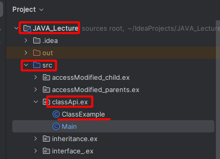

1. # Class 클래스
   자바의 모든 클래스와 인터페이스는 컴파일 후 class파일이 생성됩니다. Class 클래스는 이 파일에 대한 정보를 가져올 수 있습니다.   

1. # Class 객체 얻기   

   __클래스로부터 얻기__   
   ```java
      Class cla = 클래스이름.class
      Class cla = Class.forName("패키지..클래스 이름")
   ```   

   __객체로부터 얻기__   
   ```java
      Class cla = 참조변수.getClass();
   ```

1. # 클래스 가져오기
   ```java
      //ClassExample클래스
      public class ClassExample {

         //생성자 3개
         public ClassExample(){System.out.println("basic construct");}
         public ClassExample(int i){System.out.println("int construct");}
         public ClassExample(String s){System.out.println("string construct");}

         //메소드 3개
         public void ex1(){System.out.println("ex1");}
         public void ex2(int i){System.out.println("ex2");}
         public void ex3(String s){System.out.println("ex3");}
      }

      //Main
      public static void main(String[] args) throws ClassNotFoundException {

         Class forname_val2 = Class.forName("classApi.ex.ClassExample");
         Class class_val2 = ClassExample.class;
         ClassExample ce = new ClassExample();
         Class getClass_val2 = ce.getClass();

         String result2 =
            " forname_val2:" + forname_val2 +
            ", \n class_val2:" + class_val2 +
            ", \n getClass_val2:" + getClass_val2;

         System.out.println(result2);
         

         출력 결과:
         forname_val2:class classApi.ex.ClassExample, 
         class_val2:class classApi.ex.ClassExample, 
         getClass_val2:class classApi.ex.ClassExample
      }
   ```   
   클래스 자체를 가져올 수 있습니다.
   클래스 위치   
   Class.forName("classApi.ex.ClassExample")안에 들어갈 위치는 다음과 같습니다.   
       
    src내부부터 경로를 설정하면 됩니다.   

1. # 생성자 가져오기
   ```java
      Constructor[] cons = forname_val2.getConstructors();
        for(Constructor c :  cons){
            System.out.println(c);
        }

      출력 결과:
      public classApi.ex.ClassExample(java.lang.String)
      public classApi.ex.ClassExample(int)
      public classApi.ex.ClassExample()   
   ```

1. # 메소드 가져오기
   ```java
      Method[] mth = forname_val2.getMethods();  //메소드
         for(Method m : mth){
            System.out.println(m);
         }   


      출력 결과:
      public void classApi.ex.ClassExample.ex1()
      public void classApi.ex.ClassExample.ex2(int)
      public void classApi.ex.ClassExample.ex3(java.lang.String)
      public boolean java.lang.Object.equals(java.lang.Object)
      public java.lang.String java.lang.Object.toString()
      public native int java.lang.Object.hashCode()
      public final native java.lang.Class java.lang.Object.getClass()
      public final native void java.lang.Object.notify()
      public final native void java.lang.Object.notifyAll()
      public final void java.lang.Object.wait(long) throws java.lang.InterruptedException
      public final void java.lang.Object.wait(long,int) throws java.lang.InterruptedException
      public final void java.lang.Object.wait() throws java.lang.InterruptedException
   ```   
   ex1, ex2, ex3 뿐만 아니라 상속받은 모든 메소드들이 출력 됩니다.   


1. # 오버라이딩 생성자 값으로 가져오기
   ```java
      //create instacne for basic construct
      Class makeClass1 = Class.forName("classApi.ex.ClassExample");
      ClassExample makeObj1 = (ClassExample) makeClass1.newInstance();

      //create instacne for string construct
      Class makeClass3 = Class.forName("classApi.ex.ClassExample");
      Constructor con3 = makeClass3.getDeclaredConstructor(new Class[]{String.class});
      ClassExample makeObj3 = (ClassExample)con3.newInstance("String Parameter");
   ```