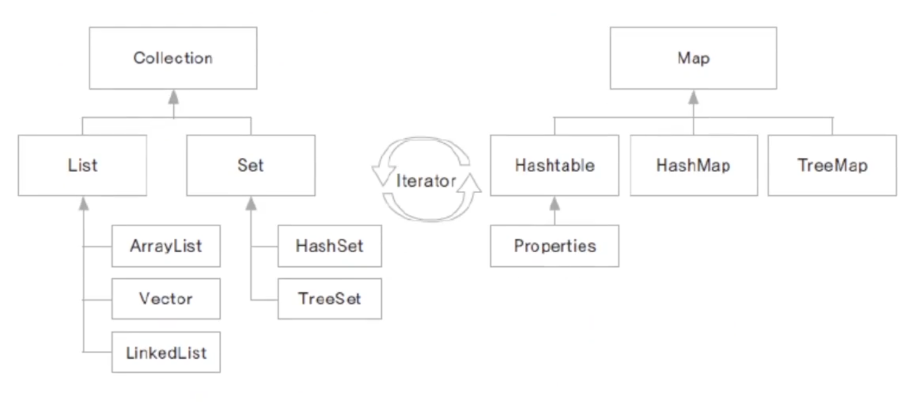

1. # 컬렉션 프레임워크
   java.util에 구현되어있는 JDK라이브러리에 있는 자료구조들입니다. 컬렉션은 객체의 저장을 뜻하고, 프레임워크는 사용 방법을 정해놓은 라이브러리 입니다. java.doc에는 굉장히 많은 라이브러리가 있지만 대표적으로 collection과 Map이 있습니다.   

      
   
   List : 배열과 비슷하게 객체를 인덱스로 관리합니다. 배열과 차이점은 저장용량이 자동으로 증가합니다. 중복을 허용하며 순서가 있습니다.   

   Set : 수학의 집합과 같으며 중복을 허용하지 않고, 순서도 없습니다. 입력한 순서와 출력한 순서가 다릅니다. 인덱스로 접근을 할 수 없기 때문에 iterator를 생성해서 접근해야 합니다. 유일한 값(주민번호, 아이디, 사번 등)을 관리하는데 사용이 용이합니다.   

   Map : Key-Value로 이루어진 쌍으로 데이터를 관리하게 됩니다. 키는 중복 저장될 수 없지만, 값은 중복이 가능합니다. Set과 마찬가지로 iterator를 생성해서 값을 가져옵니다.    

1. # 컬렉션의 메소드들
   Collection 인터페이스에서 상속받아 List와 Set에서 공통으로 제공되는 메소드들.   
   *매개변수와 리턴값을 다를 수 있지만, 기능과 이름이 공통.   
   
   - ## 추가   
   boolean add(Object o) : 객체들 추가   
   boolean addAll(Collection C) : Collection 객체 추가   

   - ## 삭제
   void clear : 모든 객체 삭제   
   boolean remove(Object o) : 지정된 객체 삭제   
   boolean removeAll(Collection c) : 지정된 Collection에 포함된 객체들 삭제   

   - ## 조회   
   boolean contains(Object o) : 객체들이 Collection에 포함되어 있는지 확인   
   boolean equals(Object o) : 동일한 Collection인지 비교   
   boolean isEmpty() : Collection이 비어있는지 확인   
   int size() : Collection에 저장된 객체 개수 반환   

   => add, remove, contains, isEmpty, size

