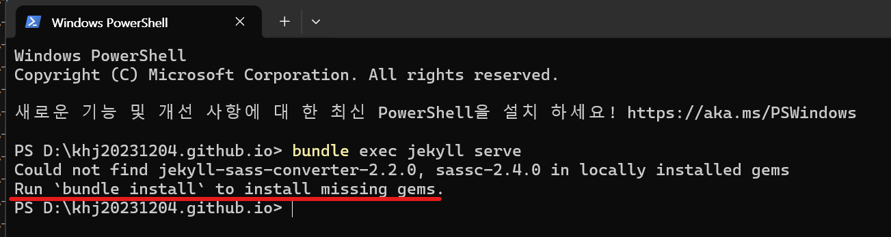

1. # Windows와 Ubuntu에서 jekyll동시 실행
   윈도우와 우분투에서 DATA에 khj20231204.github.io 폴더를 두고 2군데에서 접근하여 동시에 jekyll을 실행 못 함
   우분투에서 bundle install을 하고나서 윈도우에서 서버를 실행하려면   
      
   다음과 같이 윈도우에서 새로 bundle install을 해야한다.   

   그래서,

   윈도우와 우분투에서 디렉토리를 각각 따로 두고 블로그 수정 시 먼저 __PULL__ 을 하고 나서 블로그를 수정한다.   
   윈도우는 C드라이브에 khj20231204.github.io를 두고 우분투에서는 MyWork란 디렉토리에 khj20231204.github.io를 두고 각각의 디렉토리 안에서 jekyll 서버를 실행하면 된다.   