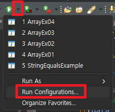
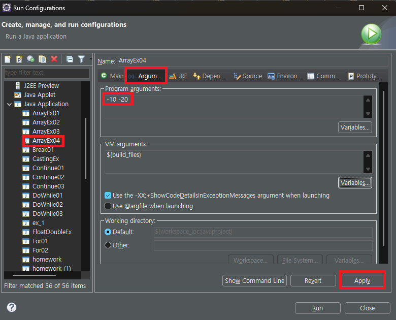
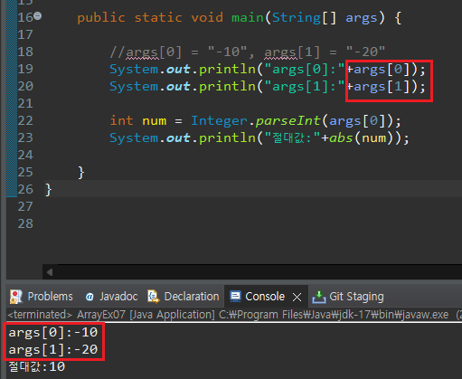

1. # 1차원 배열

   2. new 연산자로 배열 생성   
   배열에 저장될 값이 정해져 있지 않는 경우에 주로 사용하는 형식   
   ```
      int[] score = new int[3];
   ```   
   heap영역에 공간이 만들어지며 int형은 '0'으로 자동 초기화   

   __new연산자__ 로 배열을 생성하면 heap메모리 영역에 새로운 공간을 할당 받으면서 배열의 원소들은 __자동으로 초기화__ 된다.   

   int형은 '0'으로 초기화.   
   double형은 0.0으로 초기화.   
   boolean형은 false로 초기화.   

   2. 값 목록으로 배열 생성   
   배열에 저장될 값이 정해져 있는 경우에 주로 사용하는 형식. 배열 선언과 동시에 초기화를 수행   
   ```
      int[] score = {80, 90, 100};
      int[] score = new int[]{80, 90, 100};

      double[] d = {3.14, 10.5, 42.194};

      String[] str = {"java", "jsp", "oracle"};
      String[] str = new String[]{"java", "jsp", "oracle"};
   ```   

1. # 변수 초기화 오류
   ```java   
      int num; //초기화 하지 않으면
      //int num = 0;
      
		for(int i=0 ; i<3 ; i++) {
			num += 2; //여기서 에러 발생
		}
   ```   
   변수는 초기화를 꼭 해줘야 한다.

1. # 배열 선언과 할당
   ```java
      int[] scores; //여기는 주소를 할당 받지 못한 상태. 선언만 한 상태
		scores = new int[]{83, 90, 87}; //여기서는 주소값을 할당받은 상태. 주소값은 new연산자를 사용하던지 초기화를 할 때 사용됨
		
		//int[] scores = new int[4]; 힙 영역에 공간을 할당 받은 상태
		//int[] scores = {83, 90, 87}; 힙 영역에 공간을 할당 받은 상태
		
      public static int add(int[] scores) { //매개변수 int[] scores는 현재 아무런 주소도 갖지 못하고 있는 상태. 현재는 value값
         ...
      }
   ```   

1. # 향상된 for문
   for(변수 : 순차적인 자료구조(배열, 컬렉션)){
      반복 실행할 문장;
   }

1. # main에 매개변수 args에 값전달하기
   실행하기 전에 컴파일을 한번 시켜줘야 한다.   

   상단 실행 버튼 옆에 아랫쪽을 가리키는 화살표를 누르면 Run Configurations..를 선택합니다.   
      

   왼쪽 Java Application에서 실행파일을 선택하고, Arguments에서 입력한 값을 넣습니다.   
      

      

1. # 문자열을 숫자로 변경
   ```java
      int num = Integer.parseInt("10");
   ```   

1. # 배열 복사
   ```java
      int[] oldArray = {87,45,92};
		int[] newArray = new int[5]; 
		
		for(int i=0 ; i<oldArray.length ; i++) {
			newArray[i] = oldArray[i]; 
         //작은 크기 배열을 큰 크기 배열에 저장은 가능, 범위를 넘어서는 나머지 영역은 0으로 초기화 
			//oldArray[i] = newArray[i]; //큰 배열을 작은 배열에 저장하면 에러 발생 
		}
   ```   
   

