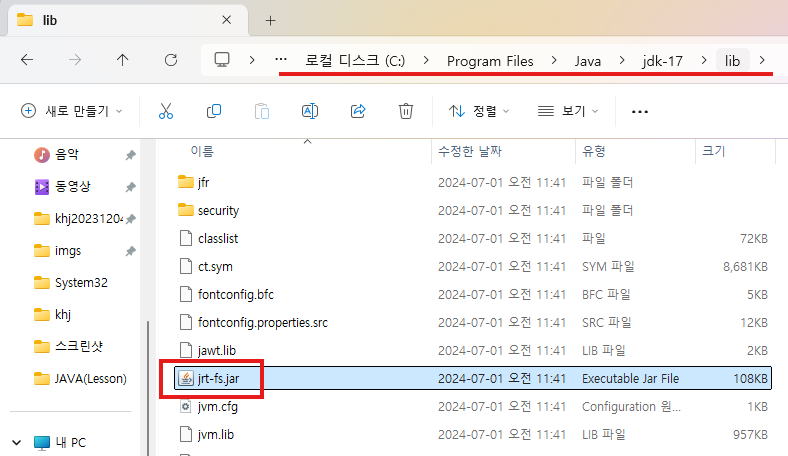

1. # 접근 제한자

   |   접근제한자 | 자신의 클래스|같은 패키지 | 하위 클래스| 다른 패키지| 
   |:-----------:|:-----------:|:---------:|:---------:|:---------:|
   |    private  |      O      |     X     |     X     |     X     |
   |생략(default)|      O      |     O     |     X     |     X     |
   |  protected  |      O      |     O     |     O     |     X     |
   |    public   |      O      |     O     |     O     |     O     |

1. # 메소드 오버로딩
   클래스 내에 같은 이름의 메소드를 여러 개 선언한는 것   

1. # 매개변수를 배열로
   ```JAVA
      //매개변수로 전달받은 값을 배열로 받아서 처리
      int sum2(int ...values) {
         int sum = 0;
         for(int i=0 ; i<values.length ; i++) {
            sum += values[i];
         }
         
         return sum;
      }

		int result2 = mycom.sum2(new int[] {1,2,3,4,5});
		System.out.println("result2:"+result2);
		
		int result3 = mycom.sum2(1,2,3,4,5);
		System.out.println("result3:"+result3);
   ```   
   
1. # 메소드 호출
   같은 클래스 안에 메소드 끼리는 객체를 생성하지 않고도 호출 가능.   

1. # 정적 멤버

   정적 멤버 = 정적 필드 + 정적 메소드   
   객체를 생성하지 않고 사용할 수 있는 필드와 메소드   

   static이 붙어 있는 필드 - 정적 필드   
   static이 붙어 있는 메소드 - 정적 메소드   

   자동으로 초기화   
   ```java
      int a = 0;
      double b = 0.0;
      bollean c = false;
   ```
   
   공유를 목적으로 누구나 쉽게 접근을 할 수 있게 만들 경우 사용   
   객체 생성없이 클래스명으로 직접 접근   

   정적 필드와 정적 메소드는 heap영역에 저장되지 않고, 메소드 영역(공유영역)에 저장   
   메모리 상에 계속 상주   

   ```java   
      //정적 필드
      static 타입 필드 [= 초기값];

      //정적 메소드
      static 리턴타입 메소드(매개변수선언, ...)
   ```   

   1. 정적 메소드에서는 this 레퍼런스 변수를 사용할 수 없다.   
   1. 정적 메소드에서는 일반적인 변수를 사용할 수 없다.   
   1. 정적 메소드에서는 정적 멤버 변수만 사용할 수 있다.   
   1. 정적 메소드는 메소드 오버라이딩 되지 않는다.   

   ```java
      Math m = new Math(); //error. Math는 정적 메소드로만 제공. 객체를 생성하지 않는다
      int r = Math.random();
	```

1. # jre파일 위치
      

1. # 싱글톤
   객체 생성을 한번만 수행하는 것   

   ```java
      class Singleton{
         //싱클톤(singleton) : 객체 생성을 한번만 수행하는 것.
         private static Singleton s = new Singleton(); //정적 필드
         //private:외부에서 막고, static:공유를 하기 위해 사용 - 모순 발생
         //누구나 쉽게 접근할 수는 있지만 외부에서 접근을 1번만 할 수 있다
         
         public static Singleton getInstance() { //정적 메소드, 리턴 타입이 클래스인 경우 return은 객체
            return s;
         }
      }
   ```

1. # 패키지 : java api 클래스
   관련 있는 클래스를 묶어 놓은 폴더   

   java.lang 패키지 : 기본 패키지   
   -자바에서 가장 사용 빈도가 높은 클래스를 묶어 놓은 패키지
   ex)java.lang.String   
   java.lang.System   
   java.lang.Integer   

   기본 패키지(java.lang)외의 패키지의 클래스는 import하고 사용 해야 한다.   

   1. 같은 패키지 안에 들어 있는 클래스   
   1)같은 패키지 안에 들어 있는 클래스에 접근 하기 위해서는 접근 제어가 public이나 default 접근 제어자로 되어 있어야 한다.   
   2)같은 패키지 안에 들어 있는 클래스에 접근 하기 위해서는 import를 하지 않아도 된다.   
   
   1. 다른 패키지 안에 들어 있는 클래스   
   1)다른 패키지 안에 들어 있는 클래스에 접근 하기 위해서는 접근 제어가 public 접근 제어자로 되어 있어야 한다.   
   2)다르 패키지 안에 들어 있는 클래스에 접근 하기 우해서는 해당 클래스를 import를 해야 된다.   

   class - default, public   
   default : 다른 패키지 허용 X   
   public : 다른 패키지 허용 O   


