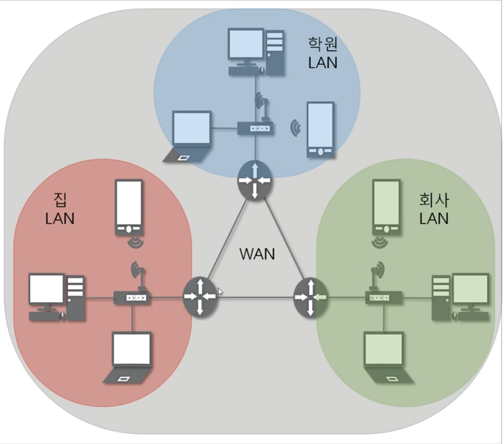
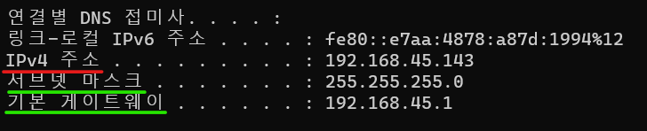
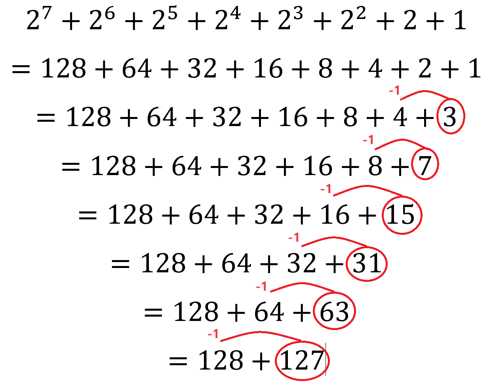
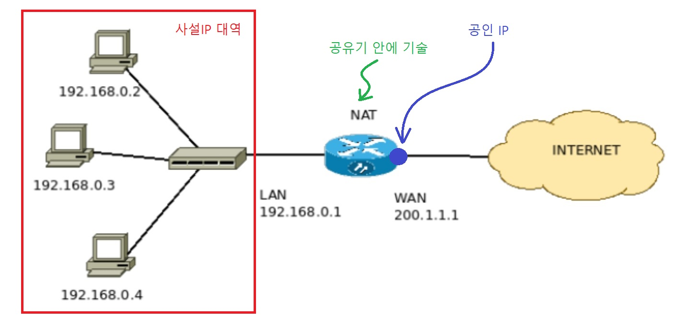

1. # 3계층의 기능
   - 멀리 떨어진 곳에 존재하는 다른 네트워크 대역까지 어떻게 데이터를 전달할지 제어하는 일을 담당.   
   - 발신에서 착신까지 패킷의 경오를 제어.   
      
   
   LAN과 LAN을 연결해 주는 게 3계층의 역할.   
   LAN과 LAN을 연결하기 위해선 라우터와 같은 3계층의 장비가 필요.
   가까운 네트워크(같은 대역) 안에선 MAC주소 만으로 통신이 가능하지만 먼 곳의 네트워크(다른 대역)와 통신을 위해선 IP가 필요.
   IP를 사용하기 위해선 서브넷 마스크, 게이트웨이가 필수.   
   IP, 서브넷 마스크, 게이트웨이만으로 통신은 가능하지만 인터넷을 사용하기 위해서 DNS서버 설정이 추가로 필요.  

1. # IPv4주소
      
   IPv4는 IP와 함께 서브넷 마스크와 게이트웨이 주소가 하나의 세트처럼 필수로 같이 필요합니다.   
   IPv4 : 현재 컴퓨터에 할당된 IP주소   
   서브넷 마스크 : IP주소에 대한 네트워크 대역을 규정하는 것   
   게이트웨이 주소 : 외부와 통신할 때 사용하는 네트워크 출입구   

   2. 네트워크 상에서 데이터를 교환하기 위한 프로토콜   
   2. 데이터가 정확하게 전달될 것을 보장하지 않습니다.
   2. 종복된 패킷을 전달하거나 패킷의 순서를 잘못 전달할 가능성도 있습니다.
   2. 악의적으로 이용되면 Dos 공격이 됩니다.
   2. 데이터의 정확하고 순차적인 전달은 이보다 상위 프로토콜인 TCP에서 보장합니다.   
   2. IP는 데이터를 멀리 전달만 하는데 중점을 둡니다.

1. # IPv4주소 구성

   <table>
   <tr>
      <td style="font-weight:bold">A Class</td>
      <td>0xxxxxxx:Network (구분비트:1bit, 나머지:7bit)</td>
      <td>Host(8bit)</td>
      <td>Host(8bit)</td>
      <td>Host(8bit)</td>
   </tr>
   <tr>
      <td style="font-weight:bold">B Class</td>
      <td>10xxxxxx:Network (구분비트:2bit, 나머지:6bit)</td>
      <td>Network(8bit)</td>
      <td>Host(8bit)</td>
      <td>Host(8bit)</td>
   </tr>
   <tr>
      <td style="font-weight:bold">C Class</td>
      <td>110xxxxx:Network (구분비트:3bit, 나머지:5bit)</td>
      <td>Network(8bit)</td>
      <td>Network(8bit)</td>
      <td>Host(8bit)</td>
   </tr>
   <tr>
      <td style="font-weight:bold">D Class</td>
      <td>1110xxxx (구분비트:4bit, 나머지:4bit)</td>
      <td>Multicast Group</td>
      <td>Multicast Group</td>
      <td>Multicast Group</td>
   </tr>
    <tr>
      <td style="font-weight:bold">E Class</td>
      <td>1111xxxx</td>
      <td>연구 및 특수 용도</td>
      <td>연구 및 특수 용도</td>
      <td>연구 및 특수 용도</td>
   </tr>
   </table>

   클래스를 통해서 네트워크 규로를 알 수 있습니다. 그리고 클래스를 통해서 네트워크 수와 1개의 네트워크에 할당된 호스트 수를 알 수 있습니다(클래스 → 네트워크 규모 → 네트워크 수와 호스트 수).   
   IP는 __클래스 범위__ , __네트워크 범위__ , __호스트 범위__ 를 전부 따로 생각해줘야 합니다.   
   *클래스 구분 : 네트워크 규모  
   네트워크 영역 : 라우터를 거치지않는 LAN영역   
   Host 영역 : 네트워크 안에서 통신할 수 있는 컴퓨터 영역   
   Host비트 수 : 컴퓨터 수  

   2. 2진수 연산   
   앞 자리 -1은 뒷 자리들의 합   
      

   2. __클래스 범위(구분 비트로 나뉨)__   
      A클래스 : 가장 앞 쪽이 항상 0. 첫 1bit 0 - 대규모 네트워크   
      0/000 0000.0000 0000.0000 0000.0000 0000 ~ 0/111 1111.1111 1111.1111 1111.1111 1111   
      A클래스 범위 0.0.0.0~127.255.255.255   

      B클래스 : 첫 2bit 10 - 중규모 네트워크   
      10/00 0000.0000 0000.0000 0000.0000 0000 ~ 10/11 1111.1111 1111.1111 1111.1111 1111   
      B클래스 범위 128.0.0.0~191.255.255.255   
         
      C클래스 : 첫 3bit 110 - 소규모 네트워크   
      110/0 0000.0000 0000.0000 0000.0000 0000 ~ 10/11 1111.1111 1111.1111 1111.1111 1111   
      C클래스 범위 192.0.0.0~223.255.255.255   
         
      D클래스 : 첫 4bit 1110 - 멀티캐스팅용   
      1110/ 0000.0000 0000.0000 0000.0000 0000 ~ 1110/ 1111.1111 1111.1111 1111.1111 1111    
      C클래스 범위 224.0.0.0~239.255.255.255   
       
      E클래스 : 첫 4bit 1111 - 연구 및 특수 용도   
      1111/ 0000.0000 0000.0000 0000.0000 0000 ~ 1111/ 1111.1111 1111.1111 1111.1111 1111    
      C클래스 범위 240.0.0.0~255.255.255.255   

   2. __네트워크 번호와 갯수__   

      *네트워크 부분을 나타낼 때는 호스트 부분을 전부 0으로 씁니다.   
      *네트워크 번호 : (구분 비트 포함해서 전체 비트를 계산)10진수 표현   
      *네트워크 갯수 : (구분 비트 제외 나머지 비트로 계산)만들 수 있는 __경우의 수__ 로 bit는 0,1로 2가지 때문에 2에 지수로 표현   

      2. A클래스 : 앞의 8bit를 네트워크 영역으로 하자   
      0|.0.0.0 ~ 126|.0.0.0(127은 제외)  
      네트워크 번호 : 1~126번   
      네트워크 갯수 : 가장 앞 구분비트 1bit제외 나머지 7bit = 2에7승 = 128개   
         
      2. B클래스 : 앞의 16bit를 네트워크 영역으로 하자   
      128.1|.0.0 ~ 191.254|.0.0(모두 0:네트워크 자체, 모두 1인 경우:브로드캐스트 주소)   
      네트워크 번호 : 128.1 ~ 191.254   
      네트워크 갯수 : 구분비트 2bit제외 나머지 6bit + 8bit = 2에14승 = 16,384개   
         
      2. C클래스 : 앞의 24bit를 네트워크 영역으로 하자   
      192.0.1|.0 ~ 223.255.254|.0(모두 0:네트워크 자체, 모두 1인 경우:브로드캐스트 주소)   
      네트워크 번호 : 198.0.1 ~ 224.255.254   
      네트워크 갯수 : 구분비트 3bit제외 나머지 5bit + 8bit + 8bit = 2에21승 = 2,097,152개   
         
   2. __호스트 부분과 개수__   
      *네트워크 1개당 존재할 수 있는 호스트 개수   
      A클래스 : 0.|0.0.0 ~ 126.|255.255.255 범위에서 뒤에 0.0.0 8bit 3자리 총 24비트
      host 8bit+ 8bit+ 8bit = 2에24승 = 16,777,216개(약 1670만개)   
      호스트 개수 중 네트워크 주소와 브로드캐스팅 주소 2개 제외 총 16,777,214개    
         
      B클래스 : host 8bit+ 8bit = 2에16승 = 65,536개의 호스트 개수   
      호스트 개수 중 네트워크 주소와 브로드캐스팅 주소 2개 제외 총 65,524개    
         
      C클래스 : host 8bit = 2에8승 = 256개의 호스트 개수   
      호스트 개수 중 네트워크 주소와 브로드캐스팅 주소 2개 제외 총 254개    
   
   2. __제외 주소__   
      Network주소   
      호스트ID의 주소가 모두 0인 주소(영역에서 가장 앞에 주소)   
      네트워크를 대표하는 값   

      Direct Brodcast주소   
      호스트ID의 주소가 모두 1인 주소(영역에서 가장 뒤에 주소)   
      특정 망 내부에 있는 모든 호스트들에게 패킷이 전달

      모든 클래스 영역 안에서 각각 네트워크 주소와 브로드캐스팅 주소 2개를 제외
      네트워크 주소 0.0.0.0 / 128.0.0.0 / 192.0.0.0 / 224.0.0.0 / 240.0.0.0   
      브로드캐스팅 주소 255.255.255.255 / 128.255.255.255 / 192.255.255.255 / 240.255.255.255   

1. # 클래스, 네트워크 범위, 호스트 범위 구별  
   1)클래스 2)네트워크 범위 3)호스트 갯수   

   178.134.10.5 와 178.134.19.5 는 같은 네트워크
   178 → 128 ~ 191로 B클래스(0, 128, 192, 224, 240 암기하기) → B클래스는 0.0 | .0.0 앞에 2개 옥테트가 네트워크 범위, 뒤에 2개 옥테트가 호스트 범위 → 178.134 라서 같은 네트워크 범위 → 10.5와 19.5가 각각 PC가 가지고 있는 주소 → 호스트는 약 16,500개        

   210.134.10.5 와 210.134.19.5 는 다른 네트워크   
   210 → 192 ~ 224로 C클래스 → C클래스는 0.0.0 | .0 앞에 3개 옥테트가 네트워크 범위, 뒤에 1개 옥테트가 호스트 범위 → 210.134.10 ≠ 210.134.19 서로 다른 네트워크 범위 → 호스트는 254개까지 가능   

1. # 서브넷 마스크
   
   인터넷을 사용하던 초창기에는 클래스를 나누고 .(점)으로 IP주소를 구분하여 네트워크 영역과 호스트 영역을 나눠쓰던 클래스풀한 방식으로 사용을 했습니다. IP주소의 낭비가 심해지면서 부족현상이 발생했습니다. 이를 해결하기 위해 새로운 방식으로 네트워크 영역과 호스트 영역을 나눠줘야할 필요가 생겼고, 이 기능을 8bit 4자리 총 32bit(4byte)의 서브넷마스크가 수행하게 됩니다. __서브넷도 하나의 네트워크__ 이기 때문에 나뉘어진 서로간 통신은 __라우터를 통해서만 가능__ 합니다.   

   서브넷마스크는 다음과 같은 규칙이 있습니다.   
   1)2진수로 표기했을 때 1로 시작.   
   2)1과 1사이에는 0이 올 수 없음 ☞ 한번 0이 나오면 계속 0이 나오게 됨    
   3)서브넷도 하나의 네트워크로 라우터를 이용
   
   '1'인 부분까지 네트워크 부분, '0'인 부분이 호스트 부분   

   IP: 15.18.192.6 ← A클래스   
   subnet mask: 255.255.0.0 ← 서브넷 마스크를 씌움   
   subnet : 15.18.0.0 ← B클래스 네트워크.   
   IP 15.18.192.6은 첫 옥테트가 15로 0~128사이 이기때문에 A클래스입니다. 여기에 subnet 마스크를 씌움으로써 나온 결과는 15.18.0.0으로 A클래스(첫 옥테트 15)+서브넷(18 두번째 옥텐트 18) = B클래스 범위가 됩니다. 서브넷 마스크로 네트워크 범위가 새로 설정됩니다.   
     
   11111111.11111111.11111111.10000000 = 255.255.255.128   
   2에1승 = 2 = 네트워크 영역을 __2개__ 로 구분   
      
   11111111.11111111.11111111.11000000 = 255.255.255.192   
   2에2승 = 4 = 네트워크 영역을 __4개__ 로 구분   
      
   11111111.11111111.11111111.11100000 = 255.255.255.224   
   2에3승 = 8 = 네트워크 영역을 __8개__ 로 구분   
       
   11111111.11111111.11111111.11000000 = 255.255.255.240   
   2에4승 = 16 = 네트워크 영역을 __16개__ 로 구분   
    
   ex) ip가 192.168.100.68 이고 서브넷 마스크가 255.255.255.192이면   
   1)192.x.x.x -> C클래스 임을 알 수 있습니다.   
   2)서브넷 마스크 x.x.x.192 -> 네트워크영역 4개로 구분   
   3)C클래스 호스트 개수 : Network | Network | Network | Host(8bit)   
   2에8승 = 256 , 256/4 = 64   
   0~63, 63~125, 126~189, 190~ 254   
   
   192.168.100.x 의 네트워크 영역을   
   192.168.100.0 ~ 192.168.100.63   
   192.168.100.64 ~ 192.168.100.127   
   192.168.100.128 ~ 192.168.100.191   
   192.168.100.192 ~ 192.168.100.225   
   
   3)C클래스를 4개의 네트워크로 구분을 했고 포함되는 영역은   
   192.168.100.64 ~ 192.168.100.127   
   입니다.   

   4)해당 범위 안에 가장 앞 주소와 가장 뒤에 주소를 각각 네트워크 주소와 브로드캐스팅 주소로 2개 제외   

1. # 공인 IP와 사설 IP   
   
   2. 공인IP : 인터넷과 통신시 사용하는 IP   
   
   2. 사설IP : 같은 네트워크 대역에서의 IP   
      A클래스 : 10.0.0.0 ~ 10.255.255.255   
      B클래스 : 127.16.0.0 ~ 127.31.255.255   
      C클래스 : 192.168.0.0 ~ 192.168.255.255   
   
   *공인IP 1개당 2^32개의 사설IP   
   *사설IP, 공인IP 기술은 1996년 도입   

      
   
   사설IP 대역에선 사설IP만으로 통신이 가능하고, 외부 인터넷 대역에선 공인IP로만 통신이 가능합니다. 사설 IP를 공인IP로 바꿔주는 NAT라는 기술이 공유기 안에서 쓰입니다. NAT란 하나의 IP를 다른 IP로 바꿔주는 기술입니다. 보통 여러개의 사설IP를 사용하고 외부 네트워크와 통신 시 1개의 공유기를 통해 1개의 공인IP를 가지고 외부와 통신을 하게 됩니다.   
   
   사설IP가 외부로 나갈 때 NAT테이블에 기록을 하고 외부 공인IP에서 내부로 들어올 때 해당 기록을 다시 참고해서 들어오게 됩니다. 만약 나간적이 없는 IP의 패킷이 공유기에 들어오게 되면 NAT테이블에 없는 데이터임을 확인하고 공유기는 그냥 패킷을 무시하게 됩니다. 따라서 사설IP로 서버를 설치하면 그 서버는 패킷을 제대로 받을 수가 없습니다.    
      
   NAT테이블에 없는 IP의 패킷을 공유기가 받아서 사설IP로 전달하기 위해선 사설IP가 아닌 공유기가 가지고 있는 공유IP를 치고 __포트포워딩__ 을 하면 설정된 사설IP로 접속이 가능합니다.    
   
   사설IP는 외부에서 인식을 못 하는 IP이기 때문에 사설 대역에서 먼저 나간 IP가 다시 들어올 때 통신이 되지, 바로 외부에서 접근하는 IP는 사설 대역에 있는 IP랑 통신이 되지 않습니다. 외부에서 바로 접근하는 IP는 기본적으로 사설 대역으로 들어올 수 없지만 포트포워딩을 통행 사설 대역으로 들어 올 수 있습니다.   
   
   *NAT는 기술   
   *어떤 설정값을 NAT로 둔다는 건 공인IP와 사설IP를 사용하겠단 뜻   
   *포트포워딩 : 공인IP 주소를 치면 원하는 호스트의 사설IP 주소로 가도록 라우터(공유기)에서 설정   

1. # 특수한 IP주소
   0.0.0.0 - Wildcard   
   0.0.0.0은 기본적으로 “기본 경로”를 나타내는 특수한 IP 주소입니다. 이 주소는 네트워크 설정에서 사용되며, 특정한 네트워크 인터페이스에 연결되지 않은 모든 인터페이스를 나타냅니다. 따라서 0.0.0.0은 모든 네트워크 인터페이스를 대표하는 주소로 사용됩니다.   

   127.0.0.1 - 자신을 나타내는 주소   

1. # 게이트웨이 주소 ≒ 라우터 주소인가?
   라우터는 일반적으로 두 개의 IP 주소를 가지고 있습니다.   
   첫 번째는 내부 네트워크에 연결된 장치들이 사용하는 사설 IP 주소입니다. 이는 내부 네트워크를 관리하고 장치들 간 통신을 가능하게 합니다.   
   두 번째는 외부 네트워크와의 통신을 위해 사용되는 공인 IP 주소입니다. 이는 인터넷으로부터 받은 고유한 IP 주소로, 외부로 나가는 트래픽을 라우터를 통해 전달합니다.   
   두 개의 IP 주소 중 하나는 내부 네트워크에 사용되는 사설 IP 주소이며, 다른 하나는 외부 네트워크와 통신하기 위한 공인 IP 주소입니다.   

   __게이트웨이 주소__ 는 일반적으로 __라우터의 내부 네트워크 IP 주소__ 를 가리킵니다. 라우터는 네트워크 간 데이터 패킷을 전달하는 역할을 합니다. 따라서 게이트웨이 주소를 설정함으로써 네트워크 내에서 외부로 나가는 트래픽을 라우터로 전송할 수 있습니다. 게이트웨이 주소는 일반적으로 라우터의 IP 주소와 동일하며, 네트워크 설정에서 설정할 수 있습니다.   