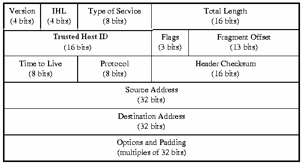

1. # IPv4
   -네트워크 상에서 데이터를 교환하기 위한 프로토콜   

   -데이터가 정확하게 전달될 것을 보장하지 않음   

   -중복된 패킷을 전달하거나 패킷의 순서를 잘못 전달할 가능성도 있음   

   -데이터의 정확하고 순차적인 전달은 그보다 상위 프로토콜인 TCP에서 보장   

1. # IPv4 Protocol   
      
   <br>
   한 줄 4byte 5줄 총 20byte.   
   마지막 Options and Padding 은 붙을 수도 있고 안 붙을 수도 있는 옵션입니다. Option은 한 줄 4byte로 총 10개의 옵션이 붙을 수 있습니다. 최대 40byte가 붙어 IP Protocol은 60byte가 최대가 됩니다. 보통 Option없이 사용하는 게 일반적입니다.   
   <br>
   __Version__ : IP 버전은 4와 6이 있는데 여긴 무조건 IPv4만 옵니다. IPv6는 포로토콜 모양 자체가 다릅니다. 입력 값 : 16진수 1개 4bit로 |4|   
   <br>
   __IHL__ : Head Length로 헤더의 길이 범위는 20byte ~ 60byte 인데 주어진 공간이 4bit라 15까지밖에 쓸 수 없습니다. 그래서 20을 4로 나눈 20/4=5, 5의 값을 쓰고 Options이 추가 될 때 마다 1씩 더해서 적게 됩니다. |5|   
   <br>
   __ToS__ : 지금은 사용하지 않는 비트로 예전 데이터의 서비스 유형을 입력했었습니다. 현재 네트워크 장비들은 ToS를 인식하지 않습니다.    
   <br>
   __Total Length__ : 뒤에 페이로드까지 합쳐진 상위 계층부터 인캡슐된 프레임의 전체 길이   
   <br>
   __Trusted Host ID__ (Identification) : 패킷을 잘게 쪼갤 때 하나의 프레임에서 쪼개졌다는 걸 나타내기 위해 표시하는 ID값   
   <br>
   __Flags__ : 3bit로 이루어져있으면 각각의 값은 XDM(총 3bit) 입니다.   
   __X__ 는 사용하지 않는 값.   
   __D__ 는 Don't fragmentation으로 데이터를 보내는 사람이 쪼개지 않고 보내겠다는 걸 명시. 만약 1600byte가 한계인 패킷에서 7000byte를 D 설정으로 보낼 시 error가 발생해서 전달이 안 됩니다. 현실적으로 D옵션은 잘 사용하지 않습니다.    
   ```
      C:\Users\KIMASUS>ping 128.12.0.1 -l 7000 -f

      Ping 128.12.0.1 7000바이트 데이터 사용:
      PING: 전송하지 못했습니다. 일반 오류입니다.
      PING: 전송하지 못했습니다. 일반 오류입니다.
      PING: 전송하지 못했습니다. 일반 오류입니다.
      PING: 전송하지 못했습니다. 일반 오류입니다.

      128.12.0.1에 대한 Ping 통계:
         패킷: 보냄 = 4, 받음 = 0, 손실 = 4 (100% 손실),  '손실 100% 발생'
   ```   
   __M__ 은 More fragmentaion으로 패킷을 쪼개서 전송시 뒤에 다른 패킷이 더 있다는 걸 알려주는 값. 최대 패킷 값보다 작은 값을 보내게 되면 0으로 설정이 되고 패킷을 쪼갤 경우 1로 설정이 되어 전송됩니다.   
   <br>
   __Fragment Offset__ : 패킷을 쪼개서 전송식 각각의 패킷에 순서를 설정하는 비트입니다. 보낼 땐 순서대로 보내도 받는 쪽에선 다른 패킷도 섞이고 순서도 랜덤으로 전송되기 때문에 받는 쪽에선 처음 보낸 패킷의 순서 값이 필요합니다. 패킷의 가장 앞 패킷부터 얼마만큼 떨어져있나를 값으로 설정됩니다.   
   ex) |a패킷a|b패킷|c패킷| : a패킷은 0, b패킷은 a패킷의 크기만큼 떨어져있습니다, c패킷은 a패킷과 b패킷의 크기를 합한만큼 떨어져있습니다.   
   <span style="color:red">network 쪽에서 offset이란 기준에서 얼마만큼 떨어진.. 이란 의미로 주로 사용</span>   
   <br>
   __TTL__ (Time to Live) : 패킷이 살아 있기 위한 시간. 라우터의 잘못된 설정으로 패킷이 무한 루프에 빠질 경우를 대비해서 특정 카운트 값을 두고 
   라우터를 거칠 때마다 1씩 감소하는 방식으로 패킷이 인터넷에 무한으로 떠도는 걸 방지하게 되는데 이 때 설정되는 값입니다. TTL값은 OS마다 설정하는 값이 다릅니다. windows는 128, Linux는 64로 설정됩니다.   
   <br>
   __Protocol__ : 상위 프로토콜의 TYPE을 알려주는 값입니다. IP Protocol의 상위 프로토콜로 올 수 있는 프로토콜은 TCP(4계층), UDP(4계층), ICMP(3계층)가 있고 각각의 값은 10진수로 6,17,1 값이 됩니다. 설정은 16진수로 셋팅되게 됩니다.   
   <br>
   __Header Checksum__ : 헤더에 오류가 있는지 없는지 확인하는 값입니다. 필드의 값들을 계산해서 설정 후 보내면 받는 쪽에서 똑같이 필드의 값을 계산해서 비교를 하게 됩니다.   
   <br>
   __Source Address__ : 출발지 IP주소   
   <br>
   __Destination Address__ : 목적지 IP주소   


