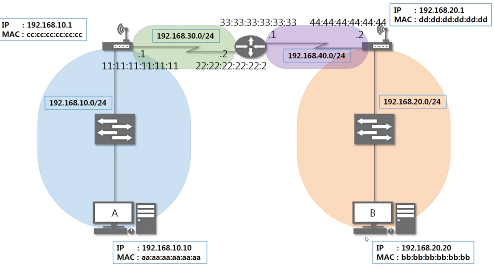

1. # 라우터의 맥 주소와 IP 주소 갯수
    일반적으로 라우터는 하나의 맥 주소를 가지고 있습니다. 하지만 고급 라우터나 스위치는 여러 개의 인터페이스를 가지고 있을 수 있으므로, 각각의 인터페이스에 대해 맥 주소를 가질 수 있습니다. 따라서 라우터가 가지는 맥 주소의 개수는 사용하는 인터페이스의 개수에 따라 다를 수 있습니다.   

    라우터의 IP 주소의 갯수는 일반적으로 최소한 두 개입니다. 하나는 로컬 IP 주소이고 다른 하나는 외부 네트워크와의 통신을 위한 IP 주소입니다. 그러나 라우터가 더 많은 네트워크를 연결하고 패킷을 전달해야 하는 경우, 라우터는 추가적인 IP 주소를 가질 수 있습니다. 이는 라우터의 사용 목적과 설정에 따라 달라질 수 있습니다.   

1. # Routing Table
    3계층의 주요 역할은 최적의 경로를 찾아 패킷을 효율적으로 전송하는 건데 그 최적의 경로가 저장된 테이블이 라우팅 테이블입니다.   
    
    라우팅 테이블 확인 : netstat -r 명령어로 확인.   
    *뒤에 옵션에 따라 포트나 4계층 값을 알아 볼 수도 있습니다.   
    ```s
    C:\Users\natis>netstat -r
    ===========================================================================
      인터페이스 목록
      9...60 a5 e2 6c 27 5e ......Microsoft Wi-Fi Direct Virtual Adapter
      3...62 a5 e2 6c 27 5d ......Microsoft Wi-Fi Direct Virtual Adapter #2
     12...60 a5 e2 6c 27 5d ......Intel(R) Wi-Fi 6 AX201 160MHz
    ===========================================================================

    IPv4 경로 테이블
    ===========================================================================
      활성 경로:
        네트워크 대상   네트워크 마스크         게이트웨이         인터페이스  메트릭
             0.0.0.0          0.0.0.0      192.168.45.1    192.168.45.143     30
           127.0.0.0        255.0.0.0             연결됨         127.0.0.1    331
           127.0.0.1  255.255.255.255             연결됨         127.0.0.1    331
     127.255.255.255  255.255.255.255             연결됨         127.0.0.1    331
        192.168.45.0    255.255.255.0             연결됨    192.168.45.143    286
      192.168.45.143  255.255.255.255             연결됨    192.168.45.143    286
      192.168.45.255  255.255.255.255             연결됨    192.168.45.143    286
      ...
    ===========================================================================
    영구 경로:
      없음

    IPv6 경로 테이블
    ===========================================================================
      활성 경로:
       IF  메트릭 네트워크 대상           게이트웨이
        1    331 ::1/128                  연결됨
        6    291 fe80::/64                연결됨
        4    291 fe80::/64                연결됨
       12    286 fe80::/64                연결됨
        6    291 fe80::9185:c3b:f0ea:4ab6/128
      ...
    ===========================================================================
    영구 경로:
      없음
     ```   
    IPv4의 네트워크 대상 값으로 특정 IP주소 값이 오기도 하지만 대부분은 네트워크 대역입니다.   
    해당 테이블에 없는 경로는 찾아 갈 수 없습니다. 만약 모르는 주소값이 왔을 경우 최상단의 값   
     ```
        ...
        네트워크 대상   네트워크 마스크         게이트웨이         인터페이스  메트릭
             0.0.0.0          0.0.0.0      192.168.45.1    192.168.45.143     30
        ...
     ```
     192.168.45.1이 라우터에 설정된 기본 게이트웨이 값이고 이쪽으로 패킷이 나갑니다. 만약 게이트웨이가 설정되지 않으면 모르는 네트워크 대역은 찾아갈 수 없습니다.   

1. # 다른 네트워크와 통신 과정
      
   `- A컴퓨터가 B컴퓨터와 통신을 하는 과정 -`   
   ARP과정으로 B의 MAC주소를 알고 라우팅 테이블에 이미 B의 네트워크 대역의 정보가 있다는 가정 하에 데이터만 이동하는 과정 설명.   
   
   1) A의 라우팅 테이블에 B의 네트워크 대역인 192.168.20.0/24가 있어야 통신가능.   
    ```
      A의 라우팅 테이블
      192.168.20.0/24 -> 192.168.10.1
    ```   
    192.168.20.0 네트워크 대역으로 가기위해선 192.168.10.1로 갑니다. 이 설정 값은 네트워크 엔지니어가 라우팅에 설정한 값 입니다.   
   
   2) 프로토콜 작성   
    | Eth | IPv4 | ICMP요청 |   
    ICMP요청 : 요청 타입 8로 설정   
    IPV4 : 버전, 헤드길이, TOS, 데이터 길이, ID, 플래그, 오프셋, TTL, 상위프로토콜 타입, 헤드 체크섬, 출발지IP, 목적지IP   
    Eth : 목적지MAC주소(cc:cc:cc:cc:cc:cc) - 이더넷은 내부영역 통신 프로토콜이기 때문에 갈 수 있는 가까운 라우터 즉 게이트웨이의 MAC 주소가 입력됩니다   

   3) 패킷이 스위치 192.168.10.0 에 갑니다.   
    패킷을 열어 Eth의 목적지 MAC주소가 cc:cc:cc:cc:cc:cc 임을 확인한 후 해당 MAC주소를 가진 라우터에게 패킷을 전종 합니다.   

   4) 라우터 192.168.10.1에서 패킷을 열어 2계층 Eth의 목적지 MAC주소 값을 보고 자신에게 온 것 임을 확인합니다.   
    3계층 프로토콜 IPv4를 열어 목적지 IP주소를 확인합니다.   
    목적지 IP주소가 192.168.20.20으로 B컴퓨터이기 때문에 자신이 아님을 확인합니다.   
    라우팅 테이블을 확인 합니다.   
    ```
      공유기의 라우팅 테이블
      192.168.20.0/24 -> 192.168.30.2
    ```   
    라우팅 테이블을 확인 후 Eth프로토콜을 다시 작성합니다.   
    목적지 MAC주소 : 22:22:22:22:22:22   
    출발지 MAC주소 : 11:11:11:11:11:11   

   5) 라우터에서 위에 과정을 반복합니다   
   목적지 IP주소 확인   
   라우팅 테이블 확인   
   Eth 프로토콜 다시 작성 - 네트워크 영역이 변경될 때 마다 Eth 프로코톨은 다시 작성됩니다.   

   6) 라우터 IP 192.168.20.1 에 와서야 MAC주소 bb:bb:bb:bb:bb:bb가 같은 네트워크이기 때문에 목적지 MAC주소로 입력되게 됩니다. B컴퓨터 네트워크 영역 이전엔 라우팅 테이블로만 경로를 추적하게 됩니다.   

   7) B컴퓨터에서 패킷을 받고 ICMP까지 열어 확인 후 요청 type 8 이 있는 것을 확인 후 응답 type 0으로 작성 후 A컴퓨터에게 전송을 하게 됩니다.   

   만약 MAC주소를 모른다면 각각의 과정마다(네트워크 대역이 변경 될 때 마다) ARP과정을 수행해야 됩니다. 위에 라우팅 과정 전에 모든 과정에서 ARP로 MAC주소를 찾는 과정이 우선 병행되게 됩니다.   

   결론 : TCP의 3way-hand-shake 방식으로 이미 서버와 클라이언트가 연결된 이후로 데이터만 전송하는 걸 나타낸 거기 때문에 서로의 맥주소는 이미 다 알고 있고, ARP테이블에 경로가 이미 다 설정되어 있다고 가정   
   ▶ IP에 도착지 맥주소가 있음   
   ▶ Eth프로토콜에서는 ARP에서 IP의 도착지 맥주소를 참조해서 계속 수정   
   
1. # netstat
    Windows의 netstat 명령어는 다양한 옵션을 가지고 있습니다. 주요 옵션은 다음과 같습니다

    | 옵션 |          설명                | 
    |:----:|:----------------------------:|
    | a | 모든 연결 및 수신 대기 포트를 표시합니다.|
    | b |바이너리 실행 파일의 이름을 표시합니다. |
    | e | 이더넷 통계를 표시합니다. |
    | f | 외부 주소의 완전한 DNS 이름을 표시합니다. |
    | n | IP 주소 및 포트 번호를 숫자 형식으로 표시합니다. |  
    | o | 연결에 대한 프로세스 ID를 표시합니다. |
    | p | 특정 프로토콜을 사용하는 연결만 표시합니다. |
    | r | 라우팅 테이블을 표시합니다. |
    | s | 프로토콜별 통계를 표시합니다. |
    | t | TCP 연결을 표시합니다. |
    | u | UDP 연결을 표시합니다. | 
    | w | 워킹스테이션에 대한 워크스테이션 통계를 표시합니다. |
    | x | 네트워크 연결이 종료되지 않고 유지되는지 확인합니다. |

    위의 옵션들을 조합하여 원하는 결과를 얻을 수 있습니다. 예를 들어, netstat -ano 명령은 모든 연결과 프로세스 ID를 표시합니다.   

