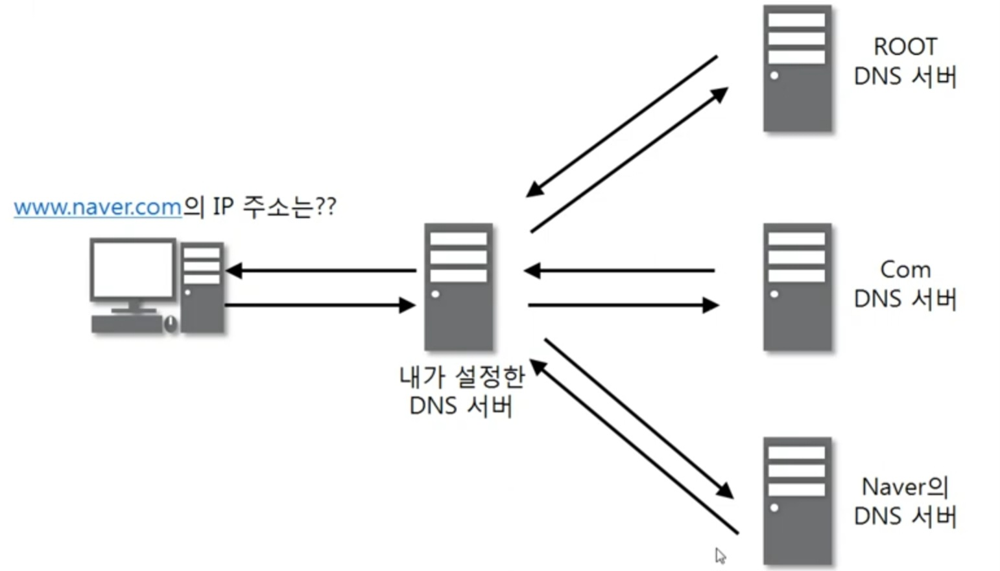

1. # UDP
   User Datagram Protocol은 Universal Datagram    Protocol이라고도 합니다.   
   비연결 지향형 프로토콜 방식입니다.   
   UDP의 전송 방식은 단순해서 서비스의 신뢰성이 낮고, 데이터그램 도착 순서가 바뀌거나, 중복되거나, 심지어 통보 없이 누락시키기도 합니다.    

   UDP는 일반적으로 오류의 검사와 수정이 필요 없는 프로그램에서 수행할 것을 가정합니다.   
1. # UDP 프로토콜 
      

   한 줄 32bit로 4byte -> 총 8byte   

   1. __Source Port Number__   
      크기 : 2byte   
      포트 번호 0 ~ 65535 : 2^16 = 65536로 총 16bit 필요.  16bit = 2byte.   
   
      데이터를 전송하는 측의 프로그램 포트 번호.   
   1. __Destination Port Number__   
      크기 : 2byte   
      포트 번호 0 ~ 65535 : 2^16 = 65536로 총 16bit 필요.  16bit = 2byte.   

      데이터를 받는 측의 프로그램 포트 번호.   

   1. __Total Length__   
      UDP프로토콜 Header + 뒤쪽 Data(페이로드)로 전체 프로토콜의 길이가 입력됩니다.   

   1. __CheckSum__   
      중간에 프로토콜의 헤더 부분 손상 유무 체크, 뒤쪽 데이터(페이로드)를 체크하진 않습니다.   

1. # UDP 프로토콜을 사용하는 프로그램
   1. __DNS 서버__   

         

      클라이언트가 도메인 주소로 접속을 하면 컴퓨터에 설정된 DNS 서버로 가서 여기서 해당 도메인 DNS서버로 요청 패킷이 가게되면 해당 도메인의 DNS서버에서 IP주소를 응답하게 됩니다. 이때 __IP주소를 응답할 때__ UDP를 사용하게 응답하게 됩니다.   

   1. __RIP 프로토콜__   
      라우터를 설정하는 방법에는 대표적으로 2가지가 있습니다.   
      사람이 일일이 수동으로 하는 방법과 라우터들끼리 정보를 공유해서 자동으로 정보를 업데이트 하는 방식이 있습니다. 이때 라우터들끼리 자동으로 업데이트하는 방식 중 하나인 RIP방식에서 UDP가 이용됩니다.

1. # UDP 프로토콜을 사용하는 경우 예
   크기가 작고 빠른 전송을 요구하는 경우에 사용됩니다. 만약 몇 기가 바이트를 하는 영화 파일 같은 경우 99%를 정상적으로 받았는데 마지막 1%를 잘못받아 오류가 나면 안 되기 때문에 용량이 큰 파일이나 속도가 느려도 정확한 전송이 요구되는 경우엔 TCP를 사용합니다. 반면 실시간 동영상 스트림 파일인 경우 초당 30개~60개 이미지 파일을 받아서 이거에 따라 소리가 재생이 되는데 이 이미지 파일 중 1개 2개 정도는 못 받아도 동영상을 보는데 큰 지장이 없고 대신 빠른 전송을 요구하기 때문에 이때 UDP가 사용됩니다.   
   단편적으로 TCP, UDP를 이러이러한 경우에 사용한다를 예로든 것이고 실제 현업에선 TCP와 UDP를 적절히 조화를 이루어 사용하게 됩니다.   

   
