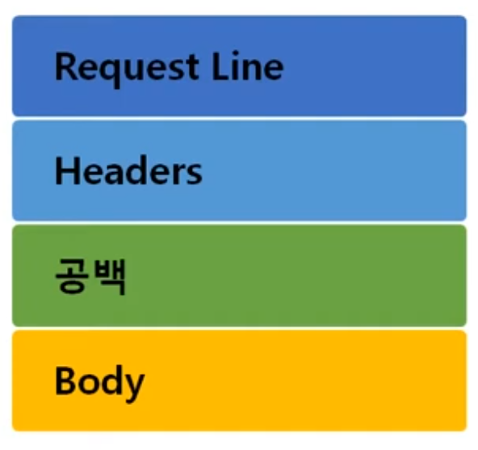
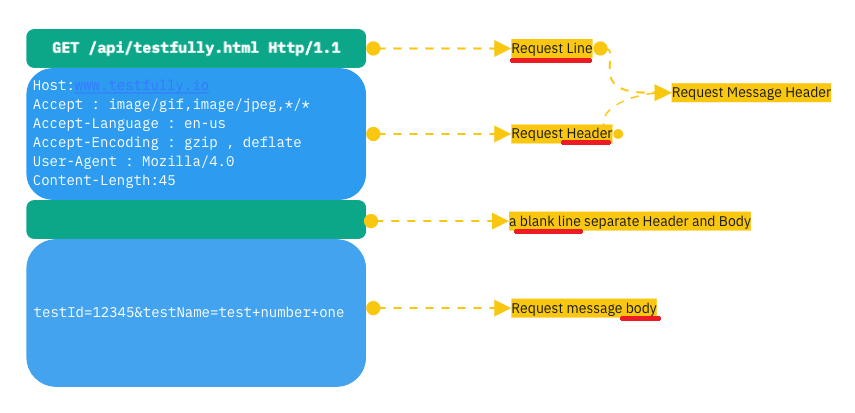
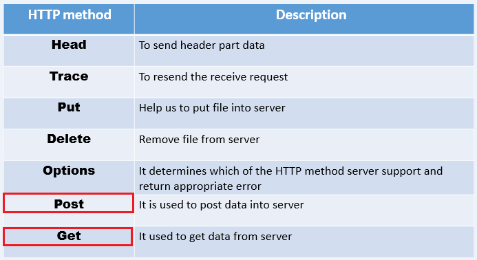
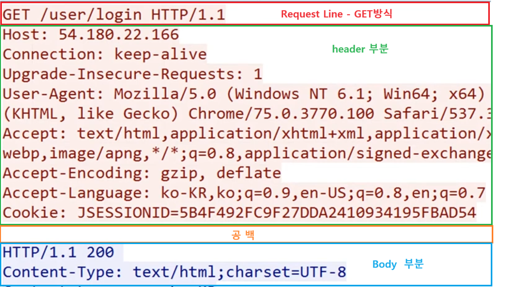
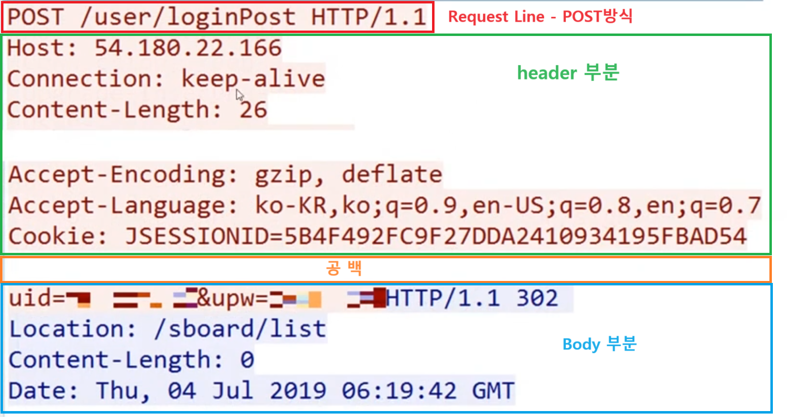
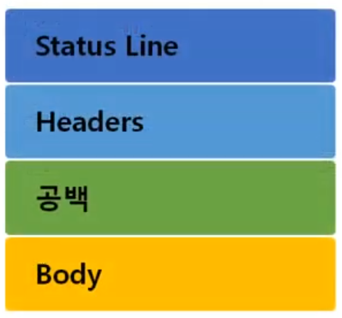

1. # HTTP(HyperText Transfer Protocol)
   www에서 쓰이는 핵심 프로토콜로 문서의 전송을 위해 쓰이며, 오늘날 거의 모든 웹 애플리케이션에서 사용되고 있습니다. 7계층 프로토콜이며 Request/Respond(요청/응답) 동작에 기반하여 서비스를 제공합니다.   
   ->화상, 음성 등 여러 종류의 데이터를 MIME로 정의하여 전송 가능
   서버에 있는 데이터를 클라이언트로 다운받을 때 사용되는 프로토콜입니다. 예를 들면 HTML,CSS,JS로 작성된 파일은 서버쪽에 있고 이걸 클라이언트의 컴퓨터에 다운받아 웹 브라우저가 해석하여 출력하게 됩니다. 이때 HTML,CSS,JS를 인터넷 상에서 다운받을 때 사용되는 프로토콜이 HTTP입니다.   

1. # MIME
   MIME은 “Multipurpose Internet Mail Extensions”의 약자로, 인터넷에서 이메일과 웹 브라우저 등에서 파일의 형식과 포맷을 정의하는 데 사용되는 표준입니다. MIME은 이메일 시스템에서 이진 파일 또는 텍스트 파일과 같은 다양한 형식의 데이터를 전송할 수 있도록 지원하며, 이를 통해 파일의 확장자나 형식에 상관없이 파일을 올바르게 인식하고 처리할 수 있습니다. MIME은 텍스트, 이미지, 오디오, 비디오 등 다양한 형식의 데이터를 전송할 수 있으며, 확장자나 포맷에 따라 적절한 MIME 타입이 할당된다.   
   웹 서버에서는 HTTP 응답 헤더에 “Content-Type”이라는 필드를 사용하여 MIME 타입을 지정합니다. 이 필드의 값으로는 MIME 타입을 나타내는 문자열이 사용됩니다. 예를 들어, HTML 문서의 MIME 타입은 “text/html”이고, 이미지 파일의 MIME 타입은 “image/jpeg”이 될 수 있습니다.   

1. # HTTPS
   HTTPS(Hypertext Transfer Protocol Secure)는 HTTP의 보안 버전으로, 데이터를 암호화하여 전송합니다. HTTPS는 SSL(Secure Sockets Layer) 또는 TLS(Transport Layer Security) 프로토콜을 사용하여 암호화를 수행하며, 이를 통해 중간에 데이터를 가로채어도 해독하기 어렵게 만듭니다. 따라서 HTTPS는 데이터의 기밀성과 무결성을 보장하여 보안성을 강화합니다.

1. # SSL과 TLS
   SSL은 넷스케이프(Netscape)에서 개발한 보안 프로토콜로, 1990년대 초반부터 널리 사용되었습니다. “Secure Sockets Layer”의 약자로, 네트워크 통신에서 보안을 제공하는 프로토콜입니다. SSL은 데이터의 안전한 전송을 위해 __암호화__ 와 __인증 기능을 제공__ 합니다. SSL은 주로 웹사이트에서 사용되며, HTTPS 프로토콜을 통해 웹 브라우저와 웹 서버 간의 통신을 보호합니다. SSL은 데이터의 기밀성과 무결성을 보장하여 제3자로부터의 데이터 탈취나 변조를 방지합니다. 그러나 SSL 버전 3.0 이후에는 취약점이 발견되어 보안성에 문제가 생겼습니다.   
   TLS는 SSL의 후속 버전으로, 인터넷 표준화 기구인 IETF(Internet Engineering Task Force)에서 개발하였습니다. TLS는 SSL의 취약점을 보완하고 개선된 보안 기능을 제공합니다. TLS 1.0부터 TLS 1.3까지 여러 버전이 존재하며, 각 버전은 보안성과 암호화 방식에 대한 업데이트와 개선이 이루어졌습니다.   
   SSL과 TLS는 프로그래밍 언어가 아닌 암호화 프로토콜입니다. C, C++ 등 다양한 프로그래밍 언어로 구현될 수 있지만, 구체적으로 어떤 프로그래밍 언어로 만들어졌는지는 명확하게 정해져 있지 않습니다. 따라서, SSL은 특정 프로그래밍 언어로 만들어진 것이 아니라 통신 보안을 위한 암호화 프로토콜이라고 할 수 있습니다.   

1. # HTTP 요청 프로토콜
   가장 일반적인 요청 프로토콜의 형태   
      
   일반 프로토콜처럼 16진수가 아닌 일반 문자와 특수 문자를 사용합니다.   
   
      
   2계층부터 4계층까지 프로토콜 ARP,ICMP,IP,TCP,..처럼 비트 단위로 데이터가 저장되는 것이 아니라 문자가 그대로 입력되어 전송됩니다. 

1. # Request Line
   | 요청타입 | 공백 | URI | 공백 | HTTP버전 | => ex)GET /api/testfully.html Http/1.1   
      
   1)요청타입    
      

   Get : 주소창에 데이터가 노출 됩니다. 중요하지 않은 데이터를 전달합니다   
   Post : 주소창에 데이터가 노출 되지 않고, Body에 입력되어 전송됩니다. 중요한 데이터를 전송시 이용합니다.   
   나머지 옵션은 대부분 막아 놓음.   

   2)공백은 필수 조건입니다. 공백으로 데이터를 구분하게 됩니다.   

   3)URI    
   Uniform Resoruce Identifier. 인터넷 상에서 특정 자원(파일)을 나타내는 유일한 주소입니다.   
   구조 - `scheme://host[:port][/path][?query]`   
   ftp: //IP주소:포트/파일이름   
   http: //IP주소(도메인):포트/폴더이름/파일이름   
      
   ex)   
   `https://naver.com` 뒤에 443번 포트가 생략이 된 것입니다.   
   `https://naver.com:443` 다음과 같이 입력해도 네이버에 접속이 됩니다.   
      
   `https://comic.naver.com/webtoon/detail.nhn?titleId=3432&no=34&weekday=thu`   
   https ← scheme   
   comic.naver.com ← host   
   webtoon/detail.nhn ← path   
   &nbsp;&nbsp;&nbsp;&nbsp;&nbsp;&nbsp;webtoon ← 폴더   
   &nbsp;&nbsp;&nbsp;&nbsp;&nbsp;&nbsp;detail.nhn ← 파일명   
   ?titleId=3432&no=34&weekday=thu ← query(클라이언트가 전달하는 데이터)   

   4)HTTP버전 : 예전 1.0 -> 현재 1.1

1. # 요청 타입에 따라
   GET방식으로 요청을 보낼 때   
     

   POST방식으로 요청을 보낼 때   
     

1. # HTTP 응답 프로토콜
     
   요청 프로토콜이 왔을 때 서버 쪽에서 만들어서 주는 프로토콜   

   | 상태 코드 종류 |       설      명     |
   |:-------------:|:--------------------:|
   | 100~199 |  단순한 정보|
   | 200~299 | Client의 요청이 성공 |
   | 300~399 | Client의 요청이 수행되지 않아 다른 URL로 재지정 |
   | 400~499 | Client의 요청이 불완전하여 다른 정보가 필요 |
   | 500~599 | Server의 오류를 만나거나 Client의 요청 수행 불가 |

   200번 대 : 클라이언트의 요정이 정상적으로 완료   
   400번 대 : 클라이언트가 오류 원인   
   500번 대 : 서버가 오류 원인   

   |상태 코드 종류|상태 문구| 설      명 |
   |:-----------:|:------:|:------------:|
   | 200 | OK | Client의 요청 성공 |
   | 403 |Forbidden|Client가 권한이 없는 페이지를 요청|
   | 404 |Not Found|Client가 서버에 없는 페이지 요청|
   | 500 |Internal Server Error|Server의 일부가 멈췄거나 설정 오류 발생|
   | 503 |Service Unavailable|최대 Session 수를 초과|
   
   *500번 대는 주로 소스 코드 오타..   

1. # Header
   HTTP 프로토콜에서 요청과 응답시 모두 Header 부분이 있는데   
   요청시 사용되는 header   
   응답시 사용되는 header   
   요청과 응답시 모두 사용되는 header로 구분됩니다.   

   일반, 요청, 항목 헤더 / 일반, 응답, 항목 헤더   

   | 헤더 종류 | 설       명|
   |:-------:|:-------:|
   | Content-Length |메시지 바디 길이를 나타낼 때 쓰인다|
   | Content-Type |메시지 바디에 들어있는 컨텐츠 종류 ex)HTML문서는 text/html|
   | Cookie |서버로부터 받은 쿠키를 다시 서버에게 보내주는 역할을 한다|
   | Host |요청된 URL에 나타난 호스틈병을 상세하게 표시 (HTTP 1.1은 필수)|
   | User-Agent |Client Program에 대한 식별|
   | Server |사용하고 있는 웹서버의 소프트웨어에 대한 정보를 포함|
   | Set-Cookie |쿠키를 생성하고 브라우저에 보낼 때 사용, 해당 쿠키 값을 브라우저가 서버에게 다시 보낼 때 사용|

1. # 포록시 서버
   프록시 서버는 클라이언트와 웹 서버 사이에서 중개 역할을 하는 서버입니다. 클라이언트가 웹 서버에 접속할 때 프록시 서버를 통해 접속하면, 프록시 서버는 클라이언트의 요청을 대신하여 웹 서버에 접속하고, 웹 서버의 응답을 클라이언트에게 전달합니다. 이를 통해 클라이언트는 웹 서버와 직접 통신하지 않고, 프록시 서버를 통해 인터넷을 사용할 수 있습니다. 프록시 서버는 보안, 속도 향상, 캐싱 등의 목적으로 사용될 수 있습니다.