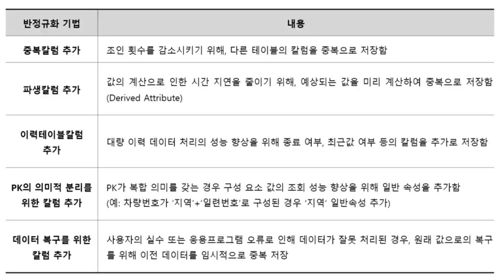
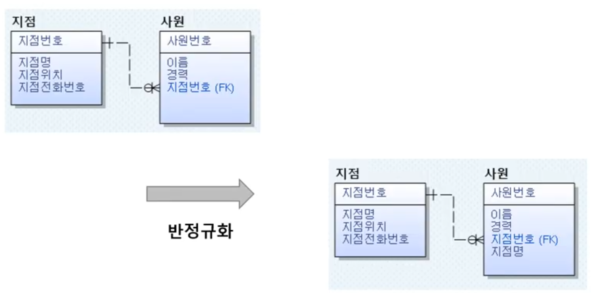
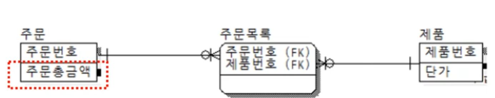
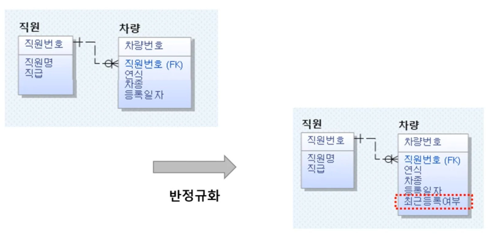

1. # 컬럼 반정규화 
      

1. # 중복컬럼 추가   
   해당 테이블에서 자주 사용하는 컬럼을 증복시킵니다.   
   밑에 그림은 사원으로 지점명을 조회하는 질의가 많은 경우 지점명을 사원 테이블 내에 추가한 예시입니다.   
      
   사원 테이블에 지점명을 추가하여 사원번호로 지점번호를 알 수 있고 지점명도 알 수 있습니다.   
   지점명을 추가하므로써 이행함수종속이 되어 3정규형에서 2정규형으로 변경이 되었습니다.   

1. # 파생컬럼 추가
   질의가 예상되는 값을 미리 계산하여 저장합니다.   
   밑에 그림은 주문 테이블에 주문총금액을 계산하여 테이블에 저장한 예시입니다.   
      
   주문금액에 따라 파생되는 주문총금액이란 유도속성(derived attribute)을 생성합니다.   
   *주문목록 테이블은 속성을 저장하는 것이 목적이 아니라 주문과 제품을 연결해주는 테이블로 __연관 엔터티__ 라고 합니다.   

1. # 이력테이블컬럼 추가
   이력테이블에 최근값, 종료여부 등의 칼럼을 중복으로 추가합니다.   
      
   차량 테이블에 최근등록여부의 칼럼을 생성합니다.   
   
1. # PK의 의미적 분리를 위한 컬럼 추가
   차량번호가 '서울 가1234' 와 같이 '지역'+'일련번호'로 구성된 경우   
   '서울' 과 같이 지역만 검색할 경우 PK를 활용해서 할 수가 없습니다. 이러한 경우   
   → 차량번호 테이블에 '지역'이란 컬럼을 하나 더 추가합니다.   
      
   
1. # 데이터 복구를 위한 컬럼 추가
   - 사용자의 실수 또는 응용프로그램의 오류로 인한 데이터 손실 대비   

   - 이력테이블과 데이터 복구 컬럼의 차이점   
      -이력테이블은 새로운 값이 들어와도 이전의 값은 그대로 유지를 합니다.   
      -테이터 복구 컬럼은 정상 데이터는 새로운 값이 들어올 경우 이전의 값은 삭제가 되는데 복구를 위해 새로운 컬럼을 추가하는 것입니다.    
      예를 들어 전입신고를 할 경우 기존의 주소는 삭제가 되고 새로운 주소가 기입이 되는데 바로 전의 주소를 그대로 옮겨놓는 컬럼을 새로 추가하는 것입니다.    