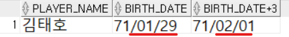
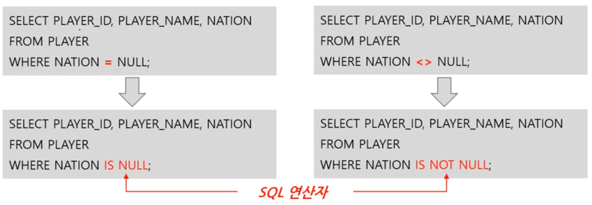
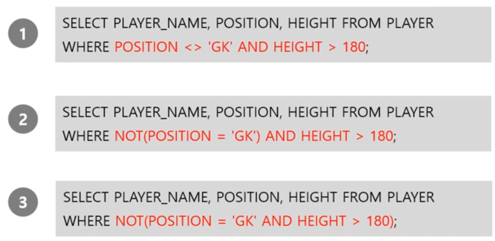
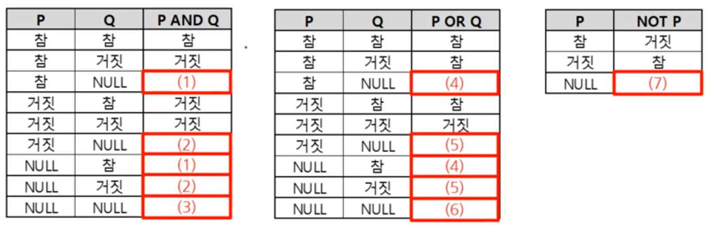

1. # 산술 연산자   
   - +,-,*,/   
   
   - 연산자는 SELECT문에도 사용 가능   

   NULL값에 대한 산술 연산의 결과는?   
   ```
      SELECT 0+NULL, 3*NULL, 4+NULL, NULL/0 FROM DUAL;   /*전부 NULL*/
   ```   
   NULL에 대한 산술 연산은 전부 NULL   
       
   DATE타입에 덧셈을 하면 '일'이 추가됩니다.   
   ```
      SELECT PLAYER_NAME, BIRTH_DATE, BIRTH_DATE+3   /**BIRTH_DATE의 일수에 3일을 더합니다./
      FROM PLAYER
      WHERE PLAYER_NAME = '김대호'
   ```   
      
   1월29일에 3일을 더한 2월 1일이됩니다.   

1. # 비교 연산자   
   -&nbsp;=, <>, >=, <=, <, >   
   -모든 자료형에 대해 적용   
   ex) 5 > 3 ☞ 먼저 나오면 작은 것   
   &nbsp;&nbsp;&nbsp;2020/1/5>2020/1/3 -날짜 자료형에도 적용 ☞ 먼저 나오면 작은 것   
   -문자열의 크기 비교는 사전 순으로 수행   
   ex) 국민 < 백성 :'ㅂ'보다 'ㄱ'이 먼저 나옴 ☞ 먼저 나오면 작은 것   
   &nbsp;&nbsp;&nbsp;A < B : 'B'보다 'A'가 먼저 나옴 ☞ 먼저 나오면 작은 것   
   &nbsp;&nbsp;&nbsp;'01'<'02'<'1'< '11 < '2' : ''문자로 인식, 사전 순으로 크기 정렬.   
   '11'은 숫자 십일이 아니라 문자로 일일   
   &nbsp;&nbsp;&nbsp;01 = 1 < 02 = 2 < 11 : 숫자인 경우   
   -NULL에는 비교 연산자 사용 불가 => SQL연산자 IS NULL과 IS NOT    
 
      
   WHERE NATION = NULL -> WHERE NATION IS NULL;   
   WHERE NATION <> NULL -> WHERE NATION IS NOT NULL;   
   
   -부정 비교 연산자   

   | 연산자 | 의미 | 예시 |
   |:----:|:------:|:----:|
   | != | 같지 않음 | WHERE COL != 10 |
   | ^= | 같지 않음 | WHERE COL ^= 10 |
   | <> | 같지 않음 | WHERE COL <> 10 |
   | NOT 컬럼명 = | 같지 않음 | WHERE NOT COL = 10 |
   | NOT 컬럼명 > | 크지 않음 | WHERE NOT COL > 10 |

1. # 논리 연산자   
   - 모든 자료형에 적용   
   
   | 연산자 | 의미 | 예시 |
   |:----:|:------:|:----:|
   | AND | 모든 조건이 TRUE여야 함 | WHERE A > 1 AND A < 10 |
   | OR  | 하나 이상의 조건이 TRUE여야 함 | WHERE A = 1 OR A = 10 |
   | NOT | TRUE면 FLASE이고 FLASE이면 TRUE | WHERE NOT A > 10|   

   논리 연산자 우선순위 : () → NOT → 비교연산자, SQL연산자 → AND → OR 순 입니다   

   ex)   
   NOT A OR B AND C 의 우선 순위는:   
   (NOT A) OR B AND C - 1: NOT A   
   (NOT A) OR (B AND C) - 2: B AND C   
   ((NOT A) OR (B AND C)) - 3: OR   

   <hr>

   문제)다음 SQL문 중 실행 결과가 나머지 두 가지와 다른 것은?   
      
   1번: (POSITION<>'GK') AND (HEIGHT>180) → POSITION이 'GK'가 아니고 HEIGHT가 180보다 크다   
   2번: (NOT (POSITION='GK')) AND HEIGHT>180 → POSITION이 'GK'가 아니고 HEIGHT가 180보다 크다   
   3번: NOT(POSITION='GK' AND HEIGTH>180) → NOT(POSITION='GK') OR NOT(HEIGHT>180) → POSITION<>'GK OR HEIGHT<=180   

   NULL을 포함한 진리표   
      
   (1): NULL (AND는 2개 다 참일 참일 때에만 참, 하나는 참인데 하나는 모름)   
   (2): 거짓 (AND는 하나가 거짓이면 거짓)   
   (3): NULL (둘 다 모름)   
   (4): 참 (OR은 하나만 참이면 참)   
   (5): NULL (하나는 거짓인데 하나는 모름)   
   (6): NULL (둘 다 모름)   
   (7): NULL (모르는 건 뒤집어도 모름)   

