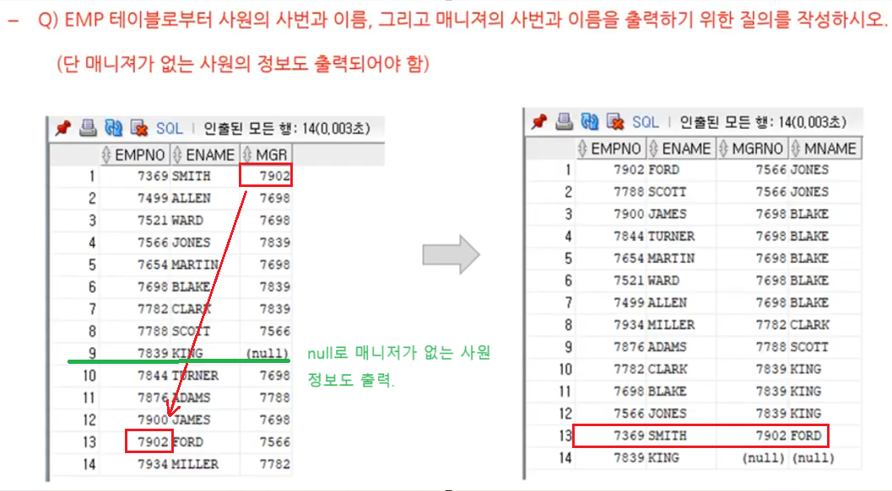

1. # SELF JOIN(셀프 조인)
   - 동일 테이블 사이의 조인 : SELF JOIN은 특별한 다른 명령어가 있는 것이 아니라 조인(INNER JOIN, NATURAL JOIN, LEFT/RIGHT JOIN, CROSS JOIN)을 할 때 FROM절에 동일 테이블이 두 번 이상 나타나면 셀프 조인이라고 얘기합니다.   
   - 테이블 식별을 위해 반드시 별칭을 사용해야 함   
   - 동일 테이블을 개념적으로 서로 다른 두 개의 테이블로 사용함   
      ex)FROM EMP E INNER JOIN EMP M   

      

   하나의 EMP테이블 내에서 사원과 매니저가 함께 있습니다. 7369번 SMITH의 매니저는 7902번 FORD입니다.   
   문제에서 매니저가 없는 사원 정보도 출력 - 매니저가 null인 항목도 출력 -> LEFT OUTER JOIN 나 RIGHT OUTER JOIN으로 EMP테이블을 기준으로 출력해 됩니다.   
   ```
      SELECT E.EMPNO, E.ENAME, M.MGRNO, M.MNAME
      FROM EMP E LEFT OUTER JOIN EMP M
      ON E.MGR = M.EMPNO 
   ```   
   왼쪽 테이블의 매니저가 오른쪽 테이블의 직원 번호여야 합니다.   