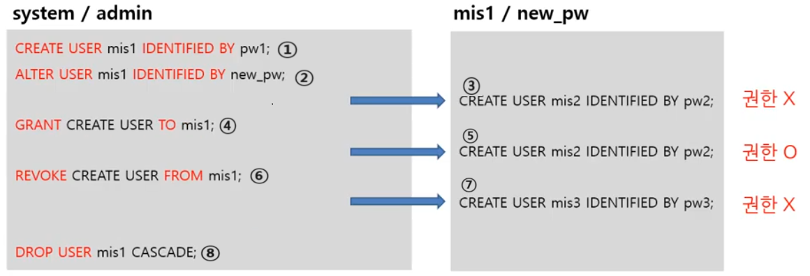
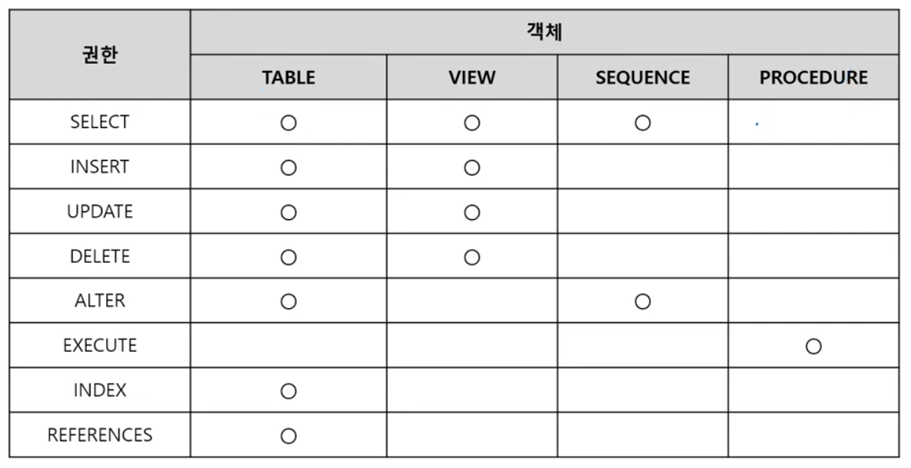
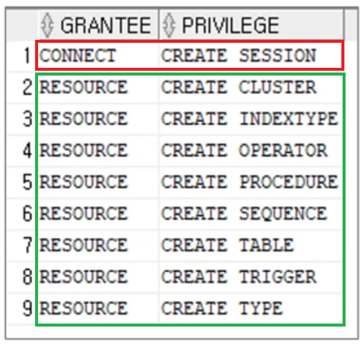
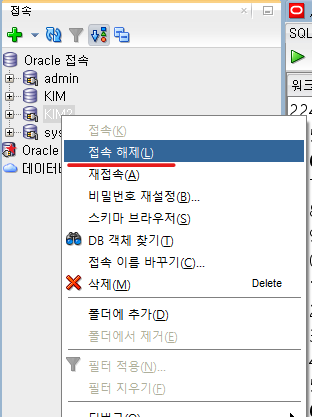
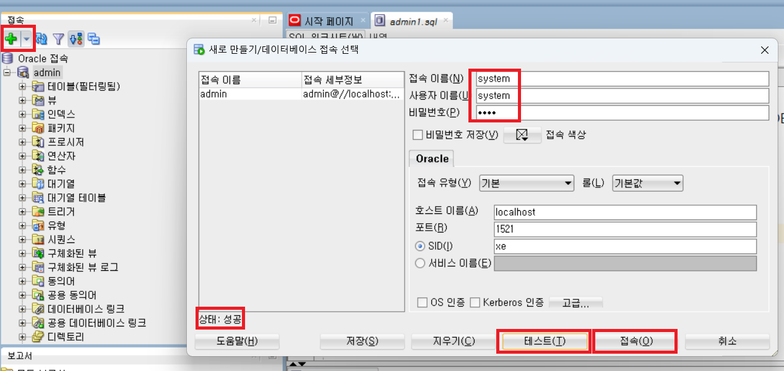

1. # DCL
   사용자의 계정 생성, 삭제, 권한 부여 / 회수에 대한 명령어   

      

   왼쪽 예제 : system이란 id에 admin이란 패스워드   
   오른쪽 예제 : mis1이란 id에 new_pw란 패스워드   

   *테이블 생성시 CREATE TABLE를 한 것처럼 USER생성시 CREATE USER사용   
   테이블 수정시 ALTER TABLE를 한 것처럼 USER 수정시 ALTER USER   

   1) CREATE USER mis1 IDENTIFIED BY pw1; 
   :mis1이란 계정을 새로 만들고 비번은 pw1로 합니다.   

   2) ALTER USER mis1 IDENTIFIED BY new_pw;   
   :ALTER를 이용해서 암호를 pw1에서 new_pw로 변경합니다.   

   3) CREATE USER mis2 IDENTIFIED BY pw2;   
   :mis1로 로그인해서 mis2란 계정을 생성해 보지만 error가 발생합니다. 아직 mis1은 USER를 만들 수 있는 권한이 없습니다.   

   4) GRANT CREATE USER TO mis1;   
   :CREATE USER를 사용할 수 있는 권한을 mis1에게 승인(grant)   

   5) CREATE USER mis2 IDENTIFIED BY pw2;   
   :create권한이 있기 때문에 mis1이 mis2계정을 생성함   

   6) REVOKE CREATE USER FROM mis1;   
   :CREATE USEER를 사용할 수 있는 권한을 mis1으로부터 폐지(revoke)

   7) CREATE USER mis3 IDENTIFIED BY pw3;   
   :create권한이 없기 때문에 error발생   

   8) DROP USER mis1 CASCADE;   
   :mis1계정 자체를 삭제   

   이때 mis1이 생성한 mis2계정, 그리고 mis1이 create table이나 create view로 테이블이나 뷰를 만들었다면 계정과 테이블과 뷰는 mis1계정이 삭제되었을 때 어떻게 될까?   
   →CASCADE옵션을 주고 삭제를 하게 되면 mis1이 생성한 모든 것(mis2계정, table, view,..등)을 사용할 수 없게 됩니다. USER를 없애면 USER가 했던 모든 행위들, 모든 객체(계정, 테이블, 뷰, 프로시정 등)도 같이 소멸됩니다.   

   *CASCADE옵션은 USER가 어떤 객체도 생성하지 않은 경우 CASCADE옵션 없이 DROP이 가능합니다.   
   하지만 삭제할 __USER가 하나의 객체라도 생성__ 을 했다면 DROP은 거절당하고 __CASCADE옵션을 사용해야만 삭제__ 를 할 수 있습니다.   
 
1. # 권한

   데이터베이스는 데이터를 안전하게 보관하고 특정 데이터에 대해서 관련된 사용자만 액세스할 수 있게 권한을 시스템 권한(system privilege)와 객체 권한(object privilege)으로 분류하고 있습니다.   

   - 시스템 권한 : 사용자 생성, 수정 및 삭제, 데이터베이스 접근, 객체 생성 및 관리, 오라클 데이터베이스의 여러 자원 생성 및 관리 등의 권한   
   - 객체 권한 : 특정 사용자가 생성한 테이블, 인덱스, 뷰, 시퀀스 등과 관련된 권한

   - 권한 확인 : DBA_(SYS, ROLE, TAB)_PRIVS   
   *SYS나 SYSTEM 계정으로 확인 가능   
   ```sql
      /* 모든 사용자 조회 */
      SELECT * FROM ALL_USERS WHERE USERNAME='ADMIN';
      결과:      
      USERNAME         USER_ID CREATED 
      ---------------- ------- --------
      ADMIN            48      23/09/26

      /* 사용자에게 부여된 시스템 권한 확인 */
      SELECT * FROM DBA_SYS_PRIVS WHERE GRANTEE = 'ADMIN' ;  --SYS
      결과:
      GRANTEE        PRIVILEGE            ADM
      ------------- --------------------- ---
      ADMIN         UNLIMITED TABLESPACE  NO 
      ADMIN         CREATE TABLE          NO 
      ADMIN         CREATE USER           NO 
      ADMIN         CREATE SESSION        NO 

      /* 사용자에게 부여된 롤 권한 확인 */
      SELECT * FROM DBA_ROLE_PRIVS WHERE GRANTEE = 'ADMIN' ;  --ROLE
      결과: 
      GRANTEE        GRANTED_ROLE      ADM DEF
      -------------- ----------------- --- ---
      ADMIN         CONNECT            NO  YES
      ADMIN         RESOURCE           NO  YES
      ADMIN         DBA                NO  YES

      /* 타사용자에게 권한 부여 확인 */
      SELECT * FROM DBA_TAB_PRIVS WHERE OWNER = 'ADMIN';  --TAB
      GRANTEE  OWNER  TABLE_NAME  GRANTOR   PRIVILEGE  GRA HIE
      -------  -----  ----------  --------  ---------- --- -----
      KIM     ADMIN   EMP         ADMIN     INSERT     YES NO 
      KIM     ADMIN   EMP         ADMIN     SELECT     YES NO 
      KIM     ADMIN   EMP         ADMIN     UPDATE     YES NO 
      -- OWNER - 권한 부여 사용자
      -- GRANTEE - 권한 부여받은 사용자
   ```   
 
1. # 시스템 권한
   - 시스템 권한 종류   
   2. USER : 사용자   
      CREATE USER - 사용자 생성 권한   
      ALTER USER - 생성된 사용자 정보 수정 권한   
      DROP USER - 생성된 사용자 삭제 권한   
   2. SESSION : 접속   
      CREATE SESSION - 데이터베이스 접속 권한   
      ALTER SESSION - 데이터베이스 접속한 상태에서 환경 값 변경 권한   
   2. TABLE : 테이블   
      CREATE TABLE - 자신의 테이블 생성 권한   
      CREATE ANY TALBE - 임의의 스키마 소유 테이블 생성 권한   
      ALTER ANY TABLE - 임의의 스키마 소유 테이블 수정 권한   
      DROP ANY TABLE - 임의의 스키마 소유 테이블 삭제 권한   
      INSERT ANY TABLE - 임의의 스키마 소유 테이블 데이터 삽입 권한   
      UPDATE ANY TABLE - 임의의 스키마 소유 테이블 데이터 수정 권한   
      DELETE ANY TABLE - 임의의 스키마 소유 테이블 데이터 삭제 권한   
      SELECT ANY TABLE - 임의의 스키마 소유 테이블 데이터 조회 권한   
   2. INDEX : 인덱스   
      CREATE ANY INDEX - 임의의 스키마 소유 테이블의 인덱스 생성 권한   
      ALTER ANY INDEX - 임의의 스키마 소유 테이블의 인덱스 수정 권한   
      DROP ANY INDEX - 임의의 스키마 소유 테이블의 인덱스 삭제 권한   
   2. 이외 VIEW(뷰), SEQUENCE(시퀀스), PROFILE(프로파일), ROLE(롤)에 대한 권한이 있음   
   *스키마 : 사용자가 생성한 테이블,뷰,제약 조건, 인덱스, 시퀀스 등 해당 사용자가 만든 모든 객체는 사용자의 스키마가 됨   
   *ANY : 소유자에 상관없이 사용 가능한 권한   

   - 시스템 권한 부여   
   ```sql
      GRANT [시스템 권한] TO [사용자 / PUBLIC] [WITH ADMIN OPTION];
   ```   
   *PUBLIC : 오라클 데이터베이스의 모든 사용자에게 권한을 부여   
   *WITH ADMIN OPTION : GRANT문을 통해 부여받은 권한을 다른 사용자에게 부여할 수 있는 권한. 만약 권한을 부여받은 사용자의 권한이 사라져도 __이 사용자가 다른 사용자에게 부여한 권한은 유지됨__. 이 옵션을 적어주지 않으면 새로 만든 사용자가 다른 사용자를 생성할 때 권한을 부여 못 함   

   - SESSION 권한 사용 예   
   DB에 접속할 수 있는 접속 권한을 부여. 로그인을 위해 CREATE SESSION 권한 필요   
   ```sql
      GRANT CREATE SESSION TO '계정명'

      GRANT CREATE SESSION TO mis1              
   ```   

   - CREATE TABLE 권한 사용 예   
   테이블을 생성할 수 있는 권한 부여   
   ```sql
      GRANT CREATE TABLE TO '계정명';  

      GRANT CREATE TABLE TO mis1;  
   ```   
   자신이 만든 테이블에 대해서는 모든 권한을 가집니다. 컬럼을 추가/삭제할 수 있고, 다른 사용자에게 테이블에 대한 접속을 허용과 거절을 할 수 있습니다.   

   - 시스템 권한 취소   
   ```sql
      REVOKE [시스템 권한] FROM [사용자 / PUBLIC]
   ```   

1. # 객체 권한  

   - 객체 권한이란?   
   특정 사용자가 생성한 테이블,인덱스,뷰,시퀀스 등과 관련된 권한으로 A란 소유자의 테이블에 B란 사용자가 접근해서 SELECT, INSERT등의 작업을 할 수 있는 권합입니다.

   - 객체 권한 종류   
      

   - 객체 권한 부여 GRANT   
   ```sql
      GRANT [객체 권한 / ALL PRIVILEGES] ON [스키마.객체 이름] 
      TO [사용자 이름 / 롤(ROLE) / PUBLIC]
      [WITH GRANT OPTION];
   ```   
   *ALL PRIVILEGES : 모든 권한   
   *PUBLIC : 오라클 데이터베이스의 모든 사용자에게 권한을 부여   
   *WITH GRANT OPTION : GRANT문을 통해 부여받은 권한을 다른 사용자에게 부여할 수 있는 권한, 만약 권한을 부여받은 사용자의 권한이 사라지면 __이 사용자가 다른 사용자에게 부여한 권한도 사라짐__   

   - 객체 권한 사용 예제
   A가 만든 테이블 TABLE_A가 있고, B가 만든 테이블 TABLE_B가 있을 때,   
   B가 TABLE_A테이블에 접근할 수 있는 권한(밑에 예제는 SELECT만 사용)을 줄 수 있는 사람은 권리자와 A입니다.   
   
   -관리자 계정으로 B가 TABLE_A에 접근할 수 있는 권한 부여   
   ```sql 
      GRANT SELECT ON A.TABLE_A TO B;   
   ```   
   (GRANT: SELECT라는 권한을 주어라, ON:~에, A.TABLE_A:A사용자의 TABLE_A테이블에, TO:B에게)   
   
   -A계정으로 B가 TABLE_A에 접근할 수 있는 권한 부여
   ```sql
      GRANT SELECT ON TABLE_A TO B;   
   ```   
   
   -조회 시   
   A계정에서 TABLE_A테이블 조회 : SELECT * FROM TABLE_A;   
   B계정에서 TABLE_A테이블 조회 : SELECT * FROM A.TABLE_A;   

   - 객체 권한 취소   
   ```sql
      REVOKE [객체 권한 / ALL PRIVILEGES] ON [스키마.객체 이름]
      FROM [사용자 이름 / 롤(ROLE) / PUBLIC]
      [CASCADE]
   ```   
   *ALL PRIVILEGES : 모든 권한   
   *CASCADE : REVOKE문으로 지정된 사용자에게 부여된 권한을 취소하면서, 해당 사용자가 다른 사용자에게 부여한 권한도 함께 취소합니다. CASCADE 옵션을 사용하면 사용자의 권한 취소가 연쇄적으로 전파됩니다.   
   
   - REVOKE 사용 예제   
   ADMIN이 A를 생성하고 A가 B를 생성한 후 ADMIN이 A에게 권한을 삭제한 경우   
   ```sql
      REVOKE SELECT ON TEMP_TABLE FROM A;
      REVOKE DELETE ON TEMP_TABLE FROM A CASCADE;
   ```   
   B는 TEMP_TABLE에 대해 SELECT 사용 가능   
   B는 TEMP_TABLE에 대해 DELETE 사용 불가   

1. # ROLE을 이용한 권한 부여   
   - ROLE : 권한들의 Package   
   권한들을 ROLE에 저장하고 그 ROLE을 할당   

   - Role생성 : MY_ROLE이란 ROLE만들기   
   ```sql
       CREATE ROLE MY_ROLE;  /* ROLE생성 */
       GRANT CREATE SESSION, CREATE TABLE TO MY_ROLE;  /* MY_ROLE에 CREATE SESSION, CREATE TABLE 권한 부여 */
   ```   
   생성한 ROLE로 mis1에게 권한 주기   
   ```sql
       GRANT MY_ROLE TO mis1;  /* mis1에 MY_ROLE부여 */
   ```   
   *ROLE생성 후 권한을 부여할 때도 GRANT사용   
   사용자에게 권한을 부여할 때도 GRANT사용   

   - 오라클 내장 ROLE권한 부여   
   ```sql
      CREATE USER myid IDENTIFIED BY mypw;  /* USER 생성 */
      GRANT CONNECT, DBA, RESOURCE TO myid;  /* ROLE로 권한 부여 */
   ```   
   -오라클에서 사용자 생성시 CONNECT와 RESOURCE를 통해 기본 권한을 부여   
   -CONNECT와 RESOURCE가 가장 기본적인 ROLE   
      

   - CONNECT와 RESOURCE의 권한 확인   
   ```sql
      SELECT GRANTEE, PRIVILEGE
      FROM DBA_SYS_PRIVS
      WHERE GRANTEE IN('CONNECT','RESOURCE')
      ORDER BY GRANTEE;
   ```   
      

1. # 사용자 삭제
   ```sql
      DROP USER USER_1  -- USER_1사용자 삭제
      DROP USER USER_1 CASCADE  -- USER_1사용자와 USER_1사용자가 만든 모든 객체 삭제
   ```   
   *CASCADE사용   
   USER_1이 테이블, 인덱스, 다른 사용자등 스키마를 생성하지 않은 경우 'DROP USER'만으로 삭제 가능   
   USER_1이 스키마를 생성한 경우 'CASCADE'를 사용해야 삭제 가능   

   - 접속이 되어 있는 경우 접속 끊기   
   2. SQL*Plus를 사용하는 경우:   
   SQL*Plus 프롬프트에서 DISCONNECT; 입력   

   2. SQL Developer를 사용하는 경우:   
      

   2. SQLcl을 사용하는 경우:   
   프롬프트에서 QUIT; 입력   

1. # 오라클 Developer에서 권한주기
   system계정으로 로그인합니다. 비밀번호는 오라클 설치 시 최초 한번 설정한 비밀번호입니다.   
      

   system계정 접속 후 admin이란 계정에 권한을 부여합니다.   
   ```
      GRANT CONNECT, DBA, RESOURCE TO ADMIN;
   ```   

   이후 ADMIN계정을 __재접속__ 합니다.   
