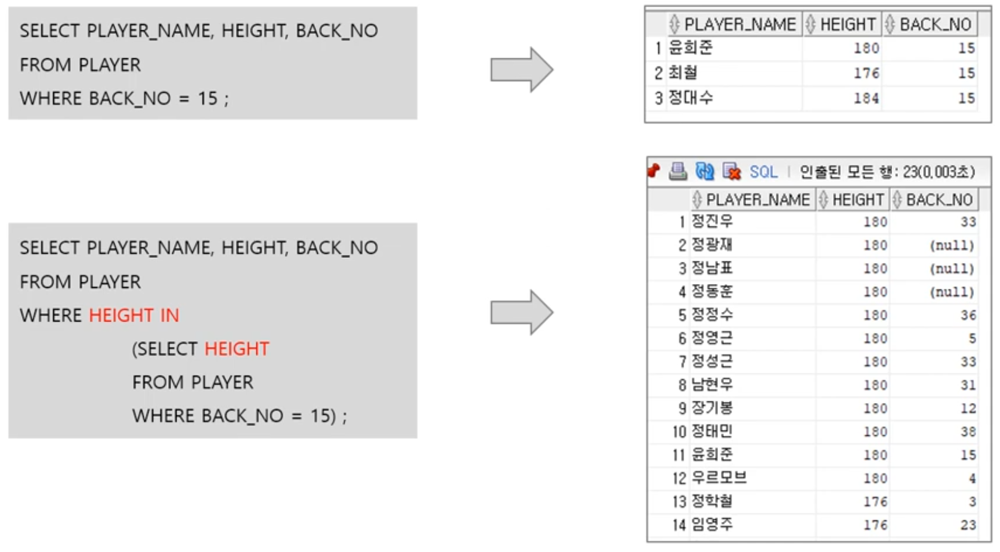
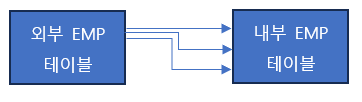

1. # Subquery
   - SQL문 안에 포함된 SQL문   
   예)신장이 가장 큰 선수의 정보 조회   
   ```sql
      SELECT PLAYER_NAME, POSITION, HEIGHT
      FROM PLAYER
      WHERE HEIGHT = (SELECT MAX(HEIGHT) FROM PLAYER);
   ```   
   가장 큰 키의 값을 추출 후 ← 서브쿼리   
   그 값에 해당하는 선수의 정보를 가져옵니다. ← 메인쿼리   

   - 용어   
      
   쿼리 안에 쿼리를 서브쿼리 또는 이너쿼리라 부르고,   
   바깥쪽 쿼리 문을 메인쿼리 또는 아우터쿼리라고 합니다.   

   - SQL문 안에 포함된 SQL문   

   |  기 준   |  유 형   |
   |:-------:|:---------:|
   | 서브쿼리 위치 |SELECT절, WHERE절, FROM절(→Inline View)|
   |결과 컬럼/행의 수|단일행 서브쿼리/다중행 서브쿼리 <br> 단일컬럼 서브쿼리/다중컬럼 서브쿼리|
   |메인 쿼리와의 연관성|연관(상관) 서브쿼리/비연관 서브쿼리|   

   -select, from절에서도 서브쿼리 사용가능   

   -from절에 사용하는 서브쿼리는 view와 비슷한 특성을 가지고 있어서 Inline View라고도 부름   

   -단일컬럼 서브쿼리   
   ...WHERE HEIGTH = (SELECT MAX(HEIGHT)... ☜서브쿼리 안에 SELECT절에 컬럼이 한 개 사용   

   -다중컬럼 서브쿼리   
   ...WHERE HEIGTH IN (SELECT MAX(HEIGHT), MIN(HEIGHT)...  ☜서브쿼리 안에 SELECT절에 컬럼이 두 개 이상 사용   

   -서브쿼리의 결과 행이 한 개면 단일행 서브쿼리 / 두 개 이상이면 다중행 서브쿼리   

   -서브쿼리는 메인쿼리의 컬럼 모두 사용 가능 → 연관 서브쿼리   

   -메인쿼리는 서브쿼리의 컬럼 사용 불가   

   -서브쿼리 안에는 ORDER BY를 포함할 수 없습니다.
   ```sql
      SELECT * FROM PLAYER 
      WHERE HEIGHT < ANY (SELECT HEIGHT FROM PLAYER) /*정상 동작*/
   
      SELECT * FROM PLAYER 
      WHERE HEIGHT < ANY (SELECT HEIGHT FROM PLAYER ORDER BY HEIGHT) /*에러 발생*/
   ```

1. # 결과 컬럼/행위 수에 따른 구분
      

1. # 단일행 서브쿼리
   - 서브쿼리의 결과 건수가 반드시 1건 이하   
   - 단일행 비교 연산자 (=, <, <=, >, >=, <>)와 함께 사용   
      -결과가 2건 이상이면 Run Time 오류 발생   
      *Run Time 오류? 문법적으론 이상이 없는데 실제 실행시 발생하는 에러   
   
   - 결과가 단일행 예제   
   '2007182'번 선수와 같은 팀에 속하는 선수의 이름, 포지션, 팀ID 출력   
      
   2007182번에 해당하는 TEAM_ID는 K06 한 개가 나와서 단일행 서브쿼리를 만족.   

   - UPDATE 구문에서도 서브쿼리 사용 가능   
   사번 7499인 직원의 매니저를 사번 7369인 직원의 매니저로 변경하는 질의를 작성하시오.   
   ```
      UPDATE EMP SET MGR = (SELECT MGR FROM EMP WHERE EMPNO=7369) WHERE MGR = 7499;
   ```   
   업데이트하는 컬럼값에도 서브쿼리가 가능   

   - 결과가 단일행일 때와 다중행일 때   
      
   '마니치'란 이름으로 검색시 K06이란 TEAM_ID 1개가 나왔고 '김충호'란 이름으로 검색시 K04란 TEAM_ID가 2개 나왔습니다. '김충호'란 동명이인있는 경우에 해당합니다. 이 경우 단일행 비교 연산자 '='를 사용하였기 때문에 __'마니치'__ 로 검색한 서브쿼리는 __정상작동__ 하지만 __'김충호'__ 로 검색한 서브쿼리는 <u>값은 K04로 동일</u>하지만 <u>행수가 2개</u>이기 때문에 __에러가 발생__ 합니다. 즉, 단일행 비교 연산자를 사용시엔 ID나 NO등 UNIQUE한 값을 가져올 수 있는 PK값으로 비교를 하든지 아니면 결과가 단일행인 걸 확신할 수 없을 땐 다중행 비교 연산자를 사용하는 것이 안전합니다.   

1. # 다중행 서브쿼리
   - 서브쿼리의 결과 건수가 2건 이상일 가능성이 있을 때   
   - 다중행 비교 연산자와 함께 사용   
      -2건 이상일 가능성은 있지만 결과 건수가 우연히 1개인 경우 → 단일행 비교 연산자도 에러는 발생하지 않음   
      

   2. IN 연산자   
   - 서브쿼리 결과값을 하나라도 만족하면 출력   
   - equl에 or을 여러개 정의한 것과 같은 의미   
   예)BACK_NO가 15인 HEIGHT가 180, 176, 184가 있는데 이 HEIGHT와 같은 HEGIHT값을 가지는 PLAYER출력   
      
   HEIGHT=180 OR HEIGHT=176 OR HEIGHT=184와 같은 의미   

   2. ALL 연산자   
   - __부등호 연산자__ 와 함께 사용   
   - 결과의 __모든 값__ 을 만족해야 하는 조건   
   - 만약, X>ALL(1,2,3,4,5) 라면 X>5가 되어야 함   
   예)BACK_NO가 15인 HEIGHT가 180, 176, 184가 있는데 모든 HEIGHT값 보다 큰 HEIGHT를 가진 PLAYER출력   
      
   HEIGHT가 176보다 커야하고, 180보다 커야 하고, 184보다 커야 하는데 이 모든 조건을 만족하는 HEGITH>184가 됩니다.
   
   2. ANY(=SOME) 연산자   
   - __부등호 연산자__ 와 함께 사용   
   - 결과의 어느 __하나의 값__ 이라도 만족하면 되는 조건(ANY = SOME)   
   - 만약, X>ANY (1,2,3,4,5) 라면 X>1이면 됨   
   예)BACK_NO가 31인 PLAYER의 HEGITH출력   
   ```sql
      SELECT HEIGHT FROM PLAYER WHERE BACK_NO=31;
   ```   
   결과 값:   
      
   가장 작은 값은 180.   
   ```sql
      SELECT PLAYER_NAME, HEIGHT, BACK_NO
      FROM PLAYER
      WHERE HEIGHT > ANY(SELECT HEIGHT FROM PLAYER WHERE BACK_NO=31);  
   ```   
      
   ANY조건이기 때문에 가장 작은 값 180초과이면 됩니다. 쿼리 결과의 최소값은 181입니다.   

   2. EXIST 연산자   
   - 조건을 만족하는 값이 존재하는지 여부를 확인   
   - 조건이 만족되는 1건만 찾으면 더 이상 검색하지 않음(속도가 빠름)   
   - 주로 참/거짓의 조건 판단용으로 사용됨   
      
   EXIST연산자에서 중요한 건 하위쿼리 내에있는 WHERE절에 조건입니다. 서브쿼리가 해당 조건에 의한 결과값이 1건이라도 있으면 아우터 쿼리가 실행됩니다. 하위쿼리 __결과값의 유무__ 로 EXISTS를 판별하기 때문에 하위쿼리 SELECT문에는 어떤 값이 와도 상관없습니다. 그래서 보통 "1"을 적습니다.   

1. # 연관(Correlated) 서브쿼리
   
   메인쿼리의 컬럼이 서브쿼리에서 사용된 쿼리를 연관 서브쿼리라고 합니다.   

   2. 일반 서브쿼리   
   - OUTER쿼리의 EMP테이블과 INNER쿼리의 EMP테이블은 이름은 같지만 각각 테이블을 생성하여 값을 가져옵니다.   
   ```sql
      SELECT ENAME, SAL, DEPTNO
      FROM EMP 
      WHERE SAL > ANY (SELECT SAL
                     FROM EMP 
                     WHERE DEPTNO = 20); 
   ```
      
   메인쿼리의 EMP테이블과 내부쿼리의 EMP테이블이 따로따로 서로 다른 관점으로 존재를 합니다.   

   2. 연관 서브쿼리
   - OUTER쿼리의 EMP테이블과 INNER쿼리의 EMP테이블과 연관지어 서브쿼리의 조건을 대조합니다.   
   ```sql
      SELECT ENAME, SAL, DEPTNO
      FROM EMP M
      WHERE SAL > (SELECT AVG(S.SAL)
                     FROM EMP S
                     WHERE M.DEPTNO = S.DEPTNO);      
   ```   
      
   메인쿼리의 EMP테이블과 내부쿼리의 EMP테이블이 이름이 같기 때문에 별칭은 필수입니다. __메인쿼리의 M테이블__ 에서 __1개의 값이 하나씩 나올 때__ 마다 S테이블에서 일치하는 값을 검색합니다.   

   2. 연관 서브쿼리 예제   
   ID가 일치하는 값들에 SAL의 합을 구한 후 이 값과 일치하는 SUM_RESULT컬럼을 가져옵니다. 테이블을 만들 때 이미 A,B,C의 합이 SUM_RESULT에 나오게 입력했습니다. 연관 서브쿼리 작동방식을 이해하는 예제입니다.
   ```sql
      CREATE TABLE CORRELATED(
          ID VARCHAR(5),
          SAL INTEGER,
          SUM_RESULT INTEGER
      );

      INSERT INTO CORRELATED VALUES('A',2,2);
      INSERT INTO CORRELATED VALUES('B',4,14);
      INSERT INTO CORRELATED VALUES('C',6,10);
      INSERT INTO CORRELATED VALUES('B',10,0);
      INSERT INTO CORRELATED VALUES('C',1,0);
      INSERT INTO CORRELATED VALUES('C',3,0);

      SELECT * FROM CORRELATED C
      WHERE SUM_RESULT IN (SELECT SUM(C2.SAL) FROM CORRELATED C2 WHERE C.ID = C2.ID);

      DELETE FROM CORRELATED;
      DROP TABLE CORRELATED;  
   ```   
   테이블: SELECT * FROM CORRELATED   
      
   SELECT * FROM CORRELATED C   
   WHERE SUM_RESULT IN (SELECT SUM(C2.SAL) FROM CORRELATED C2 WHERE C.ID = C2.ID);   
      
   결과:   
      
   C.ID의 값을 가지고 C2.ID를 쫙 검색<BR>
   A : 2 = 2   
   C.ID의 A가 C2.ID의 1번째행과 일치 SAL=2 ▶ SUM(C2.SAL) = 2<BR>
   B : 4 + 10 = 14   
   C.ID의 B가 C2.ID의 2번째행 4번째행과 일치 SAL=4, SAL=10 ▶ SUM(C2.SAL) = 14<BR>
   C : 6 + 1 + 3 = 10   
   C.ID의 C가 C2.ID의 3번째행 5번째행 6번째행과 일치 SAL=6, SAL=1, SAL=3 ▶ SUM(C2.SAL) = 10<BR>

   2. 연관 서브쿼리의 특징   
   - 메인쿼리의 컬럼이 서브쿼리에 사용된 쿼리   
   cf) 비연관 서브쿼리 : 서브쿼리에서 메인쿼리의 컬럼을 사용하지 않음   
   - 메인쿼리가 먼저 수행되고, 그 후에 서브쿼리가 수행됨   
   - 서브쿼리가 메인쿼리의 값을 이용, 그 후에 서브쿼리의 결과를 메인쿼리가 이용   
   - 서브쿼리에서 메인쿼리의 컬럼과 서브쿼리의 컬럼 간 비교가 이루어짐   
   - 메인쿼리에서는 서브쿼리의 컬럼 사용 불가   
   :메인쿼리 실행 → 서브쿼리가 메인쿼리 값 이용 → 서브쿼리 결과를 메인쿼리가 이용   

   2. 연관 서브쿼리와 집계함수   
   GROUP BY없이 연관 서브쿼리와 집계함수를 사용할 수 있습니다.   
   ```sql
      /*SELECT 절에서 부서당 사원수를 그룹으로*/
      SELECT DEPT_ID, NAME, (SELECT COUNT(*) FROM EMP E WHERE E.DEPT_ID = D.DEPT_ID) AS 사원수
      FROM DEPT_REPORT D;

      /*SELECT절에서 부서당 사원수의 나이 총합을 그룹으로*/
      SELECT D.DEPT_ID, D.NAME, (SELECT SUM(AGE) FROM EMP E WHERE E.DEPT_ID = D.DEPT_ID) AS 나이총합
      FROM DEPT_REPORT D;

      /*부서당 최고 나이를 그룹으로*/
      SELECT DEPT_ID, NAME, (SELECT MAX(AGE) FROM EMP E WHERE E.DEPT_ID = D.DEPT_ID) AS 나이
      FROM DEPT_REPORT D;
      /*아래 위 같은 결과*/
      SELECT D.DEPT_ID, AGE
      FROM DEPT_REPORT D, EMP E1
      WHERE E1.AGE = (SELECT MAX(AGE) FROM EMP E2 WHERE E2.DEPT_ID = D.DEPT_ID);
   ```

1. # 다중컬럼 서브쿼리
   - 서브쿼리의 SELECT절에 여러 컬럼이 사용   
   예)   
      
   HEIGHT, POSITION 2개의 컬럼을 반환해서 HEIGHT와 POSITION을 동시에 비교하고 있습니다. PLAYER_ID가 2007188인 선수의 키와 포지션이 2개의 값이 같은 선수를 출력하는 예제입니다.   
   1)WHERE절에 다중컬럼이기 때문에 ()를 묶어야 합니다.   
   2)WHERE(HEIGHT, POSITION)과 서브쿼리 'SELECT HEIGHT, POSITION FROM ~'에서 HEIGHT와 POSITION의 위치가 동일해야 합니다.   

   - 다중컬럼 단일행 서브쿼리   
   서브쿼리의 SELECT절이 다중컬럼인데 그 결과값이 단일행인 경우   
   ```sql
      SELECT * FROM PLAYER WHERE PLAYER_NAME='마니치'
      
      결과 테이블:
      PLAYER_NAME POSITION BACK_NO HEIGHT 
      ----------- -------- ------- -----
         마니치       FW      9      184
   ```   
   PLAYER_NAME='마니치'의 결과는 1행입니다.   
   ```sql
      SELECT * FROM PLAYER WHERE (HEIGHT, POSITION) = (SELECT HEIGHT, POSITION FROM PLAYER WHERE PLAYER_NAME='마니치');
   ```   
   PLAYER_NAME이 '마니치'인 선수는 1명이라서 단일행 연산자 '='를 사용했습니다.   

   - 다중컬럼 다중행 서브쿼리   
   서브쿼리의 SELECT절이 다중컬럼인데 그 결과값이 다중행인 경우   
   ```sql
      SELECT * FROM PLAYER WHERE PLAYER_NAME='김충호';

      결과 테이블:
      PLAYER_NAME POSITION BACK_NO HEIGHT
      ----------- -------- ------- ------
         김충호       DF      21     185
         김충호       GK      17     172
   ```   
   PLAYER_NAME이 '김충호'인 선수는 동명이인이라 2명이 검색되었습니다. 이 경우 단일행 연산자 '='를 사용하게 되면 에러가 발생합니다.   
   ```sql
      SELECT * FROM PLAYER WHERE (HEIGHT, POSITION) = (SELECT HEIGHT, POSITION FROM PLAYER WHERE PLAYER_NAME='김충호') /*ERROR 발생!*/
   ```   
   서브쿼리 결과값이 다중행이면 다중행 연산자를 사용해야 합니다.   
   ```sql
      SELECT * FROM PLAYER WHERE (HEIGHT, POSITION) IN (SELECT HEIGHT, POSITION FROM PLAYER WHERE PLAYER_NAME='김충호') /*다중행 연산사 IN사용*/
   ```   

1. # 스칼라 서브쿼리
   2. 하나의 값을 반환하는 서브쿼리   
      - 단일 행, 단일 컬럼인 경우를 특별히 스칼라 서브쿼리라 함      
      - 하나의 값을 반환한다는 점에서 함수(function)의 특성을 가짐   
      - 공집합을 반환하는 경우 null이 대응됨   
      - 컬럼이 올 수 있는 대부분의 곳에서 사용 가능   
      -SELECT절, WHERE절, 함수의 인자, ORDER BY절, CASE절, HAVING절 등   

   2. SELECT절에서 스칼라 서브쿼리 이용   
   ```
      SELECT EMPNO, ENAME, (SELECT DNAME FOR DEPT WHERE DEPTNO=A.DEPTNO) AS DNAME 
      FROM EMP A;
   ```   
   SELECT * FROM EMP;   
      
   SELECT * FROM DEPT;   
      
   EMP에 DEPTNO만 있기 때문에 EMP테이블의 DEPTNO에 해당하는 DNAME을 연관쿼리의 DEPT테이블에서 가져옵니다.   
   EMP의 DEPTNO에 걸리는 DNAME은 1개밖에 없기 때문에 단일행, 단일 컬럼이 결과로 출력됩니다.   
   *일반적으로 연관쿼리 대신 조인을 활용합니다.   

   2. WHERE절에서 스칼라 서브쿼리 이용   
   ```
      SELECT EMPNO, ENAME, DEPTNO 
      FROM EMP A 
      WHERE (SELECT DNAME FOR DEPT WHERE DEPTNO=A.DEPTNO) = 'SALES';
   ```   
   위의 연관쿼리와 같은 방식으로 이번엔 DNAME을 출력하는 것이 아니라 WHERE절에서 조건으로 사용했습니다.  

   2. 함수안에서 스칼라 서브쿼리 이용   
   ```
      SELECT EMPNO, ENAME, DEPTNO, SUBSTR((SELECT DNAME  FROM DEPT WHERE DEPTNO=A.DEPTNO),1,3) AS DNAME
      FROM EMP A;
   ```

   


