1. # 최적화
   - 옵티마이저와 실행 계획   
   -규칙기반 옵티마이저   
   -비용기반 옵티마이저   
   - 인덱스 기본   
   -B-TREE 인덱스   
   -Index Scan / Full Scan   
   - 조인 수행 원리   
   -NL Join   
   -Sort Merge Join   
   -Hash Join   

1. # 옵티마이저(Optimizer) 개념
   - SQL은 사용자의 요구사항만 기술할 뿐 처리 과정은 기술하지 않음   
   -실제로 SQL문을 실행하기 __전(before)__ 에 최적의 실행계획을 찾아야 함   
   - 옵티마이저 : 사용자의 요구사항을 만족하는 다양한 실행계획(Execution Plan) 중 최적의 실행계획을 결정   
   -SQL을 어떤 순서로 어떻게 실행할지 결정하는 작업 수행   

1. # 옵티마이저의 종류
   - 규칙기반 옵티아미저(RBO:Rule-Based Optimizer)   
   -거의 사용하지 않지만, 하위 버전 호환성을 위해 유지   
   - 비용기반 옵티마이저(CBO:Cost-Based Optimizer)
   -대부분 사용되고 있는 옵티마이저   

1. # 옵티마이저 동작 구조
   
   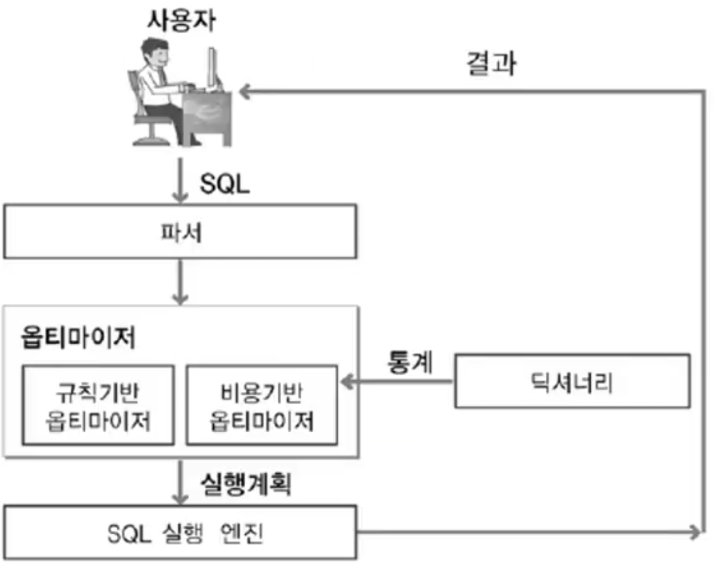   

   사용자가 쿼리문를 실행하면 DBMS의 파서가 구문을 분석 후 바로 SQL 실행 엔진을 돌려 쿼리문을 실행하는 것이 아니라 옵티마이저가 먼저 쿼리문을 분석해 최적의 실행 방법을 미리 검색 후 SQL 실행 엔진을 구동합니다.   
   -규칙기반 옵티마이저 : 실행 규칙이 미리 전부 정해져 있어서 바로 실행계획이 도출 됨   
   -비용기반 옵티마이저 : 딕셔너리의 통계를 통해 자원의 비용을 구한 후 최적의 실행계획을 구함   

1. # 규칙기반 옵티마이저 순서

   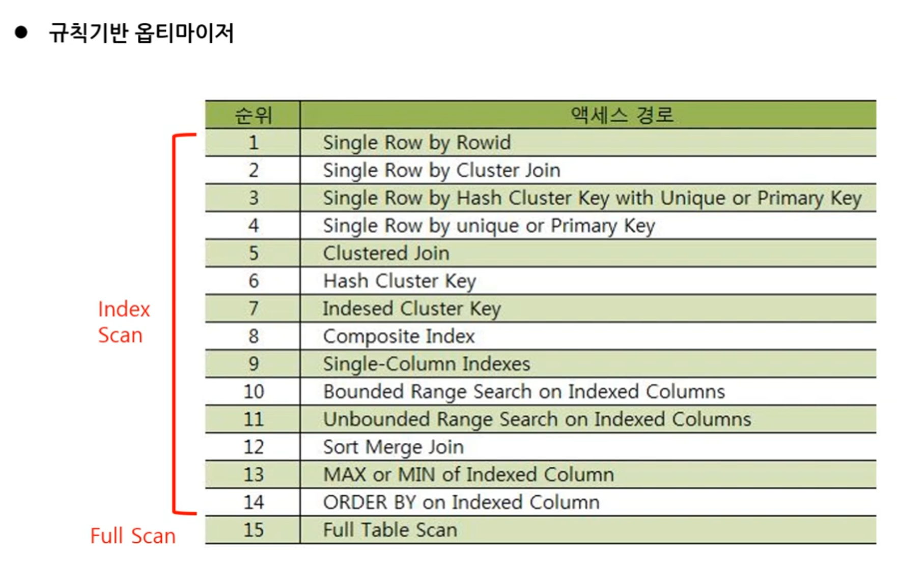   
   
   - 규칙 1. Single row by Rowid   
   -ROWID를 통해서 테이블에서 하나의 행을 액세스   
   
   - 규칙 4. Single row by unique or primary key   
   -Unique Index를 통해서 하나의 행을 액세서하는 방식   
   -인덱스를 먼저 액세스하고 인덱스의 ROWID를 추출하여 행을 액세스함   
   
   - 규칙 8. Composite index   
   -복합 인덱스로 검색하는 경우   
   -복합 인덱스 사이의 우선 순위 규칙   
   1) 인덱스 매칭률이 높을수록 우선   
   2) 인덱스 매칭률이 동일하면, 구성 컬럼이 많을수록 우선   
   3) 예)(1)A/B/C 조합과 (2)D/E 조합이 있을 때, 매칭률이 동일하면 (1)우선   

   - 규칙 9. Single column index   
   -단일 컬럼 인덱스에 '=' 조건으로 검색   

   - 규칙 10. Bounded range search on indexed columns
   -인덱스가 생성되어 있는 컬럼에 양쪽 범위를 한정하는 형태로 검색 : LIKE, BETWEEN   
   -예) X BETWEEN '10' AND '20' / X LIKE '1%'   

   - 규칙 11. Unbounded range search on indexed columns
   - 인덱스가 생성되어 있는 커럼에 한쪽 범위만 한정하는 형대로 검색 : >, >=, <, <=   
   -예) A > 10   

   - 규칙 15. Full Table Scan(전체 테이블 액세스)   
   -일반적으로 속도가 느리지만 병렬 처리 가능   

1. # 인덱스 매칭률
   - 예) index 1 ← (학번, 나이, 생년월일)로 구성, index 2 ← (주민번호, 학년)으로 구성   
   -다음 질의에서는 어떤 인덱스를 사용하는 것이 효율적인가?   
   ```
      SELECT * FROM STUDENT
      WHERE 학번='123' AND 나이=20 AND 주민번호='123456' AND 학년=3
   ```
   - 인덱스 매칭률 = 질의문에서 Equal(=) 조건으로 사용된 인덱스 컬럼 수 / 인덱스를 구성하는 컬럼 수   
   -단, 첫 컬럼부터 순서로 연속되는 경우만을 Matching으로 인정함   
   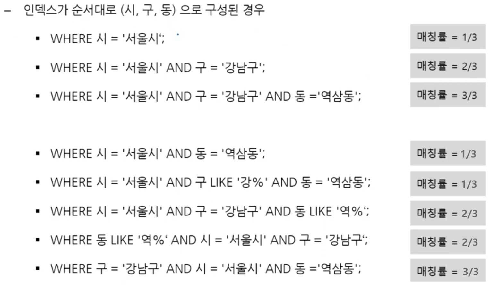   

1. # 규칙기반 옵티마이저 실행 계획 예
   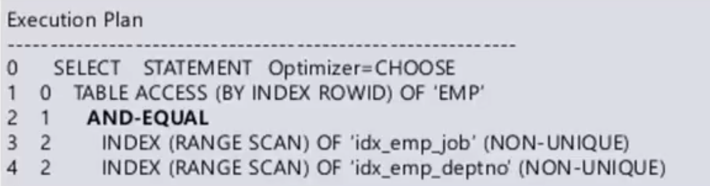   
   
1. # 비용기반 옵티마이저

   - 규칙기반 옵티마이저의 한계   
   -몇 개의 규칙만으로 현실의 모든 상황을 설명하기 어려움   
   -예) 항상 '='이 BETWEEN보다 빠른가?   

   - SQL문 처리에 예상되는 비용(소요시간, 자원사용량)을 최소화하기 위한 방법 필요   

   - 테이블, 인덱스, 컬럼 등의 객체에 대한 통계정보, 시스템 통계정보 활용   
   -정확한 통계정보 관리는 비용기반 최적화의 중요한 요소임   

   - 통계정보, DBMS버전, DBMS설정 정보에 따라 동일한 SQL문도 서로 다른 실행계획이 생성될 수 있음   

1. # 비용기반 옵티마이저의 구성
   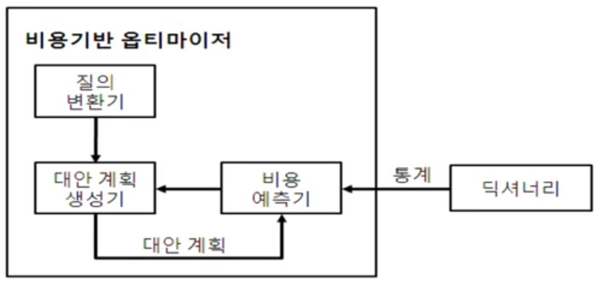   

   - 질의 변환기   
   -SQL문을 보다 작업이 용이한 형태로 변환   

   - 대안 계획 생성기   
   -동일한 결과를 생성하는 다양한 대안 계획 생성   
   -가능한 모든 계획을 생성하지는 않으므로, 최적 대안이 누락되는 경우도 있음   

   - 비용 예측기   
   -다양한 통계 정보를 활용하여 대안 계획의 비용 예측   

1. # 실행 계획
   - 실행계획은 조인 순서, 조인 기법, 액세스 기법, 최적화 정보 등으로 구성   
   - 조인 기법 : NL Join, Sort Merge Join, Hash Join 등 사용   
   - 액세스 기법 : Index Scan, Full Table Scan   
   - 최적화 정보는 실제 실행 결과가 아닌 통계 정보 바탕의 예측지   
   -Cost: 상대적인 비용 정보 (숫자가 낮을수록 유리)   
   -Card: 주어진 조건을 만족하는 행의 수   
   -Bytes: 결과 집합이 차지하는 메모리의 양   
   
1. # 비용기반 옵티마이저의 실행 계획 예
   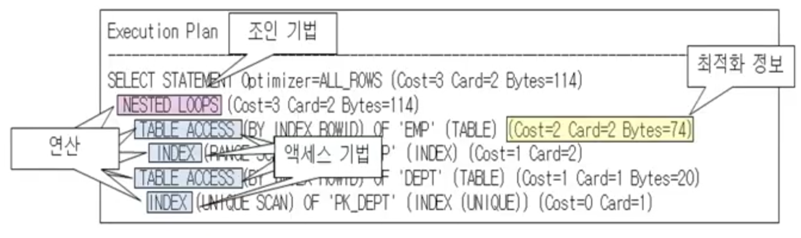   
   (Cost=3 Card=2 Bytes=114)   
   (Cost=1 Card=2)   
   ...
   Cost, Card, Bytes 값들은 실제 실행한 후의 값이 아니라 실행 전 통계 정보를 바탕으로 예측한 값들.   

1. # Full Table Scan(FTS)
   
   - 테이블 내의 모든 데이터를 읽어가면서 조건 검색   
   -고수위 마크(HWM, High Water Mark)아래의 모든 블록을 읽으므로 시간이 많이 소요됨   

   - 다음의 경우 옵티마이저는 FTS선택   
   -SQL문에 WHERE조건이 존재하지 않는 경우 → 모든 데이터가 답   
   -SQL문 조건에 사용 가능한 인덱스가 없는 경우   
   -조건을 만족하는 데이터가 매우 많은 경우(옵티마이저의 선택)   
   1) 인덱스 스캔은 한 번의 I/O요청에 한 Block씩 데이터를 읽음   
   2) FTS는 한 번의 I/O요청으로 여러 Block을 동시에 읽음   

   - 병렬처리 방식으로 처리하는 경우   
   -Index Scan은 병렬처리 방식이 안 됨   

 1. # 인덱스(Index)

   - 검색 속도의 향상을 위한 기술   
   -지나치게 많은 인덱스 생성시 시간 및 공간 낭비   
   -인덱스된 필드의 업데이트시 시간 증가   

   - B-트리 인덱스가 가장 보편적   
   -일치(=) 검색과 범위(BETWEEN,<,>) 검색에 모두 적합   

   - 유형   
   1) 인덱스 유일 스캔(Index Unique Scan)   
   &nbsp;&nbsp;&nbsp;-Unique Index를 사용하여 단 하나의 데이터를 추출하는 방식   
   &nbsp;&nbsp;&nbsp;-Index 구성 컬럼에 조건이 모두 '='로 주어진 경우   
   2) 인덱스 범위 스캔(Index Range Scan)    
   &nbsp;&nbsp;&nbsp;-한 건 이상의 데이터를 추출하는 방식      
   &nbsp;&nbsp;&nbsp;-Non-Unique Index를 이용하는 경우   
   &nbsp;&nbsp;&nbsp;-Index 구성 컬럼에 '=' 이외의 조건이 주어진 경우   

1. # B-트리 인덱스

   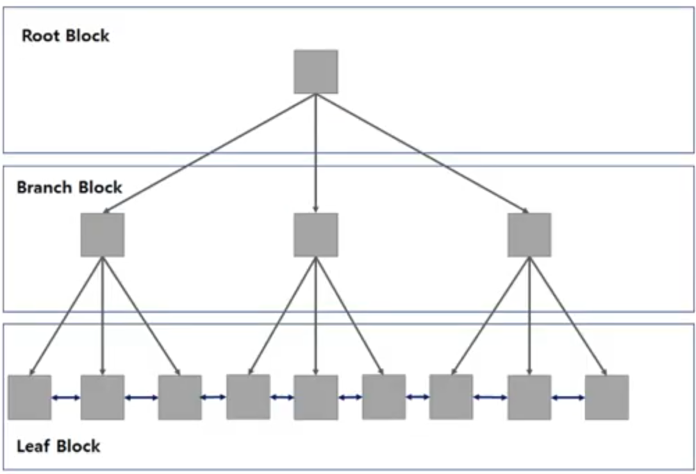   

   - Root Block   
   -Branch Block 중 최상위   

   - Branch Blcok   
   -분기를 목적으로 함   
   -다음 단계를 가리키는 포인터를 갖고 있음   

   - Leaf Block   
   -트리의 가장 아래 단계   
   -리프 노드엔 __인덱스 구성 컬럼의 데이터__ 와 __해당 행의 위치를 가리키는 식별자__ 로 구성됨   
   -Leaf Block간 양방향 링크를 갖고 있음 → 오름 차순, 내림 차순 검색 가능   

1. # B-트리 검색 예

   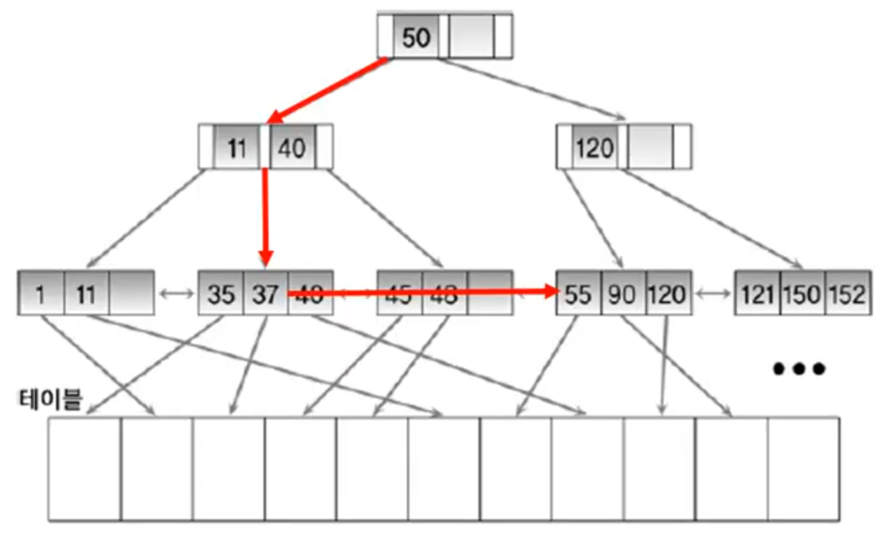   

1. # NL(Nested Loop) 조인

   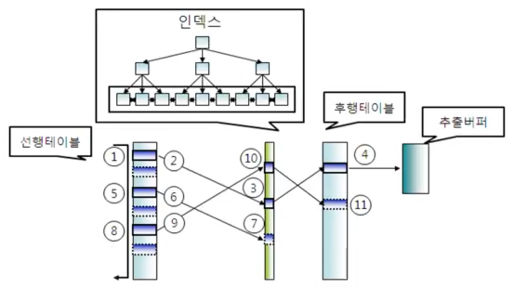   

   - 선행 테이블(외부 테이블)과 후행 테이블(내부 테이블) 조인   
      
   선행 테이블과 후행 테이블이라 불리는 이유 :   
   for(a=0 ; a<100 ; a++){   /`*` ← 먼저 실행되기 때문에 '선행 테이블'이면서 안에 for문보다 밖에 위치하기 때문에 '외부 테이블' `*`/    
   &nbsp;&nbsp;&nbsp;for(b=0 ; b<100 ; b++){   /`*` ← 위에 for문 이후 실행되기 때문에 '후행 테이블'이면서 앞에 for문보다 안에 위치하기 때문에 '내부 테이블' `*`/    
   &nbsp;&nbsp;&nbsp;&nbsp;&nbsp;&nbsp;...   
   &nbsp;&nbsp;&nbsp;}   
   }   

   - 선행 테이블의 조건을 만족하는 행 추출 → 후행 테이블 읽으면서 조인   
   -이 과정을 선행 테이블의 조건을 만족하는 행 수만큼 반복   
   
   - 결과 행의 수가 적은 테이블을 조인 순서상 선행 테이블로 두는 것이 유리   
   -선행 테이블의 레코드가 10개, 후행 테이블의 레코드가 100개인 경우 10개에 해당하는 데이터를 검색 후 먼저 걸래낼 수 있음   
   -선행 테이블의 레코드가 100개, 후행 테이블의 레코드가 10개인 경우 100개에 해당하는 데이터를 먼저 다 검색해야 됨   

1. # Sort Merge 조인

   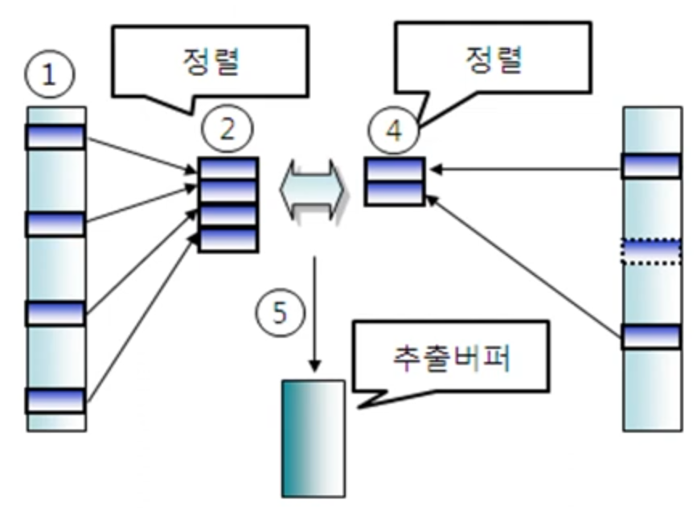   

   - 조인 컬럼 기준으로 데이터를 먼저 정렬 후 데이터 추출
   
   - 추출한 데이터를 가지고 조인 수행   

   - 정렬할 데이터가 많은 경우에는 성능 저하   

   - Non-Equi 조인 가능   

1. # Hash 조인

   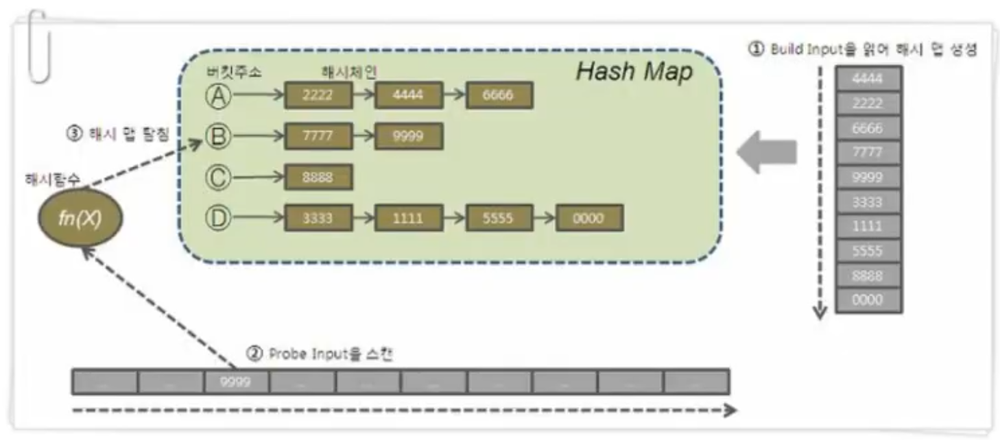   

   - 조인 컬럼 기준으로 해쉬 함수를 수행하여, 동일한 해쉬 값을 갖는 경우에만 실제 값을 비교하여 조인 수행   

   - 해시 테이블을 메모리에 생성해야 함   

   - 결과 행의 수가 적은 테이블을 선행 테이블(Build Input)로 사용하는 것이 좋음   

   - 선행 테이블:Build Input, 후행 테이블:Probe Input    

1. # 튜닝 Big3 조인

   - NL(Nested Loop) 조인 → 소규모에 유리   
      -소규모 데이터 인덱스를 사용하여 작업하는 OLTP 업무에 적합   
      -연결 조건 인덱스 및 드라이빙 테이블의 우선순위에 따라 성능 결정   

   - Sort Merge 조인 → 정렬   
      -인덱스를 사용하지 않으며, Non-Equi join도 가능   
      -정렬 수행에 비용이 소요됨   

   - Hash 조인 → 해시 테이블 생성, 대규모에 유리 
      -Equi Join만 가능하며, 데이터가 많은 경우 유리   
      -해시 함수 계산에 비용이 소모됨   
      -결과 행의 수가 적은 테이블을 선행 테이블로 사용하는 경우 성능 향상   

   - 단계별로 다른 조인 적용 가능   
      -예)A/B 조인에 NL Join, 그 결과와 C조인에 Hash Join   