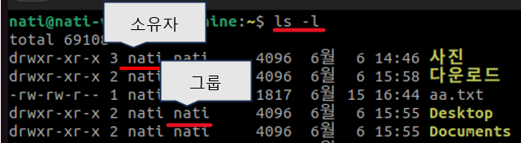

1. # 파일의 소유자
   리눅스의 모든 파일에는 소유자가 있습니다. 새롭게 파일을 작성한 작성자가 파일의 소유자가 되며 소유자는 접근권한을 자유롭게 설정할 수 있습니다.ㄴ 소유자 확인은 ls -l 입니다.   
        
1. # 그룹
   그룹이란 사용자들을 묶은 그룹을 말합니다. 한명의 사용자가 여러 그룹에 소속될 수 있습니다. 어떤 사용자도 최소한 한 그룹에는 소속되어 있어야합니다. 사용자를 처음 만들 때 그룹을 정해주지 않으면 __사용자 이름과 동일한 그룹__ 에 소속됩니다. 현재 소속된 그룹확인은 groups입니다.
   ```linux
      $ groups
      usersname
   ```
1. # 파일 퍼미션(permission)
   리눅스에서는 파일에 대한 권한을 허가할지에 대한 정보가 설정되어있습니다. 이를 퍼미션(permssion)이라 합니다. 퍼미션도 ls -l 명령어로 확인 할 수 있습니다.   
   예) -rwxr-xr-x    
   가장 앞 첫 글자는 __파일의 타입__ 입니다.    
   `-` : 일반파일   
   d   : 디렉토리   
   l   : 심볼릭 링크   
   파일 타입 뒤에 이어지는 9글자 rwxr-xr-x를 __파일 모드__ 라고 합니다. 파일 모드가 파일 퍼미션을 의미합니다.   

   | 소유자 |소유그룹|기타사용자|
   |:---:|:---:|:---:|
   |rwx|r-x|r-x|

   <br>   
   r : 읽기 권한<br>
   w : 쓰기 권한<br>  
   x : 실행 권한<br>
   <br>
   권한이 있으면 rwx란 문자가 표시되고, 권한이 없으면 -이 표시됩니다.   
1. # 디렉터리 퍼미션
   디렉터리의 설정된 퍼미션을 확인하기 위해선 ls -l 과 함께 d 옵션을 붙여줘야 합니다.   
   ex) $ls -ld dir1   
       drwxrwxr-x 2 nati nati 5월 17 18:34 dir1   
   디렉터리 퍼미션도 r, w, x 라는 문자를 사용하지만 그 의미는 완전히 다릅니다.   
   
   |기호|의미|
   |--|--|
   |r| 해당 디렉토리에 내용을 볼 수 있는 권한 ls |
   |w| 해당 디렉토리 안에 파일이나 디렉토리를 수정, 삭제 할 수 있는 권한 |
   |x| 해당 디렉토리에 접근 할 수 있는 권한 cd|   

      


 

