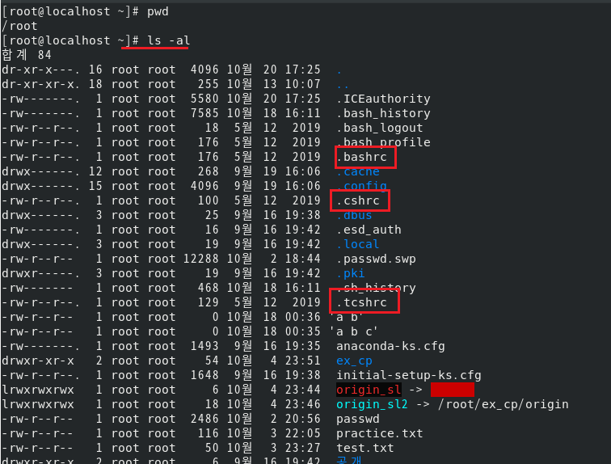
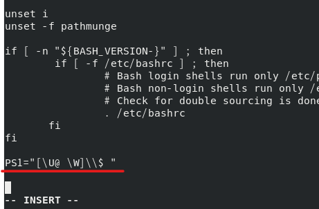

1. # 쉘
   사용자가 입력한 명령을 해석하여 커널에 전달.   
   커널과 사용자간의 대화식 인터페이스 역할.   
   스크립트 언어 - 쉘 자체가 프로그래밍 기능을 가짐.   
   recirection과 pipe기능 제공   
   본셸계열과 C셸 계열로 나뉨   
      프롬프트 $ - 본셸   
      프롬프트 % - C셸   

1. # 쉘 확인
   ```   
      echo $SHELL
   ```   
   $뒤에 문자가 오는 경우 문자를 변수로 인식하게 됨.   
   $SHELL : SHELL이란 변수에 들어있는 값을 echo출력   

1. # 쉘 기능
   히스토리 - history 명령어로 이전 입력한 값들을 확인 가능   
   alias - alias기능 제공   
   쉘 스크립트 - 스크립트 기능 제공   
   자동완성 - tab키를 입력하면 경로나 명령어 자동완성   

1. # 인용부호 메타문자
   ~ : 현재 로그인 한 사용자의 홈 디렉토리   
   `-` : 이전 작업 디렉토리   
   `*` : 하나 이상의 문자를 대체하는 문자, 일반적으로 전체를 의미   
   ex)rm -rf ./*   
   rm -rf test*   
   ? : 하나의 문자만 대체   
   ``(뻭틱) : 문자를 명령어로 인식하여 실행   
   ' '(작은 따옴표) : 특수문자(`,~,@,#,$,..)를 일반 문자로 취급   
   " "(큰 따옴표) : $,`,\ 문자를 제외한 나머지 문자만 일반문자로 취급   
   <span style="color:red">*$는 변수를 사용할 때 사용하는 문자</span>   

1. # 방향 재지정 메타문자
   표준 입력 - 0으로 인식   
   표준 출력 - 1로 인식   
   표준 에러 - 2로 인식   

   1) < : 표준 입력 재지정

   2) > : 표준 출력   
      표준 출력 및 에러를 재지정, 일반적으로 명령어의 출력을 파일로 저장 또는 네트워크로 전송   
      `>` 한번이면 덮어 씀   
      `>>` 두번이면 기존 내용에 추가   

      - 파일에 저장할 때 : echo "test" > ./file   

      - 정상적인 결과만 출력할 때 : find / -perm -4000 2> /dev/null   
         -2번인 에러출력은 /dev/null로 다른 곳으로 보내버립니다. 그럼 정상 출력만 나오게 됩니다.   
      <span style="color:red">*dev/null dev디렉토리 안에 있는 null이란 파일로 윈도우의 쓰레기통 같은 파일입니다.</span>   

      - 에러 결과만 출력할 때 : find / -perm -4000 1> /dev/null   
         -1번인 정상출력을 /dev/null로 다른 곳으로 보내버립니다. 그럼 에러만 출력되게 됩니다.   

      - 정상적인 결과는 파일에 저장, 에러는 출력하기 않을 때 : find / -perm -4000 1> .file 2> /dev/null   

   3) | : 파이프   
   [명령어1] | [명령어2] 명령어1의 결과를 명령어2의 입력으로 사용   
   ls의 결과를 grep에게 넘겨줍니다. grep는 해당 결과에서 rc란 문자를 검색합니다.   
   ```   
      ls /etc | grep rc 
   ```   
   etc/passwd 파일에서 앞에서 8번째 줄까지 출력. 그 결과를 tail에서 받아서 끝 한 줄만 출력.   
   ```
      head -8 /etc/passwd | tail -1
   ```   

 1. # 사용자 초기화 파일   
   - 전역 설정 파일 - 시스템 전역과 모든 사용자   
   /etc/profile : 시스템 전역과 모든 사용자에게 적용되는 셀 환경을 설정하는 시스템 설정 파일   
   /etc/bashrc : 별칭(alias)과 bash가 수행 시 실행되는 함수를 전역적으로 설정하는 파일   
   - 지역 설정 파일 - 개인 사용자   
   ~/.bash_profile : 개인 사용자의 셀 환경을 제어, PATH와 환경변수등을 지역적으로 설정 및 변경할 때 이용되는 시스템 설정 파일   
   ~/.bashrc : 별칭(alias)과 bash가 수행 시 실행되는 함수를 지역적으로 설정하는 파일   
   => 환경 변수, 쉘 프롬프트 모양, 별명 기능, 쉘 옵션 정의 등 설정 가능   
   *rc : running script   
      

1. # 설정 파일 실습   
   - .bashrc   
   ```
      [root@localhost ~]# cat .bashrc
      # .bashrc

      # User specific aliases and functions

      alias rm='rm -i'
      alias cp='cp -i'
      alias mv='mv -i'

      # Source global definitions
      if [ -f /etc/bashrc ]; then
      	. /etc/bashrc
      fi
      [root@localhost ~]# 
   ```   
   .bashrc파일에 alias가 저장되어 있음   

   - profile   
   ```
      [root@localhost ~]# cat /etc/profile
      # /etc/profile

      # System wide environment and startup programs, for login setup
      # Functions and aliases go in /etc/bashrc

      ...

      if [ $UID -gt 199 ] && [ "`id -gn`" = "`id -un`" ]; then
         umask 002
      else
         umask 022
      fi
   ```   
   etc/profile에서 umask를 설정   
   터미널에서 바로 umask 077 설정할 수 있지만 재로그인이나 재부팅을 하게 되면 설정값이 지워지고 초기화됩니다. /etc/profile에 umask를 설정하게 되면 재로그인이나 재부팅을해도 설정한 값 그대로 사용가능합니다.   

   - 프롬프트 설정   
   ```
      [root@localhost ~]# echo $PS1
      [\u@\h \W]\$
   ```   
   현재 프롬프트 경로 [user@host 경로]$ 에서 host를 삭제   
   [root@localhost ~]# vi /etc/profile
   profile파일 가장 하단에 설정 입력   
      
   PS1="[\(소문자)u@ \W]\\(슬래쉬2개)$(마지막에 공백입력)" 후 다시 로그인하면 수정된 초기화 파일을 다시 로딩   
   ```
      [root@localhost ~]# su - root   
      [root@ ~]#   /* ☜ 프롬프트 변경 됨*/
   ```   

1. # 환경 변수   
   __시스템 환경__ 에 대한 설정을 저장하고 있는 변수   
   환경 변수 - 전역 변수   
   셀 변수 - 지역 변수   
   PATH : 실행파일을 찾는 경로   
   HOME : 사용자의 홈 디렉토리   
   LANG : 프로그램 사용시 기본 지원되는 언어   
   SHELL : 로그인해서 사용하는 쉘   
   TERM : 터미널 종류   
   EDITOR : 기본 편집기의 이름   
   PS1 : 명령 프롬프트 변수   

1. # 메타문자 사용하기
   - cd - : 바로 이전의 디렉토리로 이동
   ```
      [root@ /etc/sysconfig/network-scripts]# cd /root
      [root@ ~]# cd -
      /etc/sysconfig/network-scripts
      [root@ /etc/sysconfig/network-scripts]# 
   ```   

   - cd ~다른사용자 : 다른 사용자의 홈 디렉토리로 이동
   ```
      [root@ ~]# cd ~test
      [root@ test]#
   ```   

   - '`` 명령어 '`` : echo 이후 뻭틱으로 묶으면 그 명령어가 실행
   ```
      [root@ ~]# echo ls -l   'ls -l 이 그대로 출력'
      ls -l

      'ls -l 명령어가 실행'
      [root@ ~]# echo `ls -l`
      total 12 -rw-------. 1 root root 2819 Aug 2 01:24 anaconda-ks.cfg drwxr-xr-x. 2 root root 6 Aug 8 02:36 khj2 -rw-------. 1 root root 2099 Aug 2 01:24 original-ks.cfg -rw-r--r--. 1 root root 94 Aug 9 08:17 test
   ```   

   - '' : 문자열로 인식   
   "" : $,`,/ 제외하고 나머지 문자는 일반문자로 인식
   ```
      [root@ ~]# echo $PS1    '$PS1 변수에 들어있는 값 출력
      [\u@ \w]\$
      [root@ ~]# echo '$PS1'    '$PS1을 문자로 인식'
      $PS1
      [root@ ~]# echo "$PS1"    '$제외하고 문자로 인식 $PS1 명령어 그대로 출력'
      [\u@ \w]\$ 
   ```   
   예제)
   ```
      [root@ ex]# echo "'cat file' contents in cat is `cat file`"
      'cat file' contents in cat is 
      file contents
      b
      d
      b
      d
      e
      feff
      fefeg g33r
      gefewgw
   ```   

1. # 방향재지정
   출력 방향을 돌립니다.
   ```
      '정상 출력만 myfile이란 파일에 입력, 화면상엔 error만 출력'
      [nati@localhost ~]$ find / passwd -name 1> myfile

      'error만 /dev/null(쓰레기통), 화면상엔 정상적인 결과만 출력'
      [nati@localhost ~]$ find / passwd -name 2> /dev/null
   ```


    
