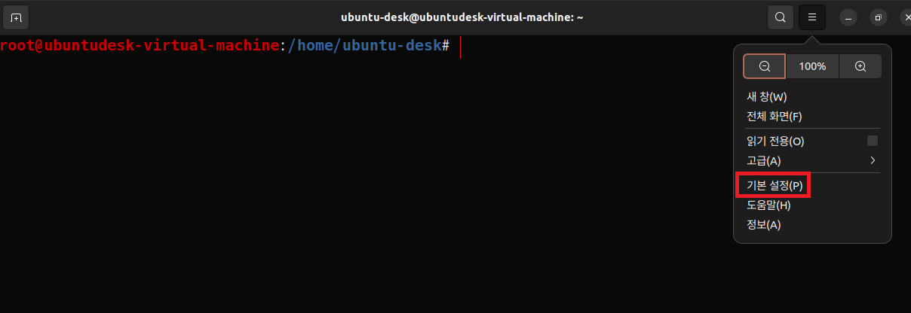

1. # 기본 셋팅
      

      

1. # 프롬프트 부분 설정
   ```s
      $ cd /root
      $ vi .bashrc
   ```   
   제일 하단에 입력   
   ```s
      PS1='\[\033[01;31m\]\u@\h\[\033[00m\]:\[\033[01;34m\]\w\[\033[00m\]\$ '
   ```   
   [01;31m] : 빨간색   
   \u : 사용자 이름   
   \h : 호스트 이름   
   \w : 현재 디렉토리   
   \$ : 프롬프트 문자열의 끝   

   입력 후   
   터미널 세션을 종료 후 다시 로그인   
   또는   
   ```s
      source ~/.bashrc
   ```   
   입력   

   


