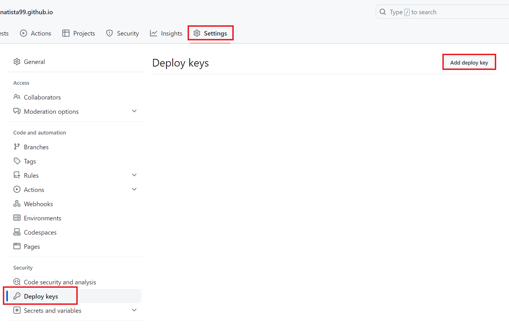
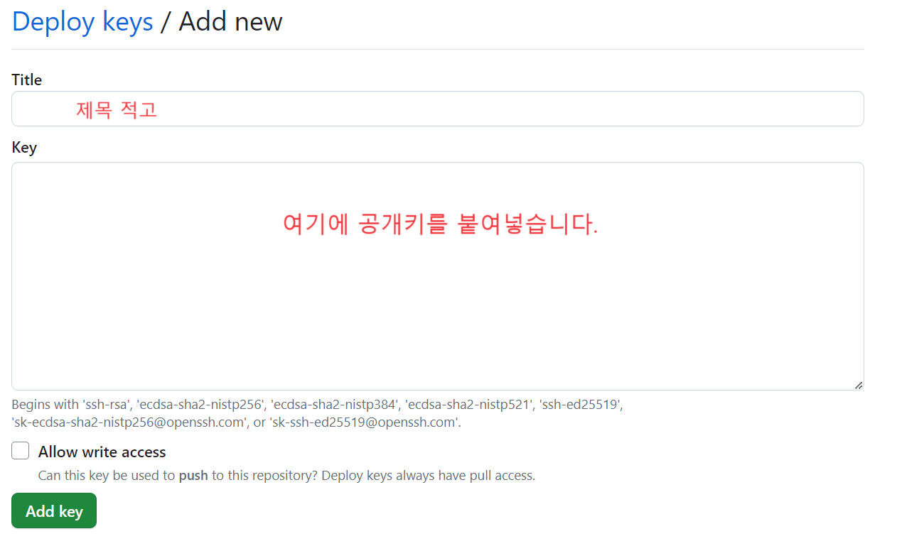

1. # ssh 명령어   
   시작: sudo service ssh start   
   중지: sudo service ssh stop   
   재시작: sudo service ssh restart   
   상태 확인: sudo service ssh status   

1. # 순서
   1)자신 계정의 SSH키 생성 : 로그인 없이 생성된 키만으로 나의 깃허브 계정에 접속   

   2)깃허브에 생성된 SSH키 입력   

   3)리눅스에서 접속 확인   

1. # SSH키 생성
   ```s
      root@ubuntudesk:/# ssh-keygen -t rsa -b 4096 -C "natista99@gmail.com"
      Generating public/private rsa key pair.
      Enter file in which to save the key (/root/.ssh/id_rsa): 
      Enter passphrase (empty for no passphrase): 
      Enter same passphrase again: 
      Your identification has been saved in /root/.ssh/id_rsa
      Your public key has been saved in /root/.ssh/id_rsa.pub
      The key fingerprint is:
   ```   
   ssh-keygen -t rsa -b 4096 -C "your_email@example.com"   

   -t 옵션은 생성할 SSH 키의 유형을 지정하는데 사용됩니다.   
   
   rsa는 RSA 알고리즘을 사용하는 SSH 키를 생성하겠다는 의미입니다.   

   -b 옵션은 생성할 SSH 키의 비트 수를 지정하는데 사용됩니다. 4096은 4096비트의 SSH 키를 생성하겠다는 의미입니다. 비트 수가 높을수록 보안 수준이 높아지지만, 생성과 사용에 더 많은 리소스가 필요하게 됩니다.   

   -C 옵션은 SSH 키에 주석(comment)을 추가하는데 사용됩니다. 주석은 해당 SSH 키를 식별하고 설명하는 용도로 사용됩니다. your_email@example.com은 이메일 주소를 주석으로 사용하겠다는 의미입니다.   

   또는 간단히   
   ```s
      root@ubuntudesk:/# ssh-keygen -t rsa -C "natista99"
   ```   
   같이 입력합니다.   

   Enter file in which to save the key (/root/.ssh/id_rsa) : 어디에 저장할 것인지 물어봅니다. 그냥 엔터를 치면 /root/.ssh 디렉토리에 id_rsa와 id_rsa.pub 파일이 2개 만들어지는데 id_rsa.pub가 공개키 입니다.   
   ```s
      root@ubuntudesk-virtual-machine:~/.ssh# ls -al
      total 20
      drwx------ 2 root root 4096 11월 28 20:24 .
      drwx------ 7 root root 4096 11월 28 20:17 ..
      -rw------- 1 root root 2590 11월 28 20:24 id_rsa
      -rw-r--r-- 1 root root  563 11월 28 20:24 id_rsa.pub
      -rw-r--r-- 1 root root  142 11월 28 20:12 known_hosts
   ```

1. # 깃허브에 입력
      

      

1. # 접속 확인
   ```s
      root@ubuntudesk-virtual-machine:/# ssh -T git@github.com
      Hi natista99/natista99.github.io! You've successfully authenticated, but GitHub does not provide shell access.
   ```   

   접속은 됐는데 쉘은 제공을 안 해주세요

1. # git clone
   ```s
      root@ubuntudesk-virtual-machine:/# git clone https://github.com/natista99/natista99
      Cloning into 'natista99'...
      remote: Enumerating objects: 6, done.
      remote: Counting objects: 100% (6/6), done.
      remote: Compressing objects: 100% (4/4), done.
      remote: Total 6 (delta 1), reused 0 (delta 0), pack-reused 0
      Receiving objects: 100% (6/6), done.
      Resolving deltas: 100% (1/1), done.

      root@ubuntudesk-virtual-machine:/# ls
      ...
      cdrom  etc  root  snap  swapfile  usr natista99 ☜
      ...
   ```   
   git clone하고 깃허브 주소를 치면 자동으로 디렉토리를 생성 후 다운 받아짐