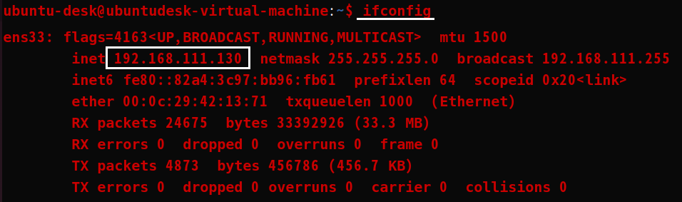

1. # SSH (Secure Shell)
   원격 시스템에 안전하게 접속하기 위해 사용되는 프로토콜입니다. SSH는 암호화된 터미널 세션을 제공하여 원격 시스템에 로그인하고 원격 시스템에서 명령을 실행할 수 있게 합니다. SSH는 보안을 강조하며, 사용자 인증 및 데이터 암호화를 포함한 다양한 보안 기능을 제공합니다.   

   ssh 명령어   
   시작: sudo service ssh start   
   중지: sudo service ssh stop   
   재시작: sudo service ssh restart   
   상태 확인: sudo service ssh status   

1. # SCP (Secure Copy)
   SSH를 기반으로 한 파일 전송 프로토콜입니다. SCP는 SSH와 동일한 보안 기능을 가지며, 파일을 안전하게 복사하고 전송하는 데 사용됩니다. SCP는 SSH와 마찬가지로 사용자 인증 및 데이터 암호화를 제공하며, SSH와 함께 설치되는 경우 대부분의 SSH 클라이언트에서 SCP를 사용할 수 있습니다.   

   SSH는 원격 시스템에 접속하고 명령을 실행하는 데 사용되며, SCP는 파일을 안전하게 복사하고 전송하는 데 사용됩니다. SCP는 SSH를 사용하여 파일을 전송하는 간단하고 편리한 방법입니다.

1. # Ubuntu → Windows
   *받는 쪽 IP를 사용 - Windows IP 사용   
   IP를 확인합니다.   
      

   ```
      scp 계정@IP:[리눅스 전송할 파일 위치] [윈도우 전송받을 파일 위치]
   ```
      
   1)우분투 계정 옆에 IP를 붙여쓴다고 가상머신의 IP를 사용하는 것이 아니라 __받는 쪽 IP__ 를 사용해야 합니다. 여기선 Windows IP를 사용합니다.   

   2)리눅스와 윈도우의 슬래쉬 방향이 다릅니다.   
   리눅스 `/`   
   윈도우 `\`

      

1. # Windows → Ubuntu
   *받는 쪽 IP를 사용 - Ubuntu(가상머신) IP 사용   

   1)ssh를 설치하고 서비스를 시작합니다.   
   ```
      $sudo apt-get -y install ssh
      $sudo service ssh start
   ```

   2)IP를 확인 합니다.   
      

   3)Windows CMD : scp [윈도우 전송할 파일 경로] 계정@IP주소:[리눅스 전송받을 파일 위치]   
   CMD창
   ```
      C:\Users\natis>scp C:\programming\blog\natista99 ubuntu-desk@192.168.111.130:/home/ubuntu-desk
      The authenticity of host '192.168.111.130 (192.168.111.130)' can't be established.
      ED25519 key fingerprint is SHA256:pIvdTkx4df1gra4qgq/w3SjF4V7un80G8zU4gg11.
      This key is not known by any other names
      Are you sure you want to continue connecting (yes/no/[fingerprint])?
      Please type 'yes', 'no' or the fingerprint:
      Warning: Permanently added '192.168.111.130' (ED25519) to the list of known hosts.
     
      ubuntu-desk@192.168.111.130's password:
      natista99.github.io.zip
   ```
