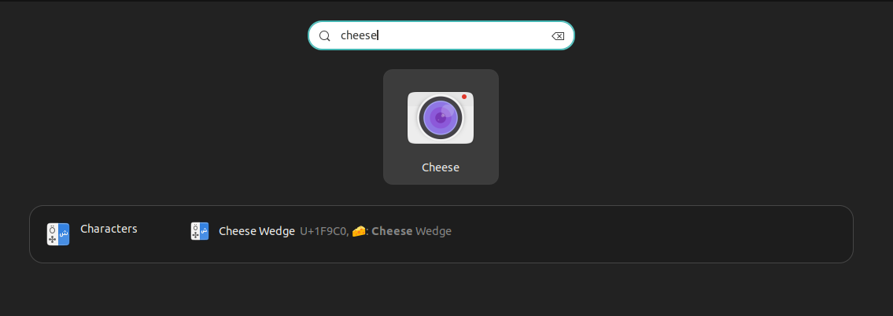

1. # 디바이스 확인
   ```s
      khj2023@khj2023-linuxUbuntu:~$ sudo apt-get install v4l-utils -y
      
      khj2023@khj2023-linuxUbuntu:~$ v4l2-ctl --list-devices
      LG Camera: LG Camera (usb-0000:00:14.0-2):
      /dev/video0
      /dev/video1
      /dev/media0
   ```   
   v4l은 Video for Linux의 약자로 리눅스에서 웹캠이나 TV튜너와 같은 멀티미디어를 연결, 설정, 관리 할 수 있게 해주는 디바이스 장치의 모음이자 api(위키피디아 해석)입니다. v4l의 두번째 버전이 v4l2이고 v4l-utils를 설치하면 ctl명령어를 사용할 수 있습니다.   
   v4l2-ctl명령어로 멀티미디어의 설정을 관리하게 되는데 v4l2-ctl로 명령어들을 확인 할 수 있습니다.   
   ```s
      khj2023@khj2023-linuxUbuntu:~$ v4l2-ctl
      General/Common options:
      --all              display all information available
      -C, --get-ctrl <ctrl>[,<ctrl>...]
                           get the value of the controls [VIDIOC_G_EXT_CTRLS]
      -c, --set-ctrl <ctrl>=<val>[,<ctrl>=<val>...]
                           set the value of the controls [VIDIOC_S_EXT_CTRLS]
      -D, --info         show driver info [VIDIOC_QUERYCAP]
      -d, --device <dev> use device <dev> instead of /dev/video0
                           if <dev> starts with a digit, then /dev/video<dev> is used
                           Otherwise if -z was specified earlier, then <dev> is the entity name
                           or interface ID (if prefixed with 0x) as found in the topology of the
                           media device with the bus info string as specified by the -z option.
      -e, --out-device <dev> use device <dev> for output streams instead of the
                           default device as set with --device
                           if <dev> starts with a digit, then /dev/video<dev> is used
                           Otherwise if -z was specified earlier, then <dev> is the entity name
                           or interface ID (if prefixed with 0x) as found in the topology of the
                           media device with the bus info string as specified by the -z option.
      ...
      ...
      --list-devices     list all v4l devices. If -z was given, then list just the
                        devices of the media device with the bus info string as
                        specified by the -z option.
      --log-status       log the board status in the kernel log [VIDIOC_LOG_STATUS]
      --get-priority     query the current access priority [VIDIOC_G_PRIORITY]
      --set-priority <prio>
                        set the new access priority [VIDIOC_S_PRIORITY]
                        <prio> is 1 (background), 2 (interactive) or 3 (record)
      --silent           only set the result code, do not print any messages
      --sleep <secs>     sleep <secs>, call QUERYCAP and close the file handle
      --verbose          turn on verbose ioctl status reporting
      --version          show version information
   ```   

   간단하게 비디오 디바이스 설치 목록만 확인
   ```s
      khj2023@khj2023-linuxUbuntu:~$ ls /dev/video*
      /dev/video0  /dev/video1

      **또는 ctrl(컨트롤ㅋㅋ) 옵션 추가로 자세히
      khj2023@khj2023-linuxUbuntu:~$ ls -ctrl /dev/video*
      crw-rw----+ 1 root video 81, 1  2월 12 07:01 /dev/video1
      crw-rw----+ 1 root video 81, 0  2월 12 07:01 /dev/video0
   ```   
   
   video1이나 video2 목록이 있으면 카메라는 인식이 된 상태입니다.   

1. # cheese 애플리케이션 설치
   ```s
      khj2023@khj2023-linuxUbuntu:~$ sudo apt-get install cheese
   ```   
   
      

      

