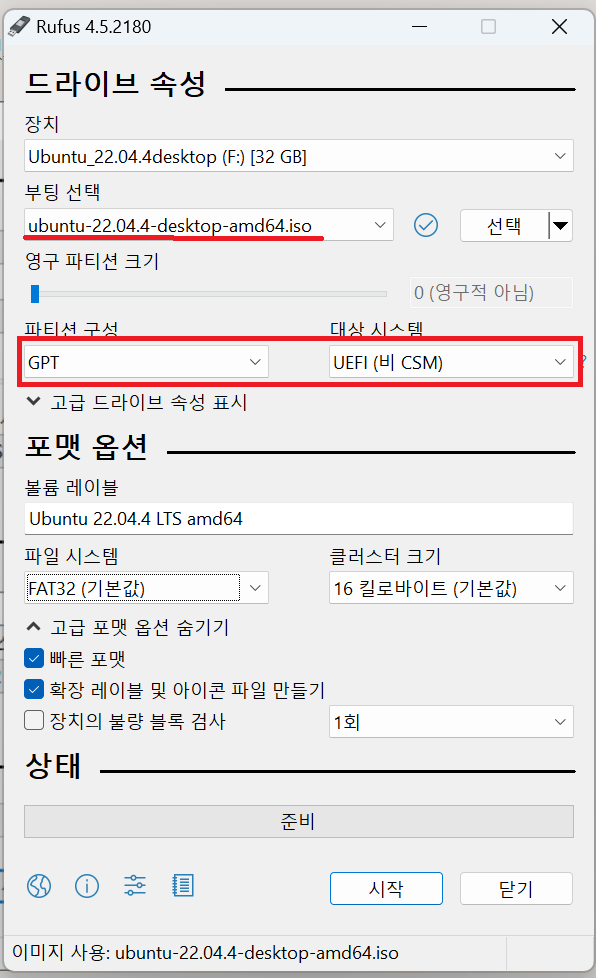

1. #  처음
   윈도우 먼저 설치해도 되고 우분투 먼저 설치해도 되지만 전 윈도우 먼저 설치 후 우분투를 깔았습니다.    
   
   SSD카드 1TB , 500GB 2개   
   1TB : 윈도우 설치, DATA   
   500GB : 우분투 설치

   윈도우 설치 후 
   win키+R에 diskmgmt.msc 입력해서 인식 되지 않는 500GB 초기화 셋팅

   이후 우분투 설치

1. # UEFI VS 레거시BIOS

   |        비교        |                  UEFI                 |                    레거시BIOS            |
   |:-----------------:|:-------------------------------------:|:-----------------------------------------:|
   |     부팅 절차     |UEFI -> EFI 부트 로더 -> 커널 -> 운영 체제|BIOS -> MBR -> 부트로더 -> 커널 -> 운영 체제|
   | 디스크 장치 호환성 |	          GPT 디스크                  |                  MBR 디스크               |
   | 지원 드라이브 크기 |                 8ZB                    |                     TB                   |
   |      보안 부트    |                  예                    |                   아니요                  |
   | 지원되는 비트 모드 |            32비트<br>64비트            |                   16비트                  |
   |초기화 위치 및 시작 정보|   EFI 시스템 파티션의 .efi 파일에서  |                 펌웨어에서                |
   |    부팅 속도      |                더 빠르게               |                    느리게                 |

   자신의 CMOS가 UEFI인지 레거시인지 확인 방법   
   win+R → msinfo32   
   
      

   *하드가 2개인 경우 둘 다 gpt 또는 mbr로 통일하는 것이 속도 면에서 유리   

1. # 부팅디스크 만들기
   Windows11를 설치할 파티션 유형이 GPT이고, 리눅스를 설치할 드라이브도 GPT로 해야합니다.
      

   Rufus설정   
      
   usb셋팅에 2~3 걸립니다.   

1. # CMOS
   재부팅 후 노트북 키보드로 빠르게 f2 난타   
   설정을 USB HDD로 변경   
      

1. # 재시작
   Try or Install Ubuntu 선택   
      

1. # 한국어 선택
      

1. # 와이파이 선택
   아이디 비번 입력 후 선택   

1. # 서드파티 체크
   "서드파티 소프트웨어 설치"를 체크해야 하드웨어 부분 설치 쉽다. 사운드, 그래픽 등 권장 사양으로 설치 됨   
      
   *시큐어 부트 설정 비번 키가 8자 이상이라서 내 비번 중 가장 긴 거 선택   

1. # 설치 형식 주의!
   HDD가 2개인 경우 "기타"를 선택해서 파티션을 직접 나눠야 합니다.   
      

   "Windows Boot Manager을(를) 그대로 두고 Ubuntu 설치"는 하나의 HDD에서 멀티부팅을 할 경우 선택합니다.   
      
      
1. # 파티션 나누기 - 중요!
   nvme0과 nvme1이 각각의 HDD디스크   
   nvme0은 1TB의 Windows와 DATA가 있는 하드디스크   
   nvme1이 500GB의 우분투를 설치할 하드디스크   
      
   /dev/nvme1n1이 500GB기 때문에 이 부분을 나눈다. 밑에 "남은 공간"에 오른쪽 마우스를 선택하거나 밑에 + 를 누른다   

   파티션은 루트(/)와 swap만 설정합니다. 처음 swap만 설정하고 나머지를 전부 루트(/)로 놓으면 하위 디렉토리인 /bin, /sbin, /etc, /user, /dev, ... 등 전부 통으로 하나의 드라이버에 설치가 됩니다.   
   처음 swap을 메모리(16G)의 2배인 32G로 설정합니다. 1024*32=32768   
   두번째로 / 로 놓고 나머지 전체를 선택하면 됩니다. /와 swap 모두 주파티션으로 하면 됩니다.   
      
   *새 파티션 종류로 "주"와 "논리"가 있는데 주파티션은 부팅이 가능한 파티션, 논리 파티션은 DATA 드라이브처럼 데이터를 저장하기 위해서 사용   

   부트로더를 설치할 장치로 nvme1n1을 선택합니다. 여기에 우분투 부트로더를 설치하면 nvme0n1에 설치되어 있는 Windows Boot Manger와 운영체제가 알아서 멀티부팅을 시켜줍니다.   
      
   
   최종 파티션 화면입니다.   
      
   
1. # 아이디&비번
   계정 이름과 암호를 입력합니다.   
      

1. # 설치 중
      

1. # 재시작
   재부팅을 하면 다음과 같이 부팅 선택란이 뜹니다.   
   이때 CMOS에서 부팅 설정을 바꿔도 되고, 이후에 바꿔도 됩니다. Ubuntu를 선택합니다.   
      

1. # 소프트웨어 업데이트
   소프트웨어를 업데이트 합니다.   
      

1. # sudo
   터미널에서 업데이트를 해야하는데 root계정이 필요하고, 그런데 설정된 root비번은 없고,..    
   우분투를 설치하면 최초 1번은 sudo 비번을 입력받습니다.   
   ```s
      sudo passwd root
   ```   
      
