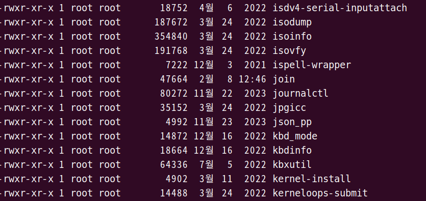
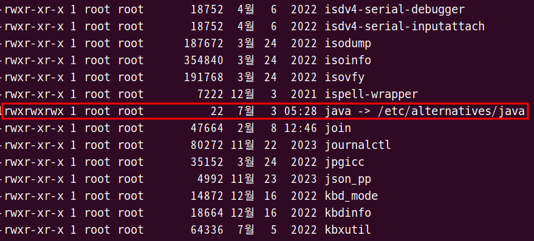

1. # 심볼릭 링크 설정
   update-alternatives --install <심볼릭을 만들 경로> <실행파일> <실제 경로> [우선순위]

   ```cs
      sudo update-alternatives --install "/usr/bin/java" "java" "/usr/local/java/jdk-22.0.1/bin/java" 1
   ```   
   2. <심볼릭을 만들경로>   
   위에 명령을 실행하면 /usr/bin에 java라는 심볼릭 파일이 실제 생성됩니다.   

      
   현재 /usr/bin 디렉토리에 "java"라는 파일이 없습니다.      
      
   다음과 같이 생겼다는 java심볼릭이 생성되었습니다.   

   2. <실행 파일>   
   `$java` 명령을 실행하면 실제는 /usr/local/java/jdk-22.0.1/bin/java에 있는 java가 실행 됩니다.  

   2. <실제 경로>   
   심볼릭을 생성할 실제 경로를 설정해 줍니다. "/usr/local/java/jdk-22.0.1/bin/java"는 /usr/local/java/jdk-22.0.1/bin 경로에 있는 java라는 파일을 심볼릭 링크로 만들게 됩니다.   

   2. 우선순위   
   버젼이 다른 경우 우선순위를 설정해 줄 수 있습니다.
   ```cs
      sudo update-alternatives --install "/usr/bin/java" "java" "/usr/local/java/jdk-22.0.1/bin/java" 3
      sudo update-alternatives --install "/usr/bin/java" "java" "/usr/local/java/jdk-17.0.1/bin/java" 1
      sudo update-alternatives --install "/usr/bin/java" "java" "/usr/local/java/jdk-15.0.1/bin/java" 2
   ```    
   java명령어를 쳤을 때 jdk-22.0.1이 에러가 나면 jdk-15.0.1이 실행됩니다.   
   __우선순위는 높을수록 먼저 실행이 됩니다__   

1. # 우선순위 설정 및 심볼릭 확인

   alternatives의 config명령을 실행하여 우선순위를 설정하거나 연결된 심볼릭을 확인할 수 있습니다.   
   ```cs
      sudo update-alternatives --config <실행파일명>
   ```   
   sudo update-alternatives --config "java"   

 1. # 심볼릭 링크 삭제
   ```cs
      sudo update-alternatives --remove <name> <path>
   ```    
   ex)sudo update-alternatives --remove "java" "/usr/local/java/jdk-22.0.1/bin/java"   
   "/usr/local/java/jdk-22.0.1/bin/java"의 실제 경로를 "java"로 심볼릭한 것을 삭제합니다.  


   
