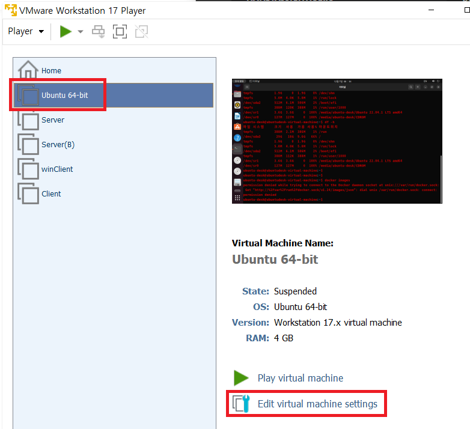
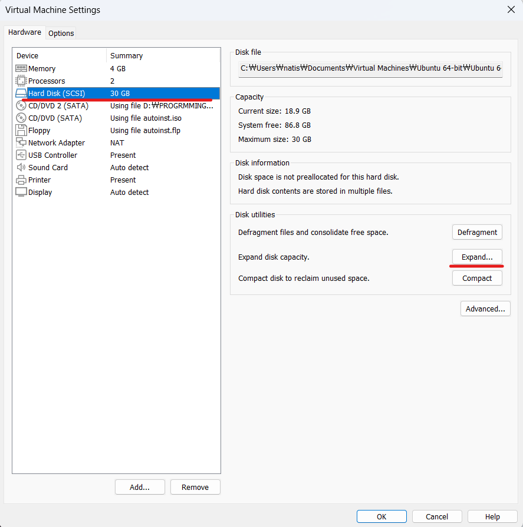
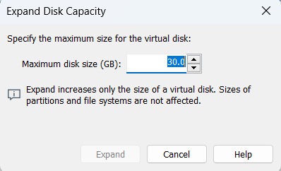
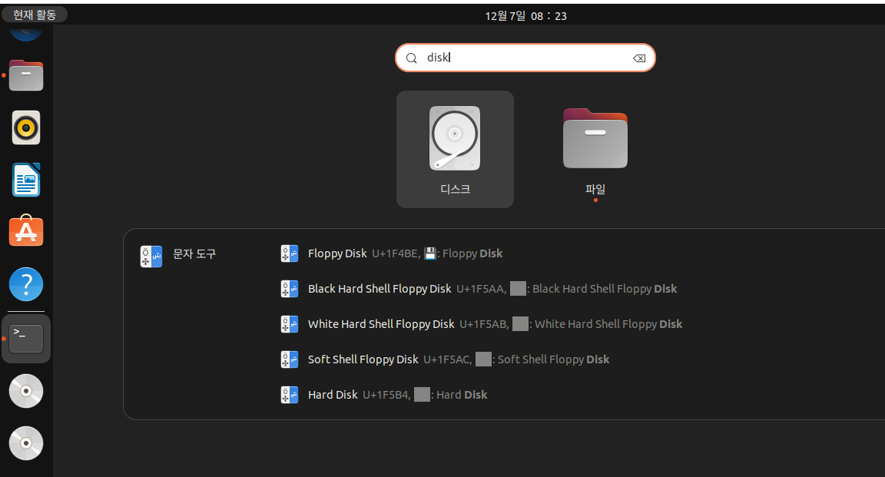
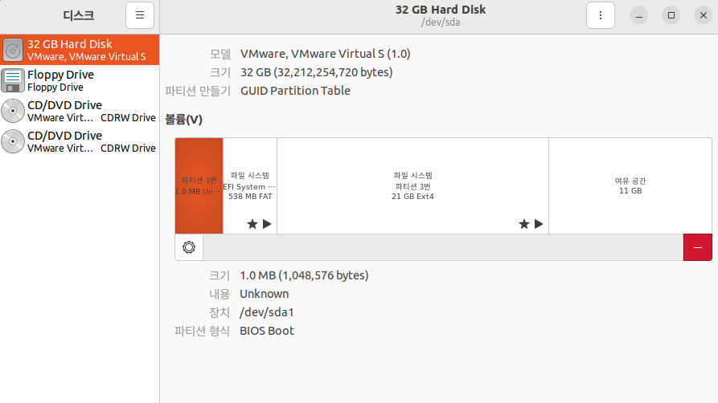
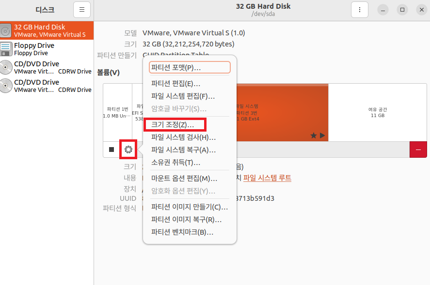
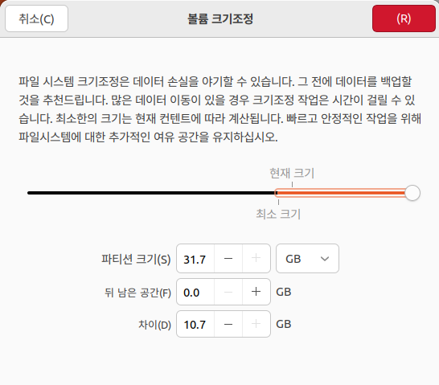
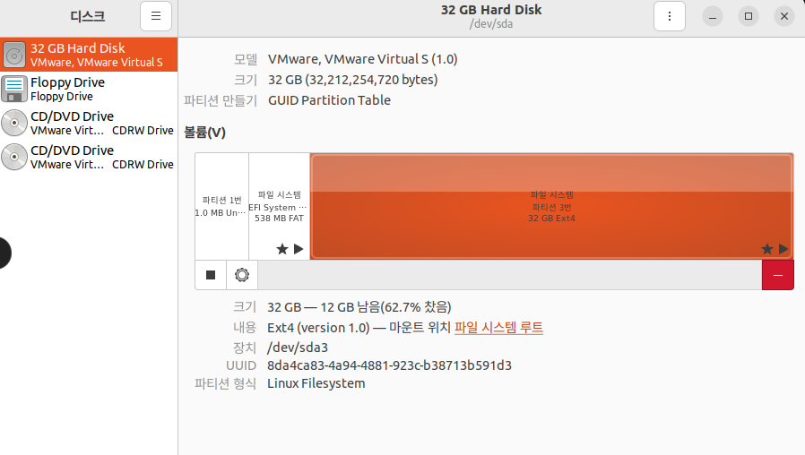

1. # VMWare에서 용량 늘리기

   용량을 늘릴 가상머신을 선택한 후 Edit virtual machine settings 클릭합니다.   
      

   Expand버튼이 비활성화가 된 경우 가상머신에서 현재 실행되고 있는 프로그램을 셧다운 시켜야 활성화 됩니다.   
      

   용량을 선택해서 확장함   
      

   VMWare에서 30GB로 늘렸는데 실제 가상머신에선 19GB로 확장된 용량이 적용되지 않았습니다.   
   ```s
      ubuntu-desk@ubuntudesk:~$ df
      파일 시스템     1K-블록     사용    가용 사용% 마운트위치
      tmpfs            396444     2120  394324    1% /run
      /dev/sda3      19946096 18660560  246996   99% / ☜19기가
      tmpfs           1982208        0 1982208    0% /dev/shm
      tmpfs              5120        4    5116    1% /run/lock
      /dev/sda2        524252     6220  518032    2% /boot/efi
      tmpfs            396440      124  396316    1% /run/user/
      /dev/sr1        3737140  3737140       0  100% /media/
      /dev/sr0         129834   129834       0  100% /media/
   ```

1. # 늘린 용량 적용

   disk로 검색합니다.   
      

   여유 공간 11GB가 파티션 분할되어 있습니다.   
      

   설정에서 크기 조정을 선택합니다.   
      

   용량을 늘립니다.   
      

   19GB에서 29GB로 늘어난 용량을 확인 할 수 있습니다.   
      

   ```s
      ubuntu-desk@ubuntudesk-virtual-machine:~$ df -h
      파일 시스템     크기  사용  가용 사용% 마운트위치
      tmpfs           388M  2.1M  386M    1% /run
      /dev/sda3        29G   18G  9.6G   66% /   ☜29G로확장됨
      tmpfs           1.9G     0  1.9G    0% /dev/shm
      tmpfs           5.0M  4.0K  5.0M    1% /run/lock
      /dev/sda2       512M  6.1M  506M    2% /boot/efi
      tmpfs           388M  112K  388M    1% /run/user/1000
      /dev/sr1        3.6G  3.6G     0  100% /media/amd64
      /dev/sr0        127M  127M     0  100% /media/CDROM
   ```


