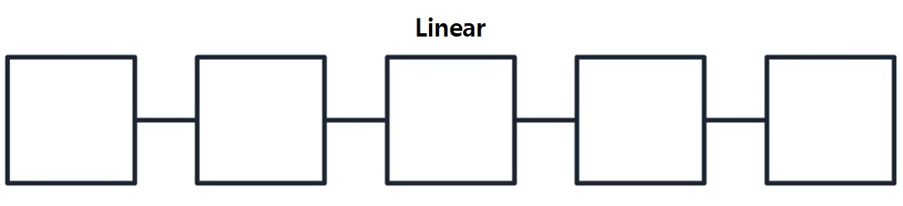
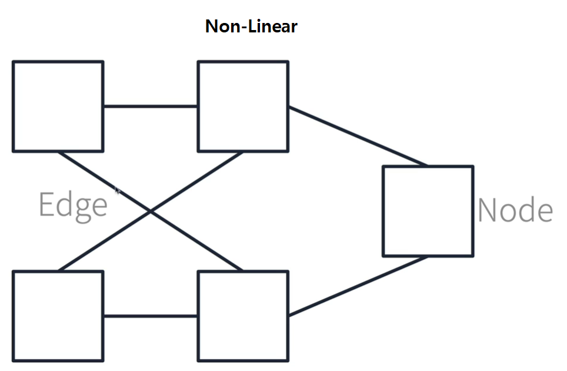
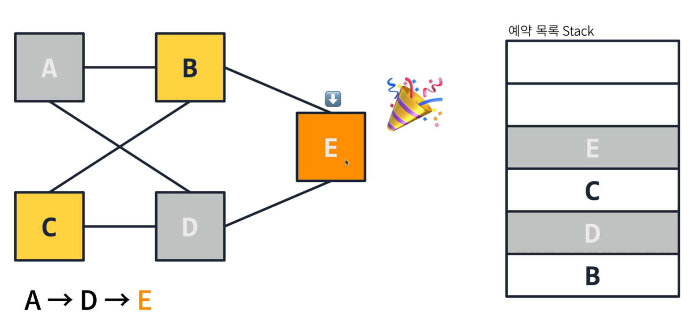
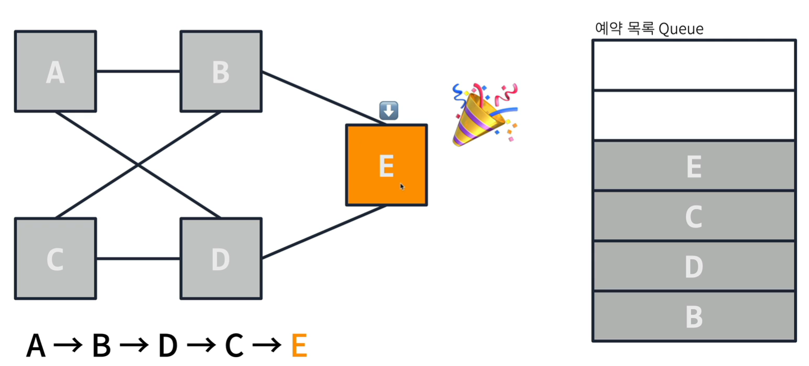
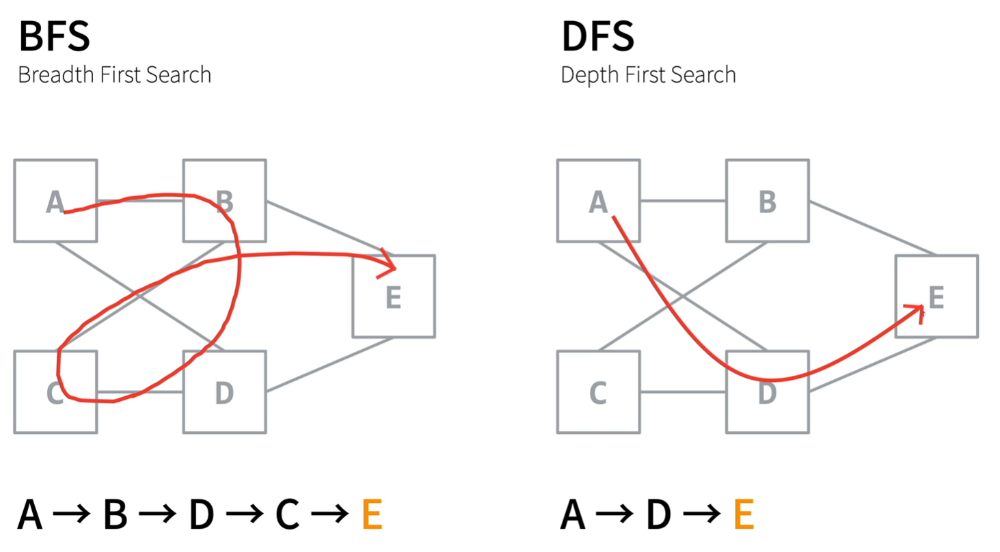

1. # Graph
   그래프는 List와 다르게 비선형 구조입니다.   
   list    
      
   graph   
      
   각각의 값을 Node라 하며 Node와 Node를 연결한 선을 Edge라고 합니다.    
   탐색순서는    
   _① 데이터를 하나 읽음_   
   _② 읽은 데이터의 노드들을 자료구조에 넣기_   
   _③ 자료구조에서 꺼내서 데이터 읽기_    
   _④ 위에 ②,③ 과정 반복_   
   입니다.   

1. # DFS(Deep First Search)
   stack를 이용한 탐색입니다. 해당 Node의 자식 Node들을 찾아 먼저 탐색을 합니다.   
      
   A → E : A에서 E를 검색해 보겠습니다.   
   1) A를 꺼냅니다   
   2) A와 연결된 노드 B,D를 스택에 넣습니다.   
   3) 가장 마지막에 들어간 노드 D 스택에서 꺼내 탐색합니다.   
   4) D와 연결된 노드 A,E 중 A는 이미 탐색되었기 때문에 빼고 E를 스택에 넣습니다.   
   5) 가장 마지막에 들어간 노드 E를 탐색합니다.   
   6) E를 발견했습니다.   

1. # BFS(Breadth Fisrt Search)   
   queue를 이용한 탐색입니다. 좌우로 넓게 탐색을 합니다.   
      
   A → E : A에서 E를 검색해 보겠습니다.   
   1) A를 꺼냅니다   
   2) A와 연결된 노드 B,D를 큐에 넣습니다.   
   3) 가장 먼저 들어간 B를 큐에서 꺼내 탐색합니다.   
   4) B와 연결된 노드 A,C,E 중 A는 이미 탐색을 했기 때문 빼고 C,E를 큐에 넣습니다.   
   5) 큐에서 다음 순서인 D를 꺼내 탐색합니다.   
   6) D와 연결된 A,E 중 E를 큐에 넣습니다.   
   7) 큐에서 다음 순서인 C를 꺼내 탐색합니다.    
   8) C와 연결된 노드 B,D는 이미 탐색을 했기 때문에 큐에 넣지 않습니다.   
   9) 큐에서 E를 꺼내 탐색합니다.   

1. # DFS와 BFS
      
   BFS는 좌우로 넓게 탐색을 하기 때문에 넓이 우선 검색이라 합니다.   
   DFS는 먼저 하나의 노드만 깊게 탐색하므로 깊이 우선 검색이라 합니다.   

1. # BFS를 JAVA로 구현
   ```java
      package cote_class;
      import java.util.*;

      class Nodes{
          String name;
          List<Nodes> link;

          boolean visit; //방문 여부
          Nodes(String name){
              this.name = name;
              link = new LinkedList<>();
          }

          @Override
          public String toString() {
              return name;
          }

          public void Link(Nodes n){
              link.add(n);
          }

          @Override
          public boolean equals(Object obj) {
              return Objects.equals(name, ((Nodes)obj).name);
          }

          void visit(){
              this.visit = true;
          }

          boolean isVisit(){
              return visit;
          }
      }

      /* 연결 graph 모양

          A ― B ＼
            X     E
          C ― D ／
      */

      public class Graph {
         public static void main(String args[]){
             //노드 생성
             Nodes A = new Nodes("A");
             Nodes B = new Nodes("B");
             Nodes C = new Nodes("C");
             Nodes D = new Nodes("D");
             Nodes E = new Nodes("E");

             //노드 연결
             A.Link(B);
             A.Link(D);
             B.Link(A);
             B.Link(C);
             B.Link(E);
             C.Link(B);
             C.Link(D);
             D.Link(A);
             D.Link(C);
             D.Link(E);
             E.Link(B);
             E.Link(D);

             Nodes target = E;

             //BFS : Queue사용
             Queue<Nodes> queue = new LinkedList<>();
             queue.offer(A);
             while(!queue.isEmpty()) {

                 Nodes n = queue.poll(); //큐에서 꺼낸다
                 System.out.println(n.name);

                 n.visit(); //한번꺼낸 건 탐색했다고 표시

                 if (n.equals(E)) { //탐색한다
                     System.out.println("found! : "+target);
                     break;
                 }

                 for(Nodes t : n.link){ //n에 연결된 node들을 큐에 넣는다.
                     if(t.isVisit()) continue; //방문했으면 넘어간다
                     if(queue.contains(t)) continue; //큐에 이미 있으면 넘어간다
                     queue.offer(t);
                 }
             }
         }
      }

   ```   
   탐색 순서는 :  A -> B -> D -> C -> E 입니다.   
   ```java
      for(Nodes t : n.link){ //n에 edge node들을 큐에 넣는다.
         if(t.isVisit()) continue; //방문했으면 넘어간다
         if(queue.contains(t)) continue; //큐에 이미 있으면 넘어간다
         queue.offer(t);
      }
   ```  
   는 다음과 같이 바꿀 수도 있습니다.   
   ```java
       n.link.stream().filter(l -> !queue.contains(l)).forEach(queue::offer);
   ```   
   filter(): 조건에 안 맞는 요소 제외   
   forEach(): 최종연산에 해당하며 각 요소에 지정된 작업 수행합니다.   
   최종연산의 결과는 스트림 요소의 합과 같은 단일 값이거나 스트림 요소가 담긴 배열또는 컬렉션일 수 있습니다.   

1. # DFS를 JAVA로 구현
    ```java
        
       //DFS : Stack사용
       Stack<Nodes> stack = new Stack<>();
       stack.push(A);
       while(!stack.isEmpty()) {

           Nodes n = stack.pop(); //스택에서 꺼낸다
           System.out.println(n.name);

           n.visit(); //한번꺼낸 건 탐색했다고 표시

           if (n.equals(E)) { //탐색한다
               System.out.println("found! : "+target);
               break;
           }

           for(Nodes t : n.link){ //n에 edge node들을 큐에 넣는다.
               if(t.isVisit()) continue; //방문했으면 넘어간다
               if(stack.contains(t)) continue; //큐에 이미 있으면 넘어간다
               stack.push(t);
           }          
       }
    ```
    위에 Queue를 Stack으로 바꾼거 외엔 바뀐 게 없다.    
    탐색 순서는 : A -> D -> E 입니다.   