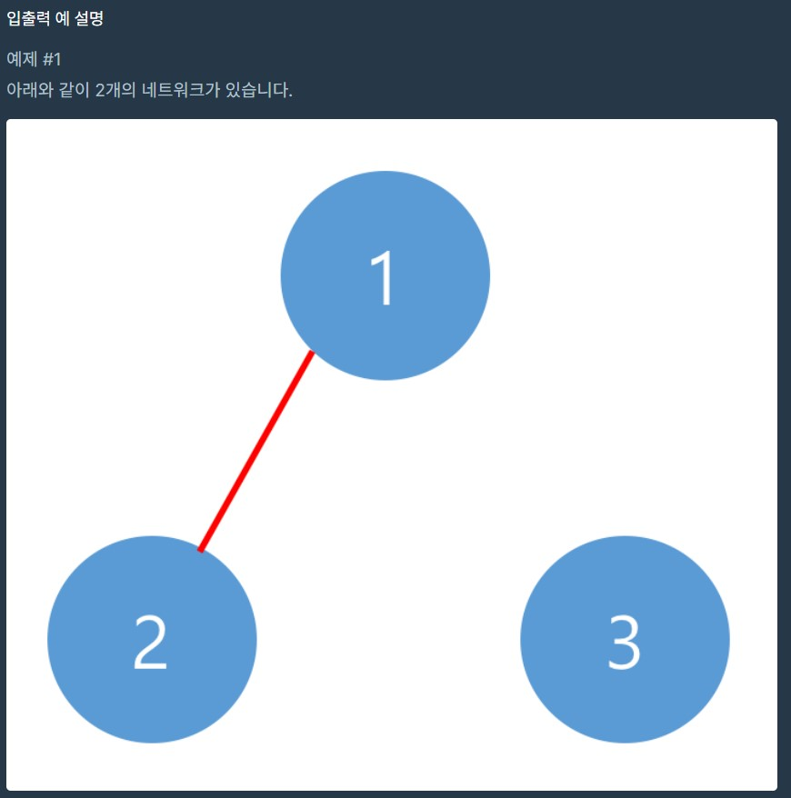

1. # 코딩 테스트 연습 - 네트워크
      
   <br>
      
   <br>
      
   <br>
1. # 소스 코드
   ```java
            
      public class Network {
          public void solution(int n, int[][] computers){
              boolean[] visited = new boolean[n];

              int count=0;
              for(int i=0 ; i<n ; i++) {
                  
                  //accessComputer에서 computer끼리 연결된 index는 visited가 true가 되어  contiune가 되고, 연결되지 않는 index값만 count++하게 된다.
                  if (visited[i]) continue; 
                  count++;
                  accessComputer(visited, computers, i);
              }
          }
          void accessComputer(boolean[] visited, int[][] computers, int n) {

              Queue<Integer> queue = new LinkedList<>();
              queue.offer(n);

              while(!queue.isEmpty()){
                  int v = queue.poll();
                  visited[v] = true; //visited가 핵심 - 이 값으로 count를 결정

                  for(int j=0 ; j<computers[v].length ; j++){ //i번째 인덱스에 연결된 모든 컴퓨터를 순회
                      if(visited[j]) continue;
                      if(computers[v][j] == 1) queue.offer(j); //값이 1로 연결된 컴퓨터가 있으면 큐에 넣고 visited=true로 만든다.
                  }
              }
          }
      }
   ``` 
     
   1)computers[i][j]에서 i의 값이 가리키는 compuer와 j값이 가리키는 computer는 동일합니다.   
   <br>
   2)i에 연결된 컴퓨터를 bfs방식으로 전부 먼저 순회 후 연결된 컴퓨터를 큐 입력 후 visited를 true로 만듭니다.   
   <br>
   3)i순회가 끝나면 visited를 확인 후 연결되지 않는 컴퓨터는 count++을 합니다.   
 
