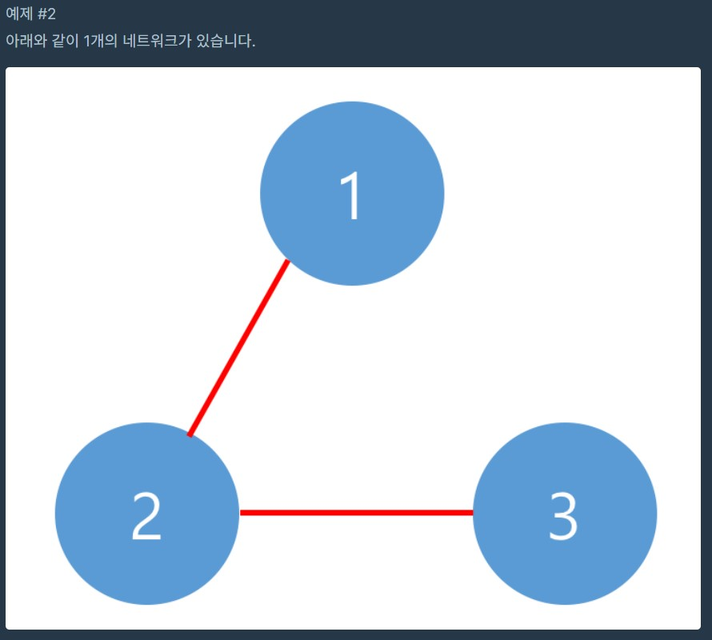

   	
1. # 문제 설명
	네트워크란 컴퓨터 상호 간에 정보를 교환할 수 있도록 연결된 형태를 의미합니다. 예를 들어, 컴퓨터 A와 컴퓨터 B가 직접적으로 연결되어있고, 컴퓨터 B와 컴퓨터 C가 직접적으로 연결되어 있을 때 컴퓨터 A와 컴퓨터 C도 간접적으로 연결되어 정보를 교환할 수 있습니다. 따라서 컴퓨터 A, B, C는 모두 같은 네트워크 상에 있다고 할 수 있습니다.

	컴퓨터의 개수 n, 연결에 대한 정보가 담긴 2차원 배열 computers가 매개변수로 주어질 때, 네트워크의 개수를 return 하도록 solution 함수를 작성하시오.

	제한사항   
	컴퓨터의 개수 n은 1 이상 200 이하인 자연수입니다.   
	각 컴퓨터는 0부터 n-1인 정수로 표현합니다.   
	i번 컴퓨터와 j번 컴퓨터가 연결되어 있으면 computers[i][j]를 1로 표현합니다.   
	computer[i][i]는 항상 1입니다.   

	입출력 예

	|  n   |              computers            | return |
	|:----:|:---------------------------------:|:------:|
	|   3  | [[1, 1, 0], [1, 1, 0], [0, 0, 1]] |    2   |
	|   3  | [[1, 1, 0], [1, 1, 1], [0, 1, 1]] |    1   |

	입출력 예 설명   
	예제 #1   
	아래와 같이 2개의 네트워크가 있습니다.   

	   

	   

1. # 풀이   
	최초방문시 answer증가   
	방문 후 연결된 node전부 visited = true   
	i가 컴퓨터   
	j가 연결   

	```java
				
		public class Network {
				public void solution(int n, int[][] computers){
					boolean[] visited = new boolean[n];

					int count=0;
					for(int i=0 ; i<n ; i++) {
						
						//accessComputer에서 computer끼리 연결된 index는 visited가 true가 되어  contiune가 되고, 연결되지 않git은 최초 방문한 index값만 count++하게 된다.
						if (visited[i]) continue; 
						count++;
						accessComputer(visited, computers, i);
					}
				}
				void accessComputer(boolean[] visited, int[][] computers, int n) {

					Queue<Integer> queue = new LinkedList<>();
					queue.offer(n);

					while(!queue.isEmpty()){
						int v = queue.poll();
						
						for(int j=0 ; j<computers[v].length ; j++){ //i번째 인덱스에 연결된 모든 컴퓨터를 순회
							if(visited[j]) continue;

							if(computers[v][j] == 1) {
								queue.offer(j); //값이 1로 연결된 컴퓨터가 있으면 큐에 넣고 visited=true로 만든다.
								visited[j] = true; //visited가 핵심 - 이 값으로 count를 결정
							}
						}
					}
				}
		}
	``` 
		
	1)computers[i][j]에서 i의 값이 가리키는 compuer와 j값이 가리키는 computer는 동일합니다.   
	<br>
	2)i에 연결된 컴퓨터를 bfs방식으로 전부 먼저 순회 후 연결된 컴퓨터를 큐 입력 후 visited를 true로 만듭니다.   
	<br>
	3)i순회가 끝나면 visited를 확인 후 연결되지 않는 컴퓨터는 count++을 합니다.   

