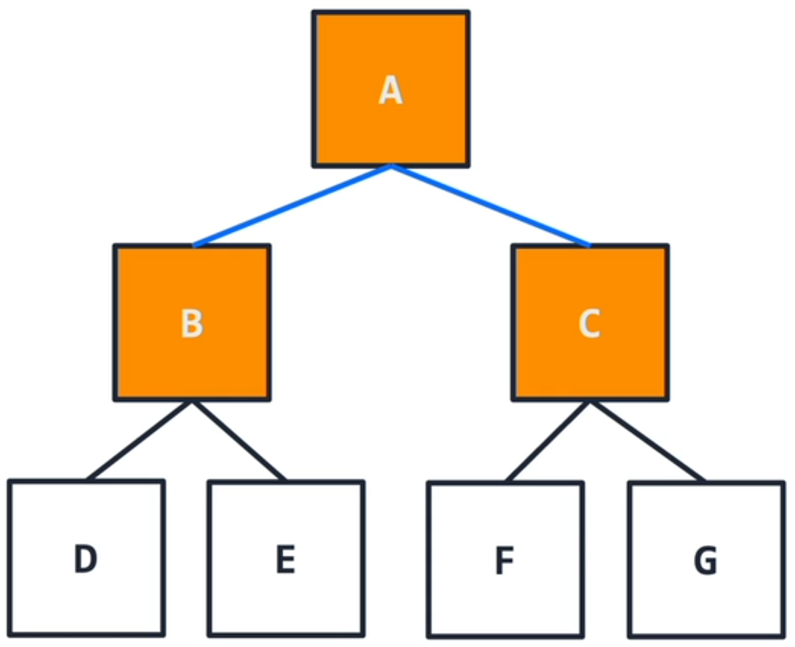
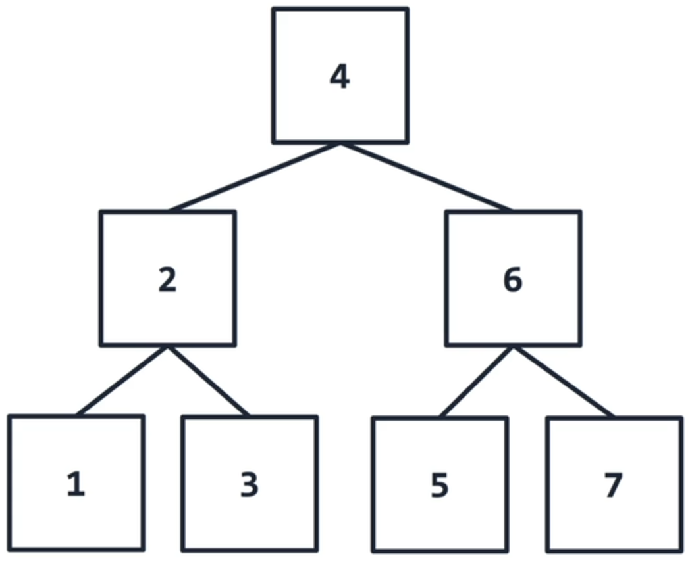
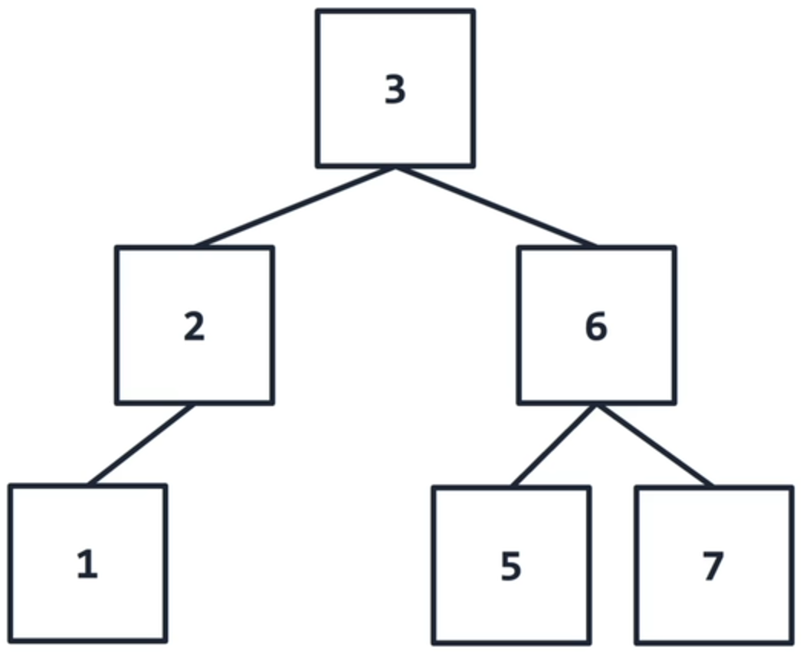
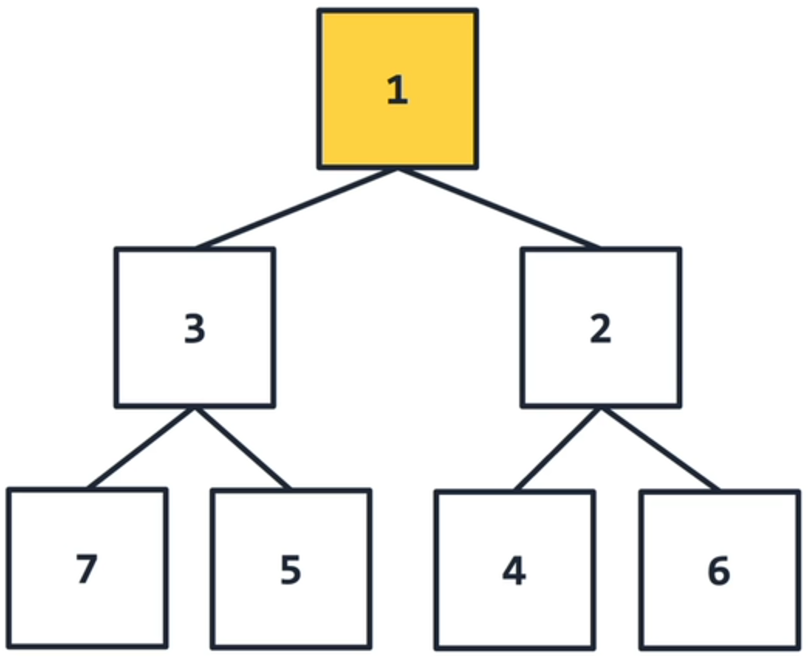
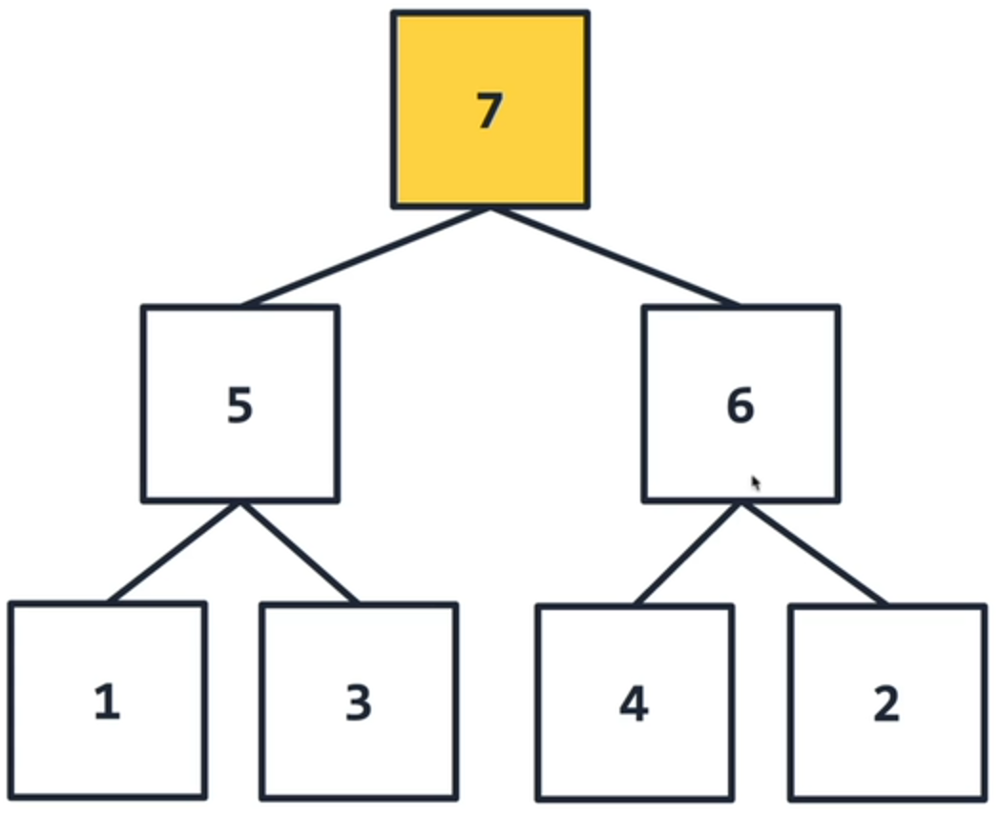

1. # Tree구조 정의

      

   Graph에서 BFS와 DFS 탐색을 하는 경우 일정한 규칙이 없이 모든 노드들을 깊이와 넢이를 기준으로 탐색을 하게 됩니다. 일정한 규칙이 없는 Graph에 규칙을 적용하게 되면 Tree가 됩니다.   

   규칙이란   
   가장 최상위 노드를 Root Node라 합니다.   
   가장 하단의 노드들을 Leaf Node라 합니다.   
   자신의 상위 노드를 Parent, 하위 노드를 Child라 합니다.   
   각 단계마다 Level이 존재합니다.   
   위 아래로는 노드를 가질 수 있지만 자신과 같은 레벨에선 옆으로 노드를 가질 수 없습니다.   
   노드와 노드의 연결을 Edge라 합니다.   

   추가 시   
   데이터를 추가할 땐 노드끼리 연결이 필수입니다. 따로 떨어진 독립적인 노드는 존재할 수 없습니다.   
   모든 노드들은 Parent를 하나만 가져야합니다.   

   삭제 시   
   부모 노드를 삭제하는 경우 노드들의 연결이 끊어지지 않도록 자식 노드 중에서 하나가 올라와서 연결을 해줘야 합니다.   

   트리역시 BFS/DFS를 활용하여 탐색을 하게됩니다.   

1. # 읽는 순서
      

   항상 left → right 순서이며 root를 어느 위치에 두느냐에 따라 이름이 결정됩니다.   
   
   In-Order Travel : Root를 중간에 읽는 방식입니다.   
   left - Root - Right 순서로 읽게됩니다.   
   D → B → E → A → F → C → G   

   Pre-Order Travel : Root를 가장 먼저 읽는 방식입니다.   
   Root - Left - Right 순서로 읽게됩니다.   
   A → B → D → E → C → F → G   

   Post-Order Travel : Root를 가장 나중에 읽는 방식입니다.      
   Left - Right - Root 순서로 읽게됩니다.   
   D → E → B → F → G → C → A   

   Root를 기준으로 읽는 방법이 있고, 전체 레벨을 차례대로 읽는 방법도 있습니다.   
   Level-Order Travel : 전체 레벨을 차례대로 읽음   
   A → B → C → D → E → F → G   

1. # Binary Search Tree

   tree구조에 일정한 규칙이 추가 된 구조를 Binary Tree라고 합니다.   
   
   하위 노드는 초대 2개까지 혀용 됩니다. 없을 수도 있고, 1개, 2개까지 허용됩니다.   
   왼쪽은 항상 부모 노드 보다 작은 값이 오고, 오른쪽은 항상 부모 노드 보다 큰 값이 옵니다.   
   왼쪽부터 빠짐없이 채워지는 경우를 Complete Binary Tree라고 합니다.   
   모든 노드들이 빈칸없이 전부 채워진 경우를 Perfect Binary Tree라고 합니다.   

   추가 시
   tree의 기본적입 규칙을 그대로 유지하기 때문에 tree와 동일합니다.   
   노드끼리 연결이 필수   
   모든 노드들은 Parent를 하나만 가짐   
   
   예)4 6 2 5 3 7 1 을 Binary Search Tree에 입력.   

   루트에 4 입력.   
   6은 4보다 크기 때문에 4의 오른쪽에 위치.   
   2는 4보다 작기 때문에 4의 왼쪽에 위치.   
   5는 4보다 크기 때문에 오른쪽에 위치 → 6보다 작기 때문에 6의 왼쪽에 위치.   
   3은 4보다 작기 때문에 왼쪽에 위치 → 2보다 크기 때문에 2의 오른쪽에 위치.   
   7은 4보다 크기 때문에 오른쪽에 위치 → 6보다 크기 때문에 6의 오른쪽에 위치.   
   1은 4보다 작기 때문에 왼쪽에 위치 → 2보다 작기 때문에 2의 왼쪽에 위치.   

   결과는 다음과 같습니다.   
      

1. # Binary Search Tree - 루트 값 삭제
   루트 값 4 삭제 시 : 루트에서 오른쪽 가장 밑에 리프 중 가장 큰 값을 루트로 입력합니다. 위에 그림에서는 3을 루트에 입력합니다.   

      

   그러면 BST의 기본 규칙을 깨트리지 않고 루트를 삭제할 수 있습니다.   

1. # Heap
   트리에 이진트리와 다른 규칙을 새로 넣어서 새로운 트리를 구성할 수 있습니다.   
   
   모든 자식 노드들은 부모 노드보다 작아야 한다. - Min Heap   
      
   루트는 최소값을 가집니다.   

   모든 자식 노드들은 부모 노드보다 커야 한다. - Max Heap   
      
   루트는 최대값을 가집니다.   

   

