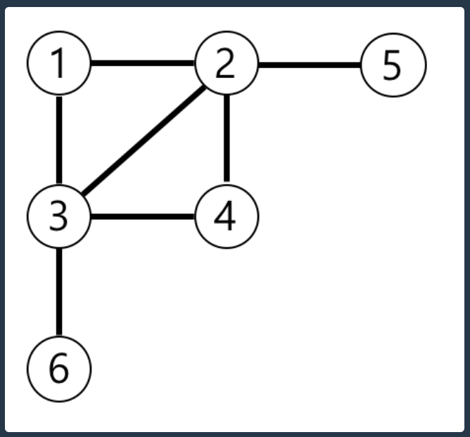

1. # 문제 설명
   n개의 노드가 있는 그래프가 있습니다. 각 노드는 1부터 n까지 번호가 적혀있습니다. 1번 노드에서 가장 멀리 떨어진 노드의 갯수를 구하려고 합니다. 가장 멀리 떨어진 노드란 최단경로로 이동했을 때 간선의 개수가 가장 많은 노드들을 의미합니다.

   노드의 개수 n, 간선에 대한 정보가 담긴 2차원 배열 vertex가 매개변수로 주어질 때, 1번 노드로부터 가장 멀리 떨어진 노드가 몇 개인지를 return 하도록 solution 함수를 작성해주세요.

   제한사항   
   노드의 개수 n은 2 이상 20,000 이하입니다.   
   간선은 양방향이며 총 1개 이상 50,000개 이하의 간선이 있습니다.   
   vertex 배열 각 행 [a, b]는 a번 노드와 b번 노드 사이에 간선이 있다는 의미입니다.   

   입출력 예   

   |   n   |                                 vertext                | return |
   |:-----:|:------------------------------------------------------:|:------:|
   |   6   |[[3, 6], [4, 3], [3, 2], [1, 3], [1, 2], [2, 4], [5, 2]]|   3    |
   
   입출력 예 설명   
   예제의 그래프를 표현하면 아래 그림과 같고, 1번 노드에서 가장 멀리 떨어진 노드는 4,5,6번 노드입니다.   

      

2. # 풀이
   ```java
      import java.util.*;

      class Solution {

         class Node{
            int v;
            boolean visited = false;
            int depth = 0;
            List<Node> line = new LinkedList<>();
            public Node(int v){this.v = v;}
         }
         
         public int solution(int n, int[][] edge) {
            int answer = 0;
            
            // 1) 노드 생성과 동시에 List에 삽입
            List<Node> list = new ArrayList<>();
            for(int i=0 ; i<n ; i++){
                  list.add(new Node(i+1));
            }
            
            // 2) 주어진 배열 값들을 연결
            for(int[] i : edge){
                  Node n1 = list.get(i[0]-1);
                  Node n2 = list.get(i[1]-1);
                  
                  n1.line.add(n2);
                  n2.line.add(n1);
            }
            
            // 3) 탐색
            Node one = list.get(0);
            one.visited = true;
            Queue<Node> q = new LinkedList<>();
            q.offer(one);
            int maxDepth = 0;
            
            while(!q.isEmpty()){
                  Node node = q.poll();
       
                  for(Node m : node.line){
                     if(m.visited) continue;  //<-- 탐색을 하는 부분에서 visited를 확인한다
                     
                     m.visited = true;   
                     m.depth = node.depth+1;  

                     if(m.depth > maxDepth) maxDepth = m.depth;
                     q.offer(m);   
                  }
            }
            
            for(Node m : list){
                  if(m.depth == maxDepth) answer++;
            }
            
            return answer;
         }
      }
   
   ```
   1) 노드를 생성하면서 List에 삽입합니다.   
   list.add(new Node(i+1)) : 노드를 생성할 땐 value값으로 1,2,3,.. 입력을 하고,   
   Node n1 = list.get(i[0]-1) : list에서 가져올 땐 get을 사용하는데 이땐 idx를 사용하게 됩니다. 0,1,2,...   
   입력된 list의 인덱스 값을 통해서 노드를 가져옵니다.   

   2) 연결   
   보통 문제에서 주어집니다. 주어진 문제의 배열 값들을 양방향으로 설계해야 할 지, 단방향으로 설계해야 할 지 결정 후 서로 연결해 줍니다.   
   문제에서는 양방향 사용   

   Node n1 = list.get(i[0]-1);   
   Node n2 = list.get(i[1]-1);   
   
   n1.line.add(n2);   
   n2.line.add(n1);   

   n1과 n2를 서로 연결   

   3) 탐색   
   일정한 패턴을 가지고 있습니다.   

   ```java
      while(큐나 스택){

         큐나 스택에서 탐색할 __부모노드 최초 1번만__  가져옴
         이후부터는 부모노드에 연결된 자식노드들을 탐색하는 용도로 사용됨

         for( 부모노드에 연결된 __자식노드__ 들 탐색){

            visited,   
            구하는 값 증가   

            큐나 스택에 삽입   
         }
      }
   ```
   이 문제같은 경우는 "1번 노드로부터 가장 멀리 떨어진 노드"를 구하는 것이 목적이기 때문에  while문 밖에서 큐에 1번 노드를 입력 후 while 안에서 __최초 부모노드를 1번__ 불러오게 되고, 이후 for문에서 부모노드에 연결된 자식노드들을 탐색하고 입력하게 되는데 이때 위에서 선언된 큐를 계속 사용하게 됩니다.   
   while문은 큐에서 최초 부모노드를 호출하게 되고 이후 큐는 자식노드들을 탐색 후 저장되는데 사용됩니다.   

   for문은 큐에서 꺼낸 부모노드들에 연결된 자식노드들을 탐색하는데 사용됩니다. 최초 1번 노드를 큐에서 꺼내고 이후 for문에서 1번 노드와 연결된 모든 자식노들을 큐에 입력합니다. 이 노드들이 while문들 돌때는 부모노드가 되고 다시 이 부모노드에 연결된 모든 자식노드들이 for문을 통해 입력됩니다. 자식이 부모가 되고 그 부모의 자식들을 탐색 후 자식이 다시 부모가 되고,...   

   부모노드들에 연결된 자식노드들을 for문에서 탐색하기 때문에 한번 방문한 자식들을 또 방문하는 것을 막기 위해서 for문 내부에 visited가 위치하게 됩니다.   


   주어진 문제를 간단히 나타내면 다음과 같습니다.   
   ```java
      while(){
         최초 부모노드 이후 부모노드에 연결된 자식노드가 부모가 됨

         for(){
            visited = true;
            큐 또는 스택에 자식 노드 삽입
         }
      }
   ```   
      
   만약, 1번 노드만 탐색하는 것이 아니라 모든 모드들에 해당하는 자식노드들을 탐색하는 경우라면   
   ```java

      for(부모 노드){

         모든 노드 visited = false;
         최초 탐색할 부모노드 1개를 큐 또는 스택에 삽입
         while(){
            최초 부모노드 이후 부모노드에 연결된 자식노드가 부모가 됨

            for(){
               visited = true;
               큐 또는 스택에 삽입
            }
         }
      }
   ```   
   for문이 while문 밖애 추가되며   
   . 모든 노드 visited = false   
   . 최초 탐색할 부모노드 1개를 큐 또는 스택에 삽입   
   라는 2개의 조건이 붙게 됩니다.   
   
   


