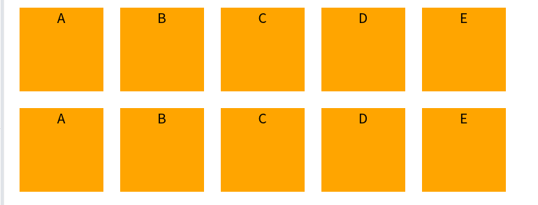
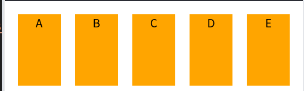
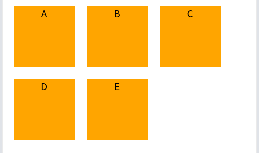
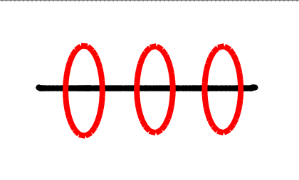
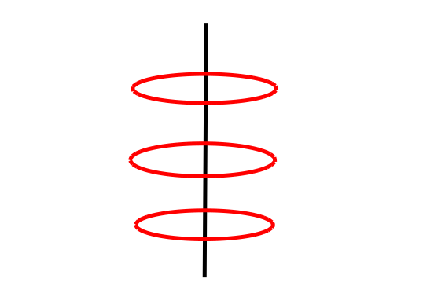
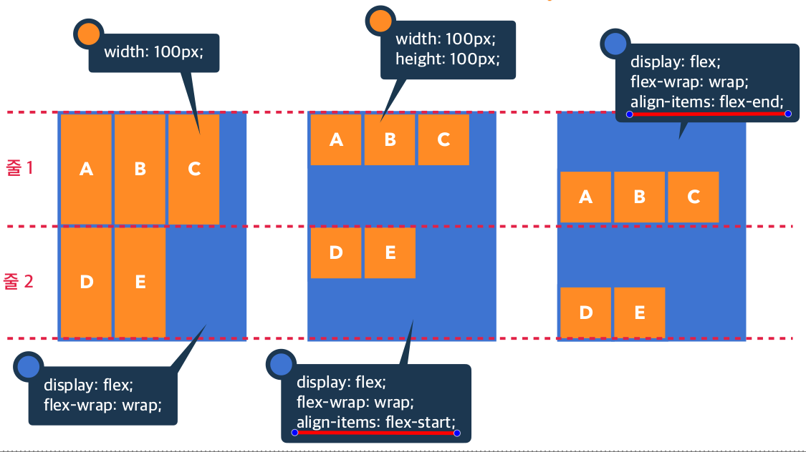

      
1. # flex 박스
   인라인 블록 요소의 사용을 더욱 편하게 하기 위해 설계되었습다. 블록 요소가 마치 인라인처럼 텍스트의 크기만큼 폭을 차지하게 됩니다. block, inline, inline-block과는 다르게 부모 태그에 flex를 설정하면 속성 값에 따라 자식 요소들이 정렬이 됩니다.   
   <p class="codepen" data-height="300" data-default-tab="html,result" data-slug-hash="oNOEvpo" data-user="khj99" style="height: 300px; box-sizing: border-box; display: flex; align-items: center; justify-content: center; border: 2px solid; margin: 1em 0; padding: 1em;">
   <span>See the Pen <a href="https://codepen.io/khj99/pen/oNOEvpo">
   ch05.01_flex01</a> by kimhyunjin (<a href="https://codepen.io/khj99">@khj99</a>)
   on <a href="https://codepen.io">CodePen</a>.</span>
   </p>
   <script async src="https://cpwebassets.codepen.io/assets/embed/ei.js"></script>

   flex의 부모 태그를 Flex Container라 하고, 자식 태그를 Flex Item이라 합니다. 각각 적용되는 속성이 따로 존재하며 다음과 같습니다.   
   
   __부모 태그 : Flex Container__ 의 속성들   
   display, flex-flow, flex-direction, flex-wrap   
   justify-content, align-content, align-items   

   __자식 태그 : Flex Item__ 의 속성들   
   order, flex, flex-grown, flex-shrink, flex-basis, align-self   

   flex를 사용하기 위해서는 부모 태그를 Flex Container로 만들어야 하는데 그 방법이 부모 태그에 displady:flex를 적는 것.   

   - display:flex => __블록 요소__ 처럼 Flext Container를 구성   
   - display:inline-flex => __인라인 요소__ 처럼 Flex Container를 구성   
   <span style="color:#E8F5FF">flex와 inline-flex는 item이 아니라 container들의 정렬 방식</span>   
   <p class="codepen" data-height="300" data-default-tab="html,result" data-slug-hash="mdgXpLR" data-user="khj99" style="height: 300px; box-sizing: border-box; display: flex; align-items: center; justify-content: center; border: 2px solid; margin: 1em 0; padding: 1em;">
   <span>See the Pen <a href="https://codepen.io/khj99/pen/mdgXpLR">
   ch05.01_flex_inlineFlex</a> by kimhyunjin (<a href="https://codepen.io/khj99">@khj99</a>)
   on <a href="https://codepen.io">CodePen</a>.</span>
   </p>
   <script async src="https://cpwebassets.codepen.io/assets/embed/ei.js"></script>
   flex는 block형태로 아래로 정렬이 되고, inline-flex는 inline형태로 수평으로 정렬이 됨.      

1. # flex Container속성 : flex-direction
   __플렉스 아이템__ 을 정렬할 주 축을 설정. 플렉스는 기본적으로 플렉스 아이템들을 가로로 설정합니다. 하지만 flex Container의 속성으로 flex-direction을 주면 가로 외의 방향으로 아이템들을 설정할 수 있습니다.   

   __행 - 수평__   
   row : 행축(좌 → 우), 수평 정렬을 왼쪽에서 시작, <u>기본값</u>   
   row-reverse : 행축(우 → 좌), 수평 정렬을 오른쪽에서 시작   
   Main-axis가 가로 축  
   *플렉스는 기본값이 가로 정렬이기 때문에 명시적으로 row을 사용하는 경우는 드물다

   __열 - 수직__   
   column : 열축(위 → 아래), 수직 정렬을 위에서 시작      
   column-reverse : 열축(아래 → 위), 수직 정렬을 아래에서 시작   
   Main-axis가 세로 축   

   <p class="codepen" data-height="300" data-default-tab="html,result" data-slug-hash="VwNxQbj" data-user="khj99" style="height: 300px; box-sizing: border-box; display: flex; align-items: center; justify-content: center; border: 2px solid; margin: 1em 0; padding: 1em;">
   <span>See the Pen <a href="https://codepen.io/khj99/pen/VwNxQbj">
   ch01.flex_direction</a> by kimhyunjin (<a href="https://codepen.io/khj99">@khj99</a>)
   on <a href="https://codepen.io">CodePen</a>.</span>
   </p>
   <script async src="https://cpwebassets.codepen.io/assets/embed/ei.js"></script>

1. # flex Container속성 : flex-wrap
   공간이 줄어들 경우 플렉스 아이템의 줄 바꿈 여부를 설정

   nowrap : 줄 바꿈 없음, <u>기본값</u>   
   wrap : 여러 줄로 묶음   

   <p class="codepen" data-height="300" data-default-tab="html,result" data-slug-hash="OJGZrBX" data-user="khj99" style="height: 300px; box-sizing: border-box; display: flex; align-items: center; justify-content: center; border: 2px solid; margin: 1em 0; padding: 1em;">
   <span>See the Pen <a href="https://codepen.io/khj99/pen/OJGZrBX">
   Untitled</a> by kimhyunjin (<a href="https://codepen.io/khj99">@khj99</a>)
   on <a href="https://codepen.io">CodePen</a>.</span>
   </p>
   <script async src="https://cpwebassets.codepen.io/assets/embed/ei.js"></script>
   
   <br>

      
   공간이 허용될 땐 전부 가로 100px, 세로 100px 공간을 가진 정사각형의 모양입니다.   
   하지만 공간이 줄어들 경우 nowrap인 경우   
      
   작은 공간에 줄바꿈없이 전부 넣게 되고 그 결과 정사각형이 찌그러지게 됩니다.   
   wrap의 경우는   
      
   자동 줄 바꿈이 되어서 가로 100px, 세로 100px의 정사각형을 그대로 유지하게 됩니다.   

   wrap을 준 상태에서 item에 height를 주지 않으면 item의 높이는 auto가 되고 auto는 부모인 container의 높이를 따라갑니다. 이때, 아이템의 기본 설정이 strech이므로 다음과 같이 container의 전체 크기 300px에 맞춰 길쭉하게 늘어난 형태를 가진다   
   <p class="codepen" data-height="300" data-default-tab="html,result" data-slug-hash="oNOQoMN" data-user="khj99" style="height: 300px; box-sizing: border-box; display: flex; align-items: center; justify-content: center; border: 2px solid; margin: 1em 0; padding: 1em;">
   <span>See the Pen <a href="https://codepen.io/khj99/pen/oNOQoMN">
   ch05_flex_strech_height</a> by kimhyunjin (<a href="https://codepen.io/khj99">@khj99</a>)
   on <a href="https://codepen.io">CodePen</a>.</span>
   </p>
   <script async src="https://cpwebassets.codepen.io/assets/embed/ei.js"></script>

1. # flex Container속성 : justify-content
   __기본 축__ 을 따라 나열되어 있는 플렉스 아이템들의 나열 방식   

   direction:row -> 주축은 가로   
      
   아이템들이 빨간색 타원의 위치로 정렬됩니다.   

   direction:column -> 주축은 세로   
      
   아이템들이 빨간색 타원의 위치로 정렬됩니다.   

   <p class="codepen" data-height="600" data-default-tab="html,result" data-slug-hash="oNOyyab" data-user="khj99" style="height: 300px; box-sizing: border-box; display: flex; align-items: center; justify-content: center; border: 2px solid; margin: 1em 0; padding: 1em;">
   <span>See the Pen <a href="https://codepen.io/khj99/pen/oNOyyab">
   ch05.flex_justify_direction</a> by kimhyunjin (<a href="https://codepen.io/khj99">@khj99</a>)
   on <a href="https://codepen.io">CodePen</a>.</span>
   </p>
   <script async src="https://cpwebassets.codepen.io/assets/embed/ei.js"></script>

   direction:row로 했을 경우 주축이 가로가 됩니다.   
   justify-contents:flex-start는 가장 왼쪽   
   justify-contents:center는 가운데   
   justify-contents:flex-end는 가장 오른쪽에 위치가 됩니다.   

   direction:column인 경우 주축이 세로가 됩니다.   
   justify-contents:flex-start는 세로 축을 기준으로 가장 윗쪽에 위치   
   justify-contents:center는 가운데   
   justify-contents:flex-end는 가장 아랫쪽에 위치합니다.   

1. # flex-Container속성 : align-item
   플렉스 박스의 교차 축 설정. 주축에서 + 모양으로 그렸을 때 교차되는 축이 교차 축의 기준으로 item들이 이 __교차 축을 기준__ 으로 위치하게 돕니다.   
   
   align-content와 다르게 한 줄의 아이템당 부모container의 높이에 맞춰 각 줄에 정렬이 됩니다.
      
   
   display:flex   
   => ㅡ 가로 축이 기준 축으로 교차 축은 |   
   align-items:flex-start 세로 축을 기준으로 가장 윗쪽에 위치   
   align-items:center 가운데   
   align-items:flex-end 가장 아랫쪽에 위치

   display:flex;   
   flex-direction:column;   
   => | 세로 축이 기준 축으로 교차 축은 ㅡ   
   align-items:flex-start 가로 축을 기준으로 가장 왼쪽에 위치   
   align-items:center 가운데   
   align-items:flex-end 가장 오른쪽에 위치 

   <p class="codepen" data-height="600" data-default-tab="html,result" data-slug-hash="NWmEXaO" data-user="khj99" style="height: 300px; box-sizing: border-box; display: flex; align-items: center; justify-content: center; border: 2px solid; margin: 1em 0; padding: 1em;">
   <span>See the Pen <a href="https://codepen.io/khj99/pen/NWmEXaO">
   align_items</a> by kimhyunjin (<a href="https://codepen.io/khj99">@khj99</a>)
   on <a href="https://codepen.io">CodePen</a>.</span>
   </p>
   <script async src="https://cpwebassets.codepen.io/assets/embed/ei.js"></script>

   ```css
      .row_flex_start{
      background-color:royalblue;
      display:flex;  /* 기준 축은 ㅡ*/
      /*   
      flex-direction:row; 
      display:flex 기본값이 row라 생략가능  
      */
      align-items:flex-start;  /* 교차 축 | 를 기준으로 윗쪽에 위치*/
      flex-wrap:wrap;  /* 공간이 부족하면 기존 모양을 유지하면서 줄 바꿈 */
      height:500px;
      width:200px;
      }

      .column_flex_start{
      background-color:royalblue;
      display:flex;  /* 기준 축은 ㅡ */
      flex-direction:column;  /* 기준 축을 | 로 바꿈*/
      align-items:flex-start;  /* 아이템들을 교차 축 ㅡ를 기준으로 앞쪽에 위치*/
      height:400px;
      width:500px;
      }
   ```

1. # flex-Container속성 : align-content
   align-items가 교차 축으로 한 줄만 정렬하는 방식이라면, align-content는 교차 축으로 여러 줄을 정렬하는 방식입니다. 보통 align-content보다 align-items를 더 많이 사용합니다.   

   items와 속성은 같습니다. 단, 자식 아이템들이 여러 줄 겹쳐져서 정렬이 됩니다.   
   display:flex   
   => ㅡ 가로 축이 기준 축으로 교차 축은 |   
   align-content:flex-start 세로 축을 기준으로 가장 윗쪽에 위치   
   align-content:center 가운데   
   align-content:flex-end 가장 아랫쪽에 위치

   display:flex;   
   flex-direction:column;   
   => | 세로 축이 기준 축으로 교차 축은 ㅡ   
   align-content:flex-start 가로 축을 기준으로 가장 왼쪽에 위치   
   align-content:center 가운데   
   align-content:flex-end 가장 오른쪽에 위치 

   <p class="codepen" data-height="600" data-default-tab="html,result" data-slug-hash="mdgQpGx" data-user="khj99" style="height: 300px; box-sizing: border-box; display: flex; align-items: center; justify-content: center; border: 2px solid; margin: 1em 0; padding: 1em;">
   <span>See the Pen <a href="https://codepen.io/khj99/pen/mdgQpGx">
   align_content</a> by kimhyunjin (<a href="https://codepen.io/khj99">@khj99</a>)
   on <a href="https://codepen.io">CodePen</a>.</span>
   </p>
   <script async src="https://cpwebassets.codepen.io/assets/embed/ei.js"></script>

1. # flex-Item속성 : order
   flext item의 순서를 설정합니다. 기본값은 0이고, 숫자가 작을 수록 먼저 왼쪽에 위치하게 됩니다.   

   <p class="codepen" data-height="300" data-default-tab="html,result" data-slug-hash="bGJQyBP" data-user="khj99" style="height: 300px; box-sizing: border-box; display: flex; align-items: center; justify-content: center; border: 2px solid; margin: 1em 0; padding: 1em;">
   <span>See the Pen <a href="https://codepen.io/khj99/pen/bGJQyBP">
   ch05.item_order</a> by kimhyunjin (<a href="https://codepen.io/khj99">@khj99</a>)
   on <a href="https://codepen.io">CodePen</a>.</span>
   </p>
   <script async src="https://cpwebassets.codepen.io/assets/embed/ei.js"></script>

   