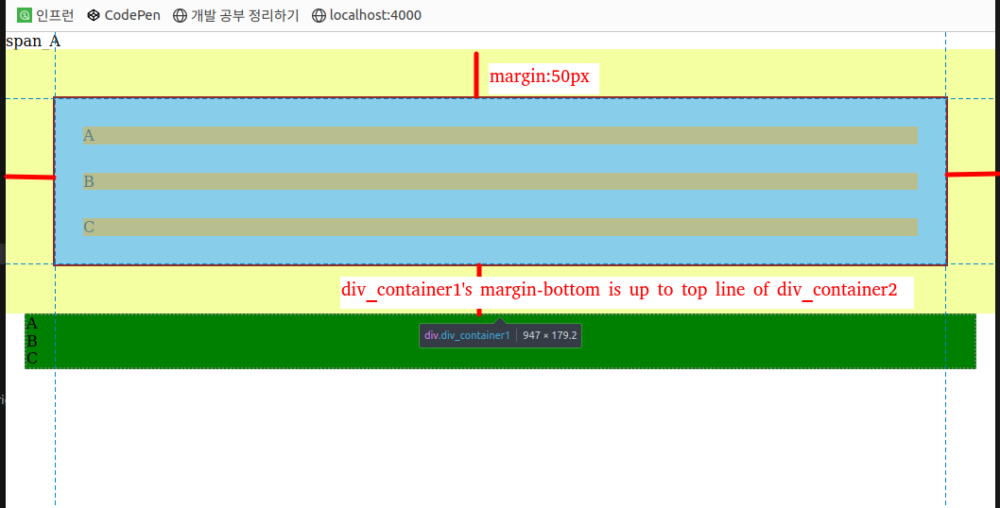
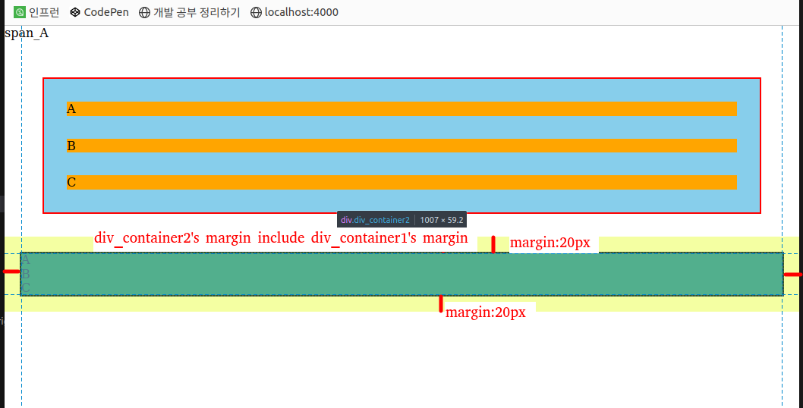

1. # margin
   margin은 div, p, ul, li 같은 block요소에 적용이 됩니다. span, img, a와 같은 inline요소에는 적용되지 않습니다.

   __margin값은 서로 겹쳐서 적용됩니다.__   

   ```cs
      <style>
         .span_container{
               background-color: red;
               margin: 20px;
         }

         .div_container1 {
               border: 2px solid red;
               background-color: skyblue;
               margin: 50px;
         }

         .item1{
               background-color: orange;
               margin:30px;
         }

         .div_container2{
               border: 2px dotted gray;
               background-color: green;
               margin:40px;
         }
      </style>
   
      <body>
         <span class="span_container1">
            span_A
         </span>
         <div class="div_container1">
            <div class="item1">A</div>
            <div class="item1">B</div>
            <div class="item1">C</div>
         </div>
         <div class="div_container2">
            <div class="item2">A</div>
            <div class="item2">B</div>
            <div class="item2">C</div>
      </div>
   ```   
      
   가장 상단의 span_A는 span태그를 사용했기 때문에 margin값이 적용되지 않는 것을 볼 수 있습니다.   
      
   div_container1의 마진은 50px인데, 이는 아랫쪽 요소엔 div_container2의 마진 30px까지 포함하게 됩니다. 아랫쪽 요소인 div_container2의 border(div_container2의 top_line)까지가 div_container1의 마진이 됩니다.   

      
   div_container2의 maring-top값은 border에서 시작해서 윗쪽이기 때문에 div_container1의 마진값과 겹치게 됩니다. 즉, div_container2의 margin-top는 10px~50px까지는 div_container1에 먹혀서 변함이 없습니다.

1. # margin 설정 방법

   2. 각각 설정하는 방법   
   ```cs
      margin-top : 10px: 
      margin-left : 10px;
      margin-bottom : 10px;
      margin-right : 10px;
   ```   
      
   2. 상 / 우 / 하 / 좌     
   ```cs
      margin : 10px 20px 30px 40px;  /* 시계방향 */
   ```   
   상 - 10px;      
   우 - 20px;   
   하 - 30px;   
   좌 - 40px;   
      
   2. 상 / 좌우 / 하      
   ```cs
      margin : 10px 20px 30px;
   ```   
   상 - 10px;   
   좌우 - 20px;   
   하 - 30px;   

   2. 상하 / 좌우   
   ```cs 
      margin : 10px 20px;
   ```   
   상하 - 10px;   
   좌우 - 20px;
      
1. # margin : auto;
   

1. # margin : 0 auto;


