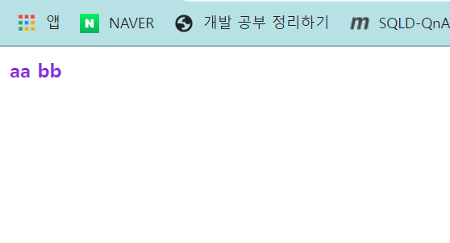
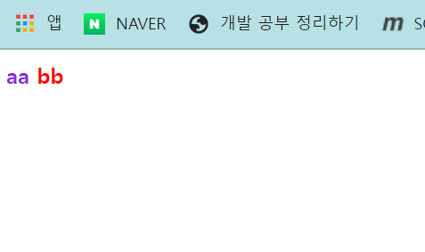

1. # nth_child와 nth_of_type
   nth-child는 해당 선택자의 부모 요소 안에서 모든 자식 요소 중에서 n번째 요소를 선택하는데 사용되는 CSS 선택자입니다. 이것은 요소의 순서에 따라 선택됩니다.   

   nth-of-type은 해당 선택자의 부모 요소 안에서 특정 유형의 요소 중에서 n번째 요소를 선택하는데 사용되는 CSS 선택자입니다. 이것은 요소의 유형에 따라 선택됩니다.   

   nth-child는 모든 자식 요소를 대상으로 하지만 nth-of-type은 특정 유형의 요소만을 대상으로 합니다. 예를 들어, div 태그 중에서 3번째 요소를 선택하려면 nth-child(3)를 사용하고, div 태그 중에서 3번째 div 요소를 선택하려면 nth-of-type(3)을 사용합니다.   

1. # 예제1
   ```css
      <style>
         .fruit div:nth-child(2){    
             color : yellow
         }

         .fruit span:nth-child(1){ 
             color : red
         }

         .fruit h3:nth-child(5){ 
             color : blue;
             font-size: 20px;
         }

         .fruit p:nth-of-type(2){ 
             color: pink;
         }

      </style>

      <div class="fruit">
          <span>딸기</span> <!-- fruit의 1 번째 자식 -->
          <p>수박</p>       <!-- fruit의 2 번째 자식 --> 
          <div>오렌지</div> <!-- fruit의 3 번째 자식 --> 
          <p>망고</p>       <!-- fruit의 4 번째 자식 --> 
          <h3>사과</h3>     <!-- fruit의 5 번째 자식 --> 
      </div>
   ```

1. # 예제2
   .fruit bb:nth-child(2) 란 뜻이

   fruit란 부모 클래스에 두번째 자식이 bb이면 적용   
   <span style="color:red;font-style:bold">①</span>.fruit <span style="color:red;font-style:bold">③</span>bb:<span style="color:red;font-style:bold">②</span>nth-child(2)   

   인지 아니면   

   fruit란 부모 클래스에 bb요소 중 두번째 자식에 적용   
   <span style="color:red;font-style:bold">①</span>.fruit <span style="color:red;font-style:bold">②</span>bb:<span style="color:red;font-style:bold">③</span>nth-child(2)   

   인지 아니면
   fruit란 부모 클래스 전체 범위 안에서 모든 두번째 자식이 bb이면 적용   

   인지 헷갈림   
   ```css
      <style>
      .fruit aa:nth-child(1){ 
         color : blueviolet;
         font-weight: 900;
      }

      .fruit bb:nth-child(2){ 
         color : red;
         font-weight: 900;
      }
      </style>

      <div class="fruit">
         <aa> aa
            <bb>bb</bb>
          </aa> 
      </div>
   ```   
   
      <p class="codepen" data-height="300" data-default-tab="html,result" data-slug-hash="wvNbdqY" data-user="khj99" style="height: 300px; box-sizing: border-box; display: flex; align-items: center; justify-content: center; border: 2px solid; margin: 1em 0; padding: 1em;">
      <span>See the Pen <a href="https://codepen.io/khj99/pen/wvNbdqY">
      Untitled</a> by kimhyunjin (<a href="https://codepen.io/khj99">@khj99</a>)
      on <a href="https://codepen.io">CodePen</a>.</span>
      </p>
      <script async src="https://cpwebassets.codepen.io/assets/embed/ei.js"></script>


   .fruit bb:nth-child(2) color:red;  
   furit요소를 가진 클래스의 두번째 자식요소 bb에 빨간색이 나타나도록 작성.   
      
   fruit클래스인 div가 부모   
   aa는 첫번째 자식   
   bb는 두번째 자식   
   이니깐 aa는 보라색, bb는 빨간색이 나와야하는데 둘 다 보라색이 나옵니다. bb는 위에 조건에 해당이 안 됩니다.   

   ```css
      .fruit bb:nth-child(1){ 
         color : red;
         font-weight: 900;
      }
   ```
   nth-child를 1로 바꾸면   
     
   빨간색이 나옵니다.   
   .fruit bb:nth-child(1)란 말은 
   fruit란 부모 클래스 안에 첫번째 자식이 bb이면 적용   
   이 아닌   
   .fruit란 클래스를 가진 부모요소 안에 __bb요소 중__ 첫번째 자식
   이라는 말입니다.   
   =>부모요소 안에서 bb요소 만을 따로 뽑아서 그 안에서 자식을 다시 세는 것   

