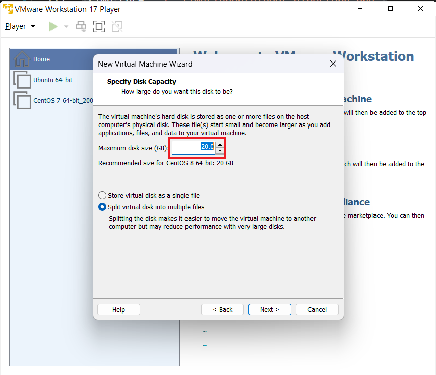

1. # vmware pro 설치 
   https://www.vmware.com/products/workstation-pro/workstation-pro-evaluation.html   
   링크를 선택하면 vmware 17 pro 버전을 다운 받을 수 있습니다. 

       
       
    스냅샷과 가상 네트워크 기능을 위해 player이 아닌 pro 버전이 필요합니다. pro 버전은 무료 30일간 사용이 가능하고 player버전은 사용기한없이 계속 사용이 가능합니다. 전 구글에서 lisence를 검색해서 입력했는데 pro버전을 사용할 수 있었습니다. ^O^   
      
    다운 후 다음과 같이 폴더를 4개 만듭니다. server,server(B), Client, winClient   
       
     
    vmware에서 virtual Marchine을 생성합니다.   
       
     
    OS는 나중에 설치하겠다는 내용입니다.   
        
     
    centOS8 선택   
       
     
    디스크 사이즈 기본 20G로 설정합니다.   
       
        
    이후 finish를 누르게 되면 다음과 같이 서버 가상 머신이 만들어진 화면이 나옵니다.   
       
        
    하단에 Edit virtual machine settings를 선택합니다.
       
     
    80GB용량과 Store virtual disk as a single file를 선택합니다. 밑에 Split virtual disk into multiple files와의 차이점은 파일을 하나의 파일로 할 것이냐, 여러개의 파일로 나눌 것이냐의 차이인데 사용자 입장에선 아무 차이가 없습니다. 일단 single file을 선택합니다.
       
     
    memory 2GB, Hard Disk-SCSI방식의 80GB, Network Adapter-NAT, 그외 USB Controller, Sound Card, Printer는 사용하지 않기 때문에 삭제합니다.   
       
     
    지금까지의 설정은 OS가 안깔린 하드웨어적인 설정입니다. OS가 안 깔린 빈 컴퓨라고 생각하시면 됩니다. Server(B)도 똑같은 작업을 해줍니다.
    하드디스크 용량을 80GB로 설정해도 실제 80GB를 호스트 컴퓨터에서 할당 받는 것이 아니라 현재 용량은 10.1MB이고 이후 최대 늘어날 수 있는 용량이 80GB란 뜻입니다. 하지만 VM ware에 설치되는 OS는 현재 용량이 80GB라고 인식을 하게됩니다.   
       
     Server와 Server(B)는 설정이 같지만 Client는 Hard Disk-NVMe 방식이고 용량은 40GB, USB Controller, Sound Card, Printer는 테스트를 위해 그냥 둡니다.   
        
      
     winClient는 Microsoft Windows를 선택하고 Version은 32bit인 Windows10을 선택합니다.   
       
      
     결과 폴더 확인   
       

     