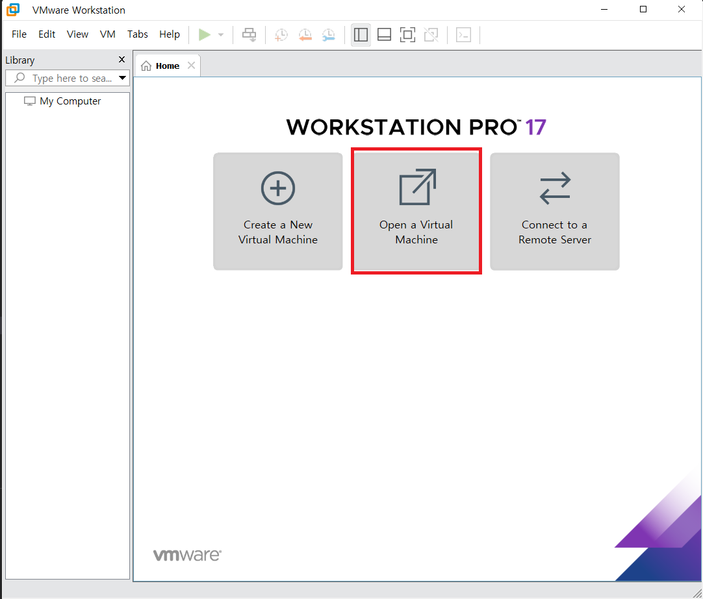
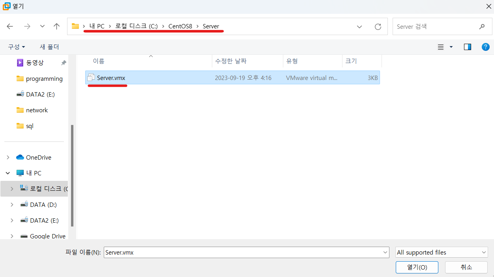
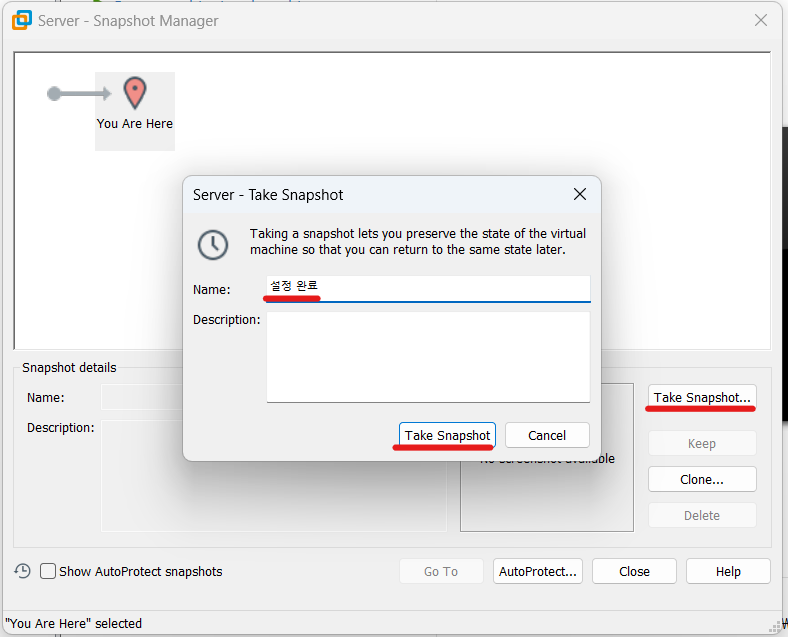
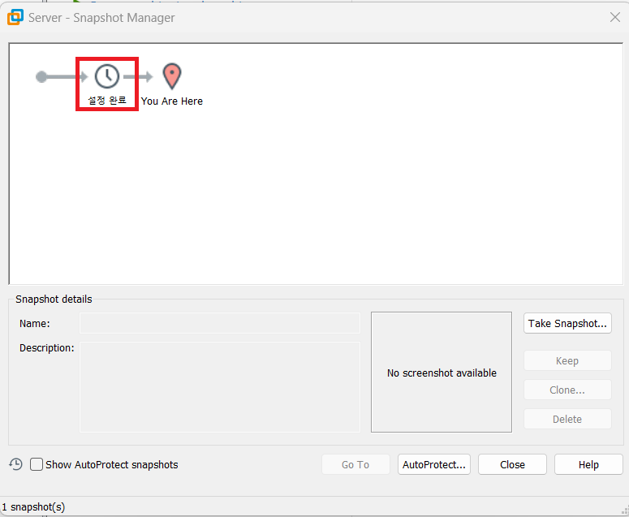
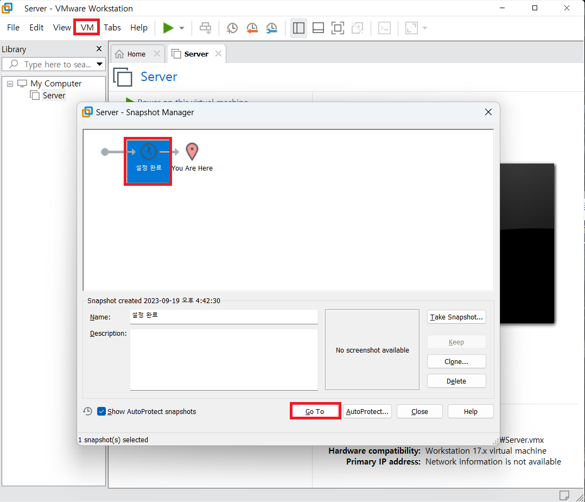

1. # 설정하기
   스냅샷 기능은 player에 없고 pro에 있습니다. VMware Workstation pro와 VMware Workstation player는 본질적으로 같은 프로그램인데 pro가 기능이 추가 되어있기 때문에 반드시 player를 종료하고 pro를 실행해줘야 합니다. pro를 실행합니다.   
    
   Open a Virtual Machine를 실행합니다.   
      

   처음 Server, Server(B), Client, winClient가 있는 CentOS8 폴더에서 Server폴더 안에 Server.vmx를 선택합니다.   
      

   VM -> Snapshot -> snapshot Manager   
      

   현재 상태를 저장하기 위해 Take Snapshot를 누르고 이름으로 "설정 완료"를 입력합니다.   
      

   설정 완료란 이름의 스냅샷이 생성되었습니다.   
      

1. # 되돌리기
   player를 닫고 pro를 실행합니다.   
   VM -> Snapshot -> snapshot Manager 에서 해당 snapshot을 선택 후 go to를 누릅니다.
      
    
   pro를 닫고 player를 실행합니다.

