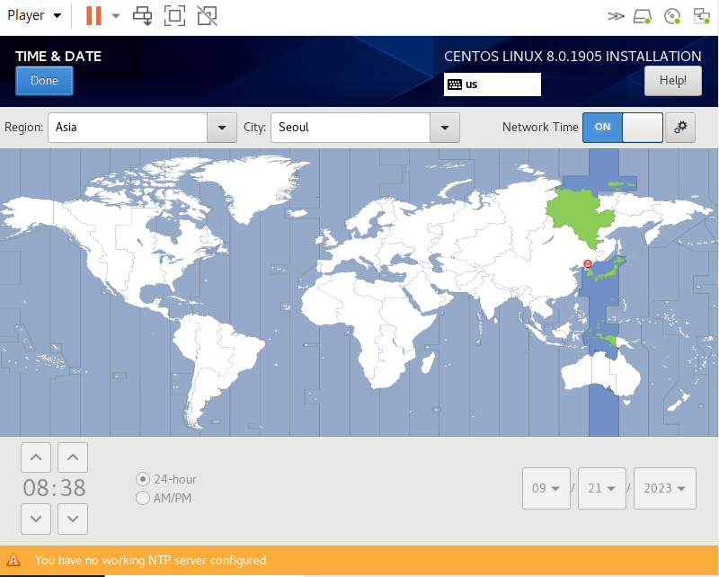

1. # 텍스트 모드로 ServerB설치
   서울로 시간과 날짜 설정   
      
   <br>
   Minimal Install
      
   <br>
   Install Destination에서 40G선택 Custom선택  
      
   <br>
   +를 누르고 Mount Point에 / Desired Capacity는 비워둠   
      
   <br>
   설치를 시작하고 root 암호 지정 후 __Done 2번 클릭__
      
   <br>
   User Creation 암호 지정   
      
   설치가 끝나면 하단에 reboot 클릭합니다.   

1. # 로그인 후 설정
   setfont sun12x22 하면 폰트가 커집니다.
   ```
      [root@localhost ~]# setfont sun12x22
   ```   
   <br>
   필요한 파일 설치
   ```
      [root@localhost ~]# dnf -y install bind-utils net-tools wget unzip bzip2
   ```   
   <br>
   - “Failed to synchronize  cache for repo ...” 란 에러가 뜬 경우   
   현재 CentOS8은 지원이 중지되었기 때문에 미러 사이트를 변경해줘야 합니다.   
   ```
      [root@localhost ~]# dnf clear all
      [root@localhost ~]# rm -rf /var/cache/dnf
      [root@localhost ~]# cd /etc/yum.repos.d/
      [root@localhost yum.repos.d]# sed -i 's/mirrorlist/#mirrorlist/g' /etc/yum.repos.d/CentOS-*
      [root@localhost yum.repos.d]# sed -i 's|#baseurl=http://mirror.centos.org|baseurl=http://vault.centos.org|g' /etc/yum.repos.d/CentOS-*
   ```   
   <br>
   서버에서 다운 받을 시 CentOS8버전만 다운 받도록하는 설정을 합니다.   
   원래는 yum.repos.d디렉토리 안에 this.repo 파일 안에 밑에 정보를 입력해야 하지만
   ```
      [BaseOS]
      name=CentOS-$releasever - Base
      baseurl=https://archive.kernel.org/centos-vault/8.0.1905/BaseOS/x86_64/os/
      	  http://linuxsoft.cern.ch/centos-vault/8.0.1905/BaseOS/x86_64/os/
      gpgcheck=0

      [AppStream]
      name=CentOS-$releasever - AppStream
      baseurl=https://archive.kernel.org/centos-vault/8.0.1905/AppStream/x86_64/os/
      	  http://linuxsoft.cern.ch/centos-vault/8.0.1905/AppStream/x86_64/os/
      gpgcheck=0

      [extras]
      name=CentOS-$releasever - Extras
      baseurl=https://archive.kernel.org/centos-vault/8.0.1905/extras/x86_64/os/
      	  http://linuxsoft.cern.ch/centos-vault/8.0.1905/extras/x86_64/os/
      gpgcheck=0

      [centosplus]
      name=CentOS-$releasever - Plus
      baseurl=https://archive.kernel.org/centos-vault/8.0.1905/centosplus/x86_64/os/
      	  http://linuxsoft.cern.ch/centos-vault/8.0.1905/centosplus/x86_64/os/
      gpgcheck=0

      [PowerTools]
      name=CentOS-$releasever - PowerTools
      baseurl=https://archive.kernel.org/centos-vault/8.0.1905/PowerTools/x86_64/os/
      	  http://linuxsoft.cern.ch/centos-vault/8.0.1905/PowerTools/x86_64/os/
      gpgcheck=0
   ```   
   <br>
   한빛 미디어의 저장소에서 wget 으로 This.repo 파일을 직접 다운 받습니다.   
   ```
      [root@localhost ~]# cd /etc/yum.repos.d/  
      [root@localhost yum.repos.d]# rm -f *.repo   'yum.reoos.d 디렉토리 안에 파일 다 삭제'
      [root@lcoalhost yum.repos.d]# wget http://download.hanbit.co.kr/centos/8/This.repo '한빛 미디어에서 설정 파일인 This.repo 다운 받기'
   ```   
   <br>
   네트워크 설정
   ```
      [root@localhost ~]# cd /etc/sysconfig/network-scripts/
      [root@localhost network-scripts]# ls
      ifcfg-ens160   
      [root@localhost network-scripts]# vi ifcfg-ens160   
   ```   
   <br>
   ifcfg-ens160을 다음과 같이 수정합니다.   
      
   <br>
   수정 후 ens160을 down 후 up을 합니다.   
   ```
      [root@localhost network-scripts]# nmcli connetion down ens160   'ens160을 내렸다가'
      [root@localhost network-scripts]# nmcli connetion up ens160   'ens160을 다시 올립니다'
   ```
   이후 reboot 후 ping 테스트를 합니다.   
   <br>
   selinux 끄기   
   ```
   vi /etc/sysconfig/selinux
   ```   
   이후 SELINUX=enforcing를 SELINUX=disabled로 변경합니다.   
   <br>
   해상도 변경하기   
   ```
     vi /etc/grub.d/10_linux
   ```
   :set nu 로 행번호 표시 후 169행으로 이동합니다. grg 뒤에 vga=771를 입력합니다.   
      
   변경 사항 저장합니다.   
   ```
     [root@localhost ~]# grub2-mkconfig -o /boot/grub2/grub.cfg
     [root@localhost ~]# reboot
   ```


  


