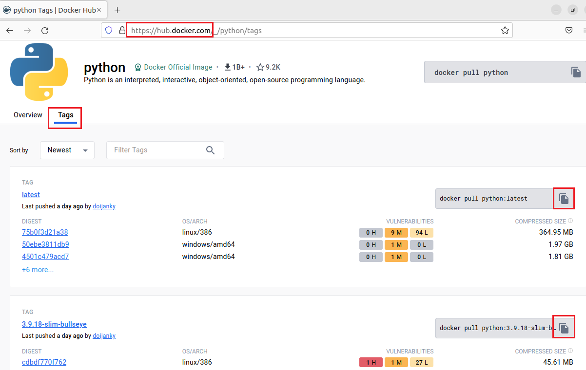
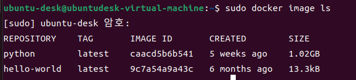

1. # 도커 이미지 취득

   도커파일 → 이미지 생성 ↔ 컨테이어 생성 → 컨테이너 실행 

   docker hub란 사이트에 접속해서 Tags에서 해당 버전에 맞는 파일을 선택 후 터미널 창에 입력하면 됩니다.   
      
   ```
      $ sudo docker image pull python
   ```   

1. # 이미지 목록 표시
   ```
      docker image ls
   ```   
      

   이미지 상세 정보   
   ```
      docker image inspect python
   ```   

1. # 이미지에 태그 붙이기
   ```
      docker image tag 이미지명 도커사용자명/만들이미지명:태그(보통 버전)

      docker image tag python nati/ex_down_python:latest
   ```   
   태그를 설정하면서 파일이 복사됩니다. 기존의 파일과 IMAGE ID가 같다는 것을 알 수 있습니다.   
       

1. # 이미지 검색
   docker hub에 있는 이미지를 검색합니다.   

   |  옵션  | 설명 |
   |:------:|:---------:|
   | --no--trunc | 결과를 모두 표시 |
   | --limit | n건의 검색 결과를 표시 |
   | --filter=stars=n | 즐겨찾기의 수(n 이상)를 지정 |
      
   ```
      docker search <옵션> 검색키워드

      docker search centos
   ```
   
   [stars]는 사용자가 즐겨찾기로 표시한 건수를 나타내므로, [stars]가 많으면 많을 수록 인기 있는 이미지입니다.   
   ```
      //nginx중 1000건 이상으로 인기 있는 이미지 검색
      docker search --filter=starts=1000 nginx
   ```   

   *Docker hub에 있는 이미지가 모두 안전한 이미지라고 할 수 없기 때문에 공식 이미지 이거나 Dockerfile이 제대로 공개되어 있는지 확인해야 합니다.   

 1. # rm와 prune 요약   
   rm도 특정 이미지 1개    
   prune는 이미지 모두 삭제 가능   

1. # 이미지 삭제 - rm
   ```
      docker image rm [옵션] 이미지명/이미지ID

      $ docker image rm caacd5b6b541
      $ docker image rm -f hello-world
   ```   

   |  옵션  | 설명 |
   |:------:|:---------:|
   | --force, -f | 이미지 강제 삭제 |
   | --no-prune | 중간 이미지 삭제하지 않음 |
      
1. # 이미지 삭제 - prune(사용하지 않는 중간 이미지 삭제)
   ```
      docker image prune [옵션]

      $ docker image prune -a
   ```   

   |  옵션  | 설명 |
   |:------:|:---------:|
   | --all, -a | 사용하지 않는 이미지 모두 삭제 |
   | --force, -f | 이미지를 강제로 삭제 |
 
 1. # 이미지 상세 정보
   ```
      docker image inspect 이미지ID
   ```

 1. # 중간 이미지란  
   도커에서 중간 이미지는 도커 이미지 빌드 과정에서 생성되는 임시 이미지를 의미합니다. 도커는 이미지를 레이어(layer)라는 단위로 구성하며, 중간 이미지는 이러한 레이어들의 중간 단계를 나타냅니다.   
   일반적으로 도커 이미지는 Dockerfile에 정의된 명령어를 순차적으로 실행하면서 레이어를 생성하고 캐시합니다. 이미지 빌드 과정에서는 변경된 부분만 다시 빌드하고 이전에 캐시된 레이어를 재사용하여 빌드 시간을 단축시킵니다. 중간 이미지는 이러한 캐시된 레이어들의 상태를 나타내며, 이후에 변경된 내용을 포함하여 최종 이미지를 생성합니다.   
   중간 이미지는 주로 도커 이미지 빌드 과정에서 디버깅이나 테스트를 위해 사용되며, 중간 레이어를 재사용하여 빌드 속도를 향상시킬 수도 있습니다. 그러나 중간 이미지는 최종 이미지에는 포함되지 않고, 중간 레이어들은 캐시되기 때문에 보안에 주의해야 합니다.   
   
   - 사용하지 않는 이미지란?   
   2. 태그가 없는 이미지: 도커 이미지는 태그를 통해 버전 관리가 가능합니다. 하지만 태그가 없는 이미지는 어떤 버전인지 구분할 수 없으므로 사용되지 않는 이미지로 간주됩니다.   
   2. 다른 이미지에 의존하지 않는 이미지: 도커 이미지는 레이어(layer)라는 단위로 구성됩니다. 레이어는 이전 레이어의 변경 사항을 적용하여 생성됩니다. 사용하지 않는 이미지는 다른 이미지에 의존하지 않는 독립적인 레이어들로 구성된 이미지입니다.   
   2. 컨테이너에서 사용되지 않는 이미지: 도커 컨테이너는 도커 이미지를 기반으로 생성됩니다. 이미지를 사용하여 컨테이너를 생성한 후, 해당 컨테이너가 종료되고 삭제되지 않은 경우, 해당 이미지는 사용되지 않는 이미지로 간주됩니다.   