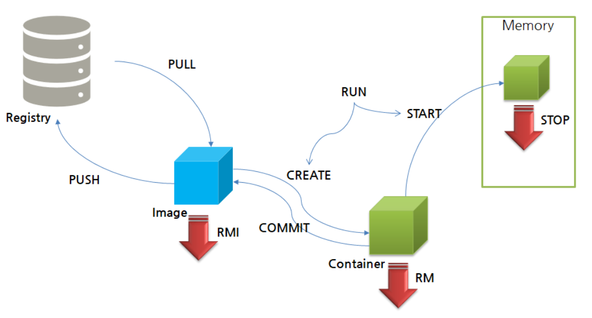

1. # 컨테이너 라이프 사이클

   도커파일 → 이미지 생성 ↔ 컨테이어 생성 → 컨테이너 실행 

      

   | 명령어 |  뒤에 오는 형태 |
   |:------:|:-----------
   |  pull 다음  | Image |
   | create 다음 | ImageID |
   | start, stop, rm,..등 다음 | ContainerID|

   1)Registry에서 PULL로 이미지를 다운 받음 → docker pull 이미지명   
   *pull한 이미지 확인   
   ```
      docker images
   ```   
   pull 한 이미지들 목록   

   2)image를 실행하기 위해선 contrainer를 생성해야 됨   

   3)Container를 생성 → docker container create   
   :컨테이너를 시작할 준비 상태

   4)생성된 Container를 시작 → docker container start   
   :컨테이너 상에서 임의의 프로세스를 시작   

   5)(1번)과 3번과 4번 생성과 시작을 한번에 → docker container run   
   :컨테이너를 생성하고 컨테이너 상에서 임의의 프로세스를 시작   
   *PULL하지 않은 없는 이미지라면 run = pull + create+ start   
   이미 PULL된 이미지라면 run = create + start   

   6)Run을 할 때마다 Container가 생성 됨 따라서 create를 사용해야 하는 경우에만 run을 사용한다고 생각   
   
   7)Container를 정지  → docker container stop   

   8)Container를 재시작 → docker container restart

   8)정지된 Container삭제 → docker container rm   

 1. # 컨테이너의 대화식 실행
   ```
      root@ubuntudesk:/home# docker container run -it --name "test1" centos /bin/cal
          November 2023   
      Su Mo Tu We Th Fr Sa
                1  2  3  4
       5  6  7  8  9 10 11
      12 13 14 15 16 17 18
      19 20 21 22 23 24 25
      26 27 28 29 30     
   ```   
   docker container run : 컨테이너 생성 및 실행   
   -it : 콘솔에 결과를 출력   
   -i : 컨테이너의 표준 출력   
   -t : tty(단말 디바이스)를 확보   
   `--name` "test1" : 컨테이너 이름을 "test1"로 설정   
   `/bin/cal` : centos 이미지 안에 있는 bin디렉토리 안에 cal(달력)을 실행   

   ```
      root@ubuntudesk:/home# docker container run -it --name "test2" centos /bin/bash
      [root@f6f0e92fc3b1 /]# ls ☜호스트명이 바뀜
      bin  dev  etc  home  lib  lib64  lost+found  media  mnt  opt  proc  root  run  sbin  srv  sys  tmp  usr  var
   ```   
   centos 이미지 안에 있는 bin/bash(쉘)를 실행   
   실제 쉘 명령어를 사용하여 시스템에 접근 가능   

1. # 컨테이너의 백그라운드 실행
   ```
      docker container run [옵션] 이미지명:[:태그명] [인수]
   ```   

   |      옵션     |   설명    |
   |:------------:|:---------:|
   | --detach, -d | 백그라운드에서 실행 |
   | --user, -u | 사용자명을 지정 |
   | --restart | 명령의 실행 결과에 따라 재시작 |
   |  --rm   | 명령 실행 완료 후에 컨테이너를 자동으로 삭제 |

   백그라운드 실행 옵션은 -d입니다.   

   예)   
   ```
      docker container run -d centos /bin/ping localhost
   ```   
   docker container run : 컨테이너 생성 및 실행   
   -d : 백그라운드 실행 옵션   
   centos : 이미지명    
   /bin/ping localhost : 컨테이너에서 실행할 명령 - 로컬호스트에 대해 핑 명령어 실행   

   실행 결과:   
   ```
      root@ubuntudesk:/home/ubuntu-desk# docker container run -d centos /bin/ping localhost
      f0da69b3b4a28fec91c006007c91241038b42266b3bb68891b8dc951215cf6b5
   ```   
   실행 결과가 콘솔에 출력되지 않고 결과로 컨테이너ID가 출력됩니다.   

1. # 백그라운드 로그확인

   백그라운드로 실행 중인지 아닌지 알기위해서 로그를 확인합니다.   
   ```
      docker container logs -t f0da69b
   ```   
   컨테이너ID를 적어줘야 하는데 앞에 5~6자리만 적어도 일치하는 ID가 없기 때문에 확인이 가능합니다.   

   확인 결과:   
   ```
      root@ubuntudesk:/home/ubuntu-desk# docker container logs -t f0da69b
      2023-11-24T11:58:37.795273514Z PING localhost (127.0.0.1) 56(84) bytes of data.
      2023-11-24T11:58:37.795455293Z 64 bytes from localhost (127.0.0.1): icmp_seq=1 ttl=64 time=0.195 ms
      2023-11-24T11:58:38.824248867Z 64 bytes from localhost (127.0.0.1): icmp_seq=2 ttl=64 time=0.056 ms
      2023-11-24T11:58:39.848465695Z 64 bytes from localhost (127.0.0.1): icmp_seq=3 ttl=64 time=0.045 ms
      2023-11-24T11:58:40.873173869Z 64 bytes from localhost (127.0.0.1): icmp_seq=4 ttl=64 time=0.063 ms
      2023-11-24T11:58:41.897371808Z 64 bytes from localhost (127.0.0.1): icmp_seq=5 ttl=64 time=0.069 ms
      2023-11-24T11:58:42.919930244Z 64 bytes from localhost (127.0.0.1): icmp_seq=6 ttl=64 time=0.031 ms
      2023-11-24T11:58:43.945214207Z 64 bytes from localhost (127.0.0.1): icmp_seq=7 ttl=64 time=0.074 ms
      2023-11-24T11:58:44.968591205Z 64 bytes from localhost (127.0.0.1): icmp_seq=8 ttl=64 time=0.201 ms
   ```   
   아직까지 실행 중 입니다.   

   container 확인 및 삭제   
   ```
      root@ubuntudesk:/home/ubuntu-desk# docker container ls ☜f0da69가 실행 중
      CONTAINER ID   IMAGE     COMMAND                 CREATED         STATUS         PORTS     NAMES
      f0da69b3b4a2   centos    "/bin/ping localhost"   6 minutes ago   Up 6 minutes             epic_swanson

      root@ubuntudesk:/home/ubuntu-desk# docker container stop f0da69 ☜f0da69 중지
      f0da69

      root@ubuntudesk:/home/ubuntu-desk# docker container ls 
      CONTAINER ID   IMAGE     COMMAND   CREATED   STATUS    PORTS     NAMES
      ☜ 실행 중인 container가 없음
    ```   

1. # 가동 컨테이너 상태 확인
   ```s
      docker container stats [컨테이너 식별자]

      docker container stats test1
   ```   

   컨테이너에서 실행 중인 프로세스 확인   
   ```s
      docker container top [컨테이너 식별자]

      docker container top test1
   ```   

1. # 컨테이너 네트워크 설정
   ```
      docker container run [네트워크 옵션] 이미지명[:태그명] [인수]
   ```   
   2. 옵션   

   |       옵션      |            설명          |
   |:---------------:|:------------------------:|
   | --add-host=[호스트명:IP 주소] | 컨테이너의 /etc/hosts에 호스트명과 IP주소를 정의|
   | --dns=[IP주소] | 컨터이너용 DNS서버의 IP주소 지정 |
   |--expose | 지정한 범위의 포트 번호를 할당 |
   |--mac-address=[MAX주소] | 컨테이너의 MAC주소 지정 |
   | --net| 컨테이너의 네트워크를 지정|
   |--hostname, -h|컨테이너 자신의 호스트명 지정|
   |--publish, -p <br>[호스트의 포트 번호]:[컨테이너의 포트 번호]|호스트와 컨테이너의 포트 매핑|
   |--publish|-all, -p | 호스트의 임의의 포트 번호를 컨테이너에 할당 |

   ```s
      docker container run -d -p 8080:80 nginx
   ```   
   nginx 이미지의 컨테이너를 생성하고, 백그라운에서 실행합니다. 이때 호스트의 포트 번호 8080과 컨테이너의 포트번호 80을 매핑시킵니다. 이 명령을 실행하고나서 호스트 8080포트에 액세스하면 컨테이너에서 작동하고 있는 80번 포트의 nginx의 서비스에 액세스 할 수 있습니다.   
   -d : 백그라운드 실행   
   -p :  포트번호 설정   

   2. DNS 설정   
   ```s
      docker container run -d --dns 192.168.1.1 nginx
   ```   

   2. MAC Address 지정   
   ```s
      root@ubuntudesk:/home/ubuntu-desk# docker container run -d --mac-address="92:34:a4:d3:3e:ff" nginx ☜nginx 컨테이너에 mac주소 지정
      97cda27e4cb7a37f8eb244f4586335a46ef59863

      root@ubuntudesk:/home/ubuntu-desk# docker container inspect --format="{ Config MacAddress }" 97cda27 ☜97cda27의 백그라운드 컨테이너의 mac 주소 확인
      92:34:a4:d3:3e:ff
   ```    
