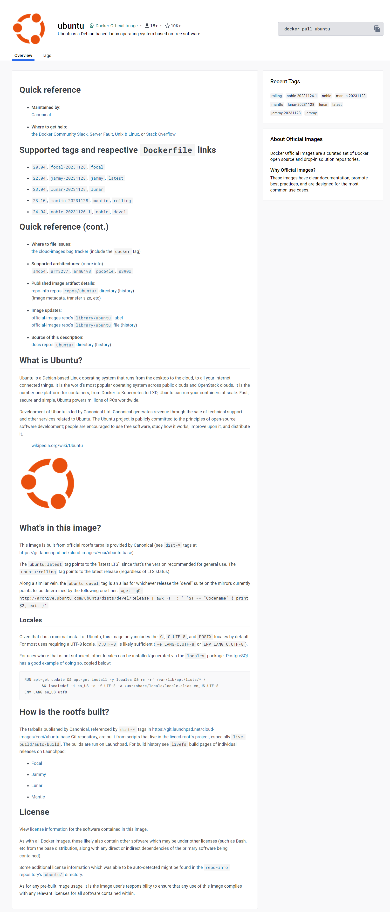
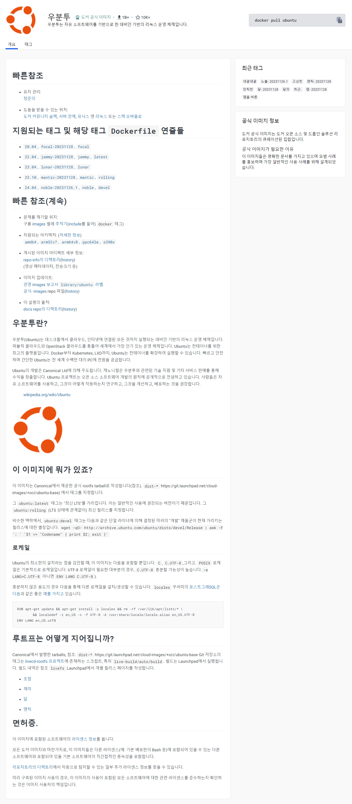

   

  

https://hub.docker.com/_/ubuntu

깃허브 계정   
```
   Your account was flagged because you appear to have registered multiple free user accounts. Our Terms of Service state that an individual may not maintain more than one:

   GitHub Terms of Service Account Requirements

   If you believe we should have reached a different decision, please review our process for appeals and submit additional information via the instructions found here:

   GitHub Appeal and Reinstatement

   Note: To avoid seeing this message again, please be sure to select yes when asked if you have previously contacted GitHub about this claim when opening a new support ticket. Any replies to this email will not be seen by our team, you will need to open a new support ticket.

   Best regards,
   GitHub Support
```   


