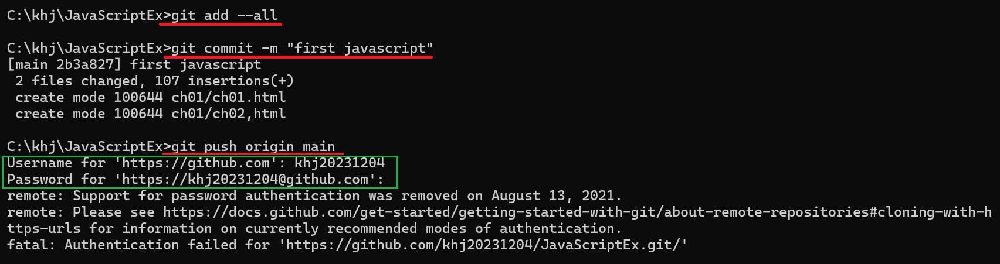

1. # PC에 있는 디렉토리를 Github에 올리는 방법(윈도우에서 실행)   

   2. ## cmd창에서 command명령어로 추가
      C:\programming\javaTeamProject_src를 github에 추가해 보겠습니다.   

   2. ## github에서 레파지토리 생성   
      github에서 리파지토리를 먼저 생성합니다.   
         
      javaTeamProject란 이름으로 생성했습니다.   

   2. ## 폴더로 이동
      로컬에서 github에 올릴 폴더로 이동합니다.   
          
      javaTeamProject_src경로에 있는 main, test 2개의 폴더를 원격저장소에 올릴예정입니다.   

   2. ## gitignore파일 만들기
      github에 올리지 않을 .gitignore 파일도 먼저 만들어둡니다 .gitignore란 이름의 파일을 만들면 원격저장소에 데이터를 올릴 때 github가 알아서 해당파일은 제외를 합니다.   
      ```javascript
         ### Eclipse ###
         .metadata //현재 폴더의 
         bin/
         tmp/
         *.tmp
         
         ### Team Ignore ###
         Access.java
         
         # External tool builders
         .externalToolBuilders 
      ```   

   2. ## 주소창에 cmd입력   
      주소창에서 cmd를 입력하면 해당 경로로 만들어진 명령창이 뜹니다.   
         
      <br>
      주소창에서 cmd를 입력면 해당 경로로 실행된 명령창이 바로 뜹니다.   
         

   2. ## init   
      git init를 실행해서 git을 로컬에 설치하고 초기화를 합니다.   
         
      init를 하고 나면 .git이란 감춰진 폴더가 생성됩니다.   

   2. ## github주소 복사   
      원격저장소의 code로 가서 주소를 복사해옵니다   
         

   2. ## add origin과 pull   
      ```javascript
         git remote add origin "https://github.com/natista99/javaTeamProject.git" 
         //원격저장소의 origin을 연결, branch가 master로 설정됨

         git remote -v  //origin 확인

         git pull origin main  //github에 파일 가져오기

         git branch -M main  //branch를 main으로 설정
         //github에서 repostitory를 생성하면 기본 branch가 main을 만들어짐
         //하지만, git remote add origin으로 파일을 가져오면 기본 branch가 master가 됨
         //앞으로 로컬에 있는 파일을 업로드할 branch 역시 main으로 바꿔줌

         git branch  //branch 확인

         git pull origin main //branch 변경 후 pull 한번 수행해 줘야 됨
         //*처음 commit 후 push에서 error가 나는 경우는 대부분 이 과정을 생략해서 임
      ```   
      github에 저장소의 주소를 원격 주소로 연결을하고 origin이 제대로 설정되어 있는지 확인하는 명령어가 git remote -v 입니다.   
      git pull을 해서 github에 있는 repository 파일들을 가져오면 git branch가 설정되있는데 현재 설정된 branch를 확인하는 명령어가 git branch입니다.   
      예전 깃허브 초장기에 기본 branch가 master였습니다. 하지만 남여차별의 이유로 현재는 기본 branch가 main입니다. git pull을 하고나면 나의 로컬에 branch가 설정되는데 그 값이 master로 됩니다. 깃허브 branch 값이 main과 로컬에 설정된 branch값이 master로 다르기 때문에 로컬 branch를 main으로 바꿔줘야 합니다.   
      branch를 변경 후 "git pull origin main" 명령을 한번 실행해줘야 합니다. 이걸 하지 않으면 나중에 commit 후에 push를 할 때 error가 발생합니다.   
      
      <br>
      pull을 하고 나면 폴더에 없던 readme.md파일을 확인할 수 있습니다.   
         

   2. ## add -> commit -> push   
      
      원격 저장소에 올리기전 로컬 저장소의 대기상태로 만들기 위해 add를 하고 이후 commit메세지와 함께 commit을 합니다.   
      ```javascript
         git add --all
         
         git status //git 상태 확인, 현재 로컬에 add 되어있는 파일들이 나타나남

         git commit -m "java Project first commit"
         git status //clean 이란 상태가 표시됨
         
         git push origin main 
      ```   
         

      __*이미 로그인 되어있는 VS Code"에서 bash 터미널로 실행할 것__   
      로그인 되어 있지 않으면 다음과 같이 아이디와 패스워드 입력 문구가 발생   
         
__
1. # LF-CR 경고   
         
      LF를 CRLF로 바꾼다는 경고문이다. 무시해도 좋은데 그냥 해결하려면   
      ```javascript
         git config --global core.autocrlf true
      ```   
      입력하시면 됩니다.   

1. # GitHub Desktop에서 추가   
   
   2. ## File에서 Add local repository를 선택합니다.   
      
   
   2. ## choose에서 원격저장소와 연동할 폴더를 선택한 후 create a repository를 선택합니다.   
      
   
   2. ## 새로운 repository 이름을 입력합니다.   
      
   
   2. ## Current repository에 새로 생성한 저장소가 생겼습니다.   
      
   
   2. ## 결과 확인   
   추가 되었습니다.   
      
   
   