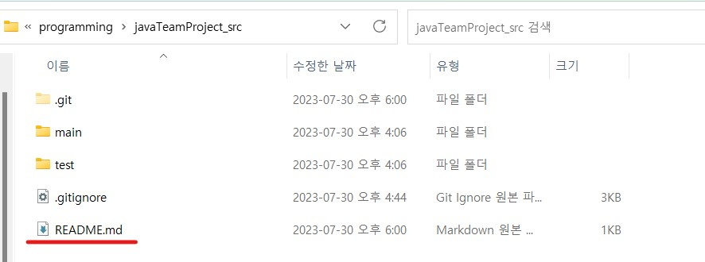
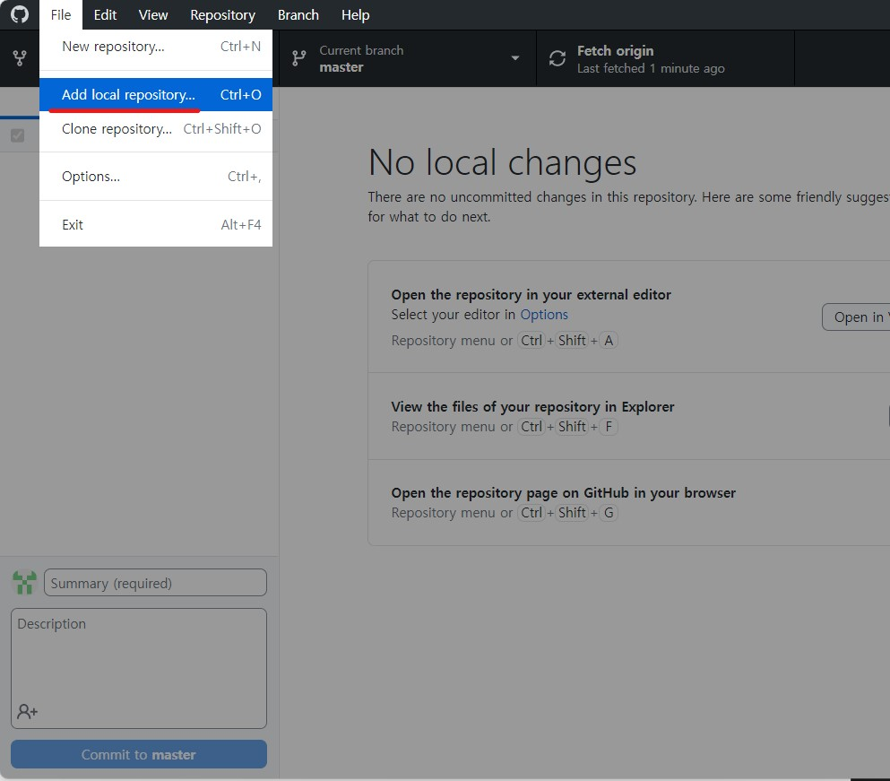

window에서 수행합니다.   

1. # cmd창에서 command명령어로 추가
   C:\programming\javaTeamProject_src를 github에 추가해 보겠습니다.   
   1. ## github에서 레파지토리 생성
   github에서 리파지토리를 먼저 생성합니다.   
      
   javaTeamProject란 이름으로 생성했습니다.   
   1. ## 폴더로 이동
   로컬에서 github에 올릴 폴더로 이동합니다.   
       
   javaTeamProject_src경로에 있는 main, test 2개의 폴더를 원격저장소에 올릴예정입니다.   
   1. ## gitignore파일 만들기
   github에 올리지 않을 .gitignore 파일도 먼저 만들어둡니다 .gitignore란 이름의 파일을 만들면 원격저장소에 데이터를 올릴 때 github가 알아서 해당파일은 제외를 합니다.   
   ```javascript
      
      ### Eclipse ###
      .metadata //현재 폴더의 
      bin/
      tmp/
      *.tmp
      
      ### Team Ignore ###
      Access.java
      
      # External tool builders
      .externalToolBuilders 
   ```
   1. ## 주소창에 cmd입력
   주소창에서 cmd를 입력하면 해당 경로로 만들어진 명령창이 뜹니다.   
      
   <br>
   주소창에서 cmd를 입력면 해당 경로로 실행된 명령창이 바로 뜹니다.   
      
   1. ## init
   git init를 실행해서 git을 로컬에 설치하고 초기화를 합니다.   
      
   init를 하고 나면 .git이란 감춰진 폴더가 생성됩니다.   
   1. ## github주소 복사
   원격저장소의 code로 가서 주소를 복사해옵니다
      
   1. ## add origin과 pull
   ```javascript
      git remote add origin "https://github.com/natista99/javaTeamProject.git" //원격저장소의 origin을 연결
      git branch -M main //branch를 main으로 하기
      git pull origin main
   ```
      
   <br>
   폴더에 없던 readme.md파일을 확인할 수 있습니다.   
      
   1. ## add -> commit -> push
   원격 저장소에 올리기전 로컬 저장소의 대기상태로 만들기 위해 add를 하고 이후 commit메세지와 함께 commit을 합니다.
   ```javascript
      git add --all
      git commit -m "java Project first commit"
      git push origin main 
   ```
      
   1. ## LF-CR 경고
      
   LF를 CRLF로 바꾼다는 경고문이다. 무시해도 좋은데 그냥 해결하려면
   ```javascript
      git config --global core.autocrlf true
   ```
   입력하시면 됩니다.
1. # GitHub Desktop에서 추가
   File에서 Add local repository를 선택합니다.   
       
   <br>
   choose에서 원격저장소와 연동할 폴더를 선택한 후 create a repository를 선택합니다.   
      
   <br>
   새로운 repository 이름을 입력합니다.   
      
   <br>
    Current repository에 새로 생성한 저장소가 생겼습니다.   
      
   <br>
   추가 되었습니다.   
      
   
   

