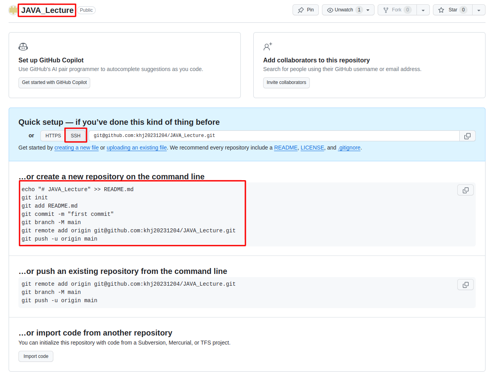
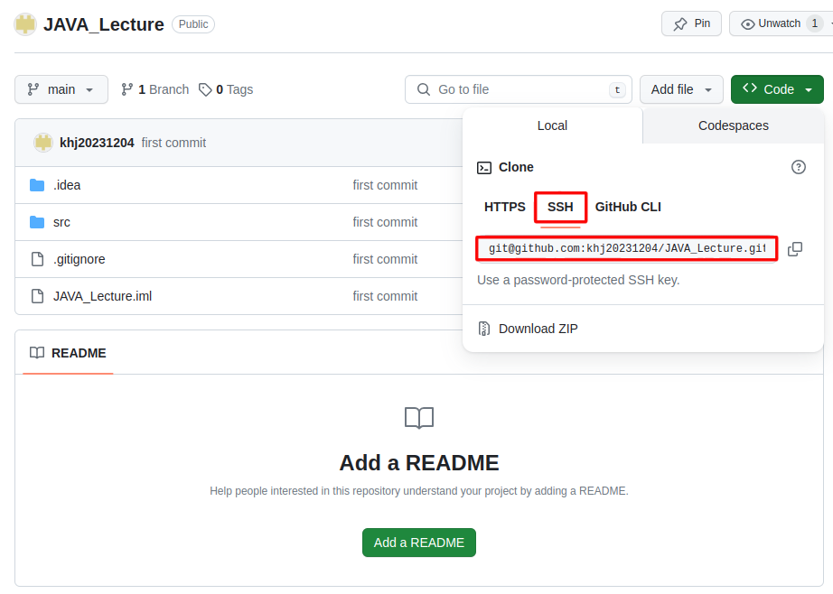

1. # src refspec main does not match any

   ```s
      error: src refspec main does not match any
      error: failed to push some refs to 'https://github.com/khj20231204/CodingTest.git'
   ```
   처음 repository를 생성하면 branch를 만들고 최초 한번 commit을 해줘야하는데, 그 과정에서 commit을 먼저 시행 후 branch를 생성해 줘야 하는데 순서가 엉망이 되면 저런 메세지가 나왔었다. 
   init를 하면 기본적으로 연결되는 branch는 master인데 github에선 뭐;; 인종차별, 주종 관계 의미를 없애기 위해서 master대신 main을 권장하기 때문에 예제가 main으로 나와있다. 그래서 깃허브에선 친절하게 순서까지 알려주는데 무시하고 예전에 했던 감각으로만 명령을 수행하니 이런 일이.. 모르면 찾아봐야 하는데 감으로 하니 이런 일이;;

       

    여기 순서대로 add부터 차례대로 수행해서 문제 해결 되었음
    ```s
      git init
      git add . #전체파일 add .(점)으로 표시 - local staing area
      git commit -m "first commit"   #local repository area
      git branch -M main   # 깃허브 branch 생성
      git remote add origin git@github.com:khj20231204/JAVA_Lecture.git  #ssh로 origin 추가
      git push -u origin main
   ```   

1. # fatal: Authentication failed
   ```java
   khj2023@khj2023-linuxUbuntu:~/IdeaProjects/CodingTest$ git push -u origin main
   Username for 'https://github.com': khj2023
   Password for 'https://khj2023@github.com': 
   remote: Support for password authentication was removed on August 13, 2021.
   remote: Please see https://docs.github.com/en/get-started/getting-started-with-git/about-remote-repositories#cloning-with-https-urls for information on currently recommended modes of authentication.
   fatal: Authentication failed for 'https://github.com/khj20231204/CodingTest.git/'
   ```
   http하지말고 ssh로한다.   

      

1. # LF will be replaced by CRLF the next time Git touches it
   ```s
      git config --global core.autocrlf true
   ```

1. # fatal: The current branch master has no upstream branch.
   git push를 하면 나타나는 오류
   ```   
      fatal: The current branch master has no upstream branch.
      To push the current branch and set the remote as upstream, use

         git push --set-upstream origin master

      To have this happen automatically for branches without a tracking
      upstream, see 'push.autoSetupRemote' in 'git help config'.
   ```   
   git push --set-upstream origin master 입력

1. # git@github.com: Permission denied (publickey).   
   ```
      git@github.com: Permission denied (publickey).
      fatal: Could not read from remote repository.

      Please make sure you have the correct access rights
      and the repository exists.
   ```
   github에 저장되어 있는 publicSSH 키랑 현재 컴퓨터에 있는 publicSSH키 값이 다르기 때문이다. 우분투에서 key를 만들었는데 포맷 후 윈도우에서 접속하려는 key가 안 맞아서 발생하는 에러이다.
   <a href="https://khj20231204.github.io/ubuntu/Ubuntu-ssh_github_connect/">SSH키 생성</a>
   
1. # refusing to merge unrelated histories
   git pull 이나 git push를 한 경우 발생한다.   
   ```s
      git pull origin master --allow-unrelated-histories
   ```   
   --allow-unrelated-histories : 관련 독립적인 두 프로젝트를 병할 할 때 사용하는 옵션   
   
1. # error: Your local changes to the following files would be overwritten by merge:  
   원격 저장소에 있는 파일을 가져올 때 로컬에 수정한 파일이 존재해서 발생하는 error. pull을 먼저 해야 하는데 프로젝트 수정 중 pull을 하게 될 경우 발생   

   해결
   ```s
      git stash → git pull origin master → git stash pop
   ```

   2. # git stash   
   하던 작업을 스택에 잠시 저장할 수 있도록 하는 명령어입니다. 이를 통해 아직 완료하지 않은 일을 commit하지 않고 나중에 다시 꺼내와 마무리할 수 있다.

1. # error: The following untracked working tree files would be overwritten by merge: